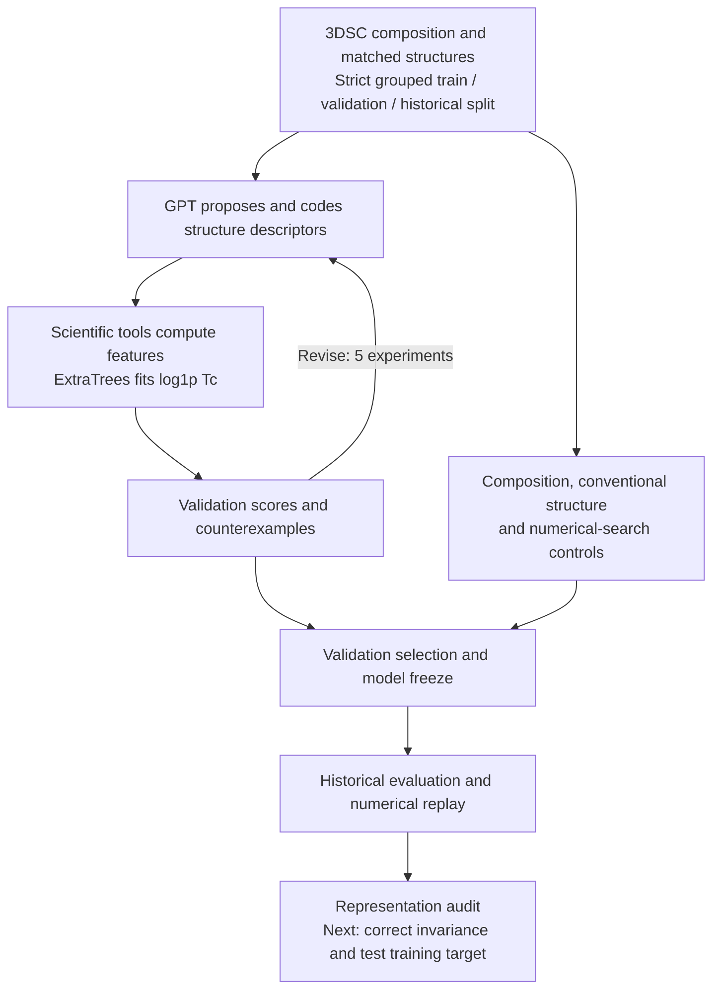

# PRIS reproduction bundle

[English](README.md) | [简体中文](README_zh.md)

Reproduced on 2026-09-14 from [AI4QC/PRIS](https://github.com/AI4QC/PRIS), commit `34e6c86c083759dc1ee594ae22238ea9b5ebd8f4`.

Read the full report in [English](REPORT.md) or [Chinese](REPORT_zh.md). This repository contains actual calculations, original public input structures, derived numerical tables, logs, and unchanged upstream analyzer source. It is an independent, partial scientific reproduction of the data-complete portions of the release. It does not rerun the two-million-candidate agent search or VASP, and it does not reproduce the missing full held-out benchmark. It is not the official PRIS repository.

## Research progress for advisor review 2026-10-01

Two property-prediction directions are progressing in parallel:

| Direction | Completed work | Current conclusion | Report |
| --- | --- | --- | --- |
| Formation energy and hull classification | 14 tool calls; five descriptor programs; 721 fresh MP test structures | Formation-energy MAE 0.3515 to 0.3138 eV/atom; HGB remains stronger at 0.2793; hull-classification gain inconclusive | [English](experiments/scientific-agent-2026-09-30/REPORT_EN.md) / [中文](experiments/scientific-agent-2026-09-30/REPORT_ZH.md) |
| Superconducting critical temperature | 12 tool calls; five descriptor programs; 5773 3DSC records; numerical and representation audits | Historical MAE 4.392 to 4.364 K; interval crosses zero; high-Tc error worsens; stable improvement not established | [English](experiments/superconductivity-agent-2026-10-01/REPORT.md) / [中文](experiments/superconductivity-agent-2026-10-01/REPORT_zh.md) |

### Current superconductivity workflow


[Vector workflow SVG](experiments/superconductivity-agent-2026-10-01/figures/workflow.svg)

<details>
<summary>Expand detailed workflow</summary>



</details>

The superconductivity historical cohort has been analyzed before and is not a new independent test. The proposed second round has not been executed. See the [full workflow and supporting evidence](experiments/superconductivity-agent-2026-10-01/README.md).

## Tool-using GPT extension — 2026-09-30

A separate [scientific-agent experiment](experiments/scientific-agent-2026-09-30/README.md)
adds real hypothesis/code/experiment/counterexample/revision tools. GPT authored five
descriptor programs in 14 tool calls. On 721 fresh MP test structures, the selected
program reduced formation-energy MAE from 0.3515 to 0.3138 eV/atom (10.7%);
HGB reached 0.2793, and the hull-classification improvement was inconclusive.
Read the [English report](experiments/scientific-agent-2026-09-30/REPORT_EN.md)
or [中文报告](experiments/scientific-agent-2026-09-30/REPORT_ZH.md).
The original reproduction results below concern a different task and dataset.

## Results at a glance

| Experiment | Recomputed result | Scope |
|---|---|---|
| E3 crystal screening | Set 4 retains 27/30 parents and rejects 119/150 damaged structures | Selected discovery subset; not a held-out performance estimate |
| Independent E4 EOS fits | 260/260 fitted; maximum absolute difference 0.000233 GPa | Existing published energy–volume data; no new DFT |
| E4 symmetry | 520 structures; Law 7 passes increase from 61 to 113, with zero row-level mismatches | Input-cell convention, 260 published pairs |
| Geometry and implementation | Seven periodic geometry controls and ten upstream analyzer tests pass | A separate historical regression test lacks an upstream fixture |
| Representation sensitivity | Equivalent NaCl cells produce different Set 4 verdicts | Public analyzer behavior, documented without patching its rules |

The packaged six-step run completed with all exit codes zero; see [the run log summary](results/run_logs/summary.json). Exact denominators, missing-value handling, selection effects, and unavailable inputs are documented in the reports.


## Run again

Use Python 3.12. From this directory:

```text
python bootstrap.py --workers 4
```

This entry point creates `.venv`, installs the 48 pinned distributions, runs `pip check`, verifies bundled source and scientific input hashes, and executes the six-step reproduction. `python bootstrap.py --install-only` prepares and validates the environment without rerunning the calculations. Existing unrelated directories are not overwritten. The validated environment and outstanding upstream inputs are documented in [DEPENDENCIES.md](DEPENDENCIES.md).

The equivalent manual setup is:

```powershell
python -m venv .venv
.\.venv\Scripts\python.exe -m pip install --no-compile -r requirements-lock.txt
.\.venv\Scripts\python.exe run_all.py --workers 4
```

On macOS/Linux use `.venv/bin/python` in place of `.\.venv\Scripts\python.exe`. The package versions are the exact versions used for this run, not the authors' original environment, which was not fully pinned. Installing dependencies requires network access; the default reproduction itself uses the included data and makes no model/API/DFT calls.

`run_all.py` runs geometry controls, all 180 E3 structures, all 260 E4 equation-of-state fits, the paired E4 symmetry audit, report figures, and the ten upstream analyzer tests. It records each subprocess exit code in `results/run_logs/summary.json`. Results are written under `results/`.

## Individual experiments

```text
python scripts/validate_core.py
python scripts/run_structure_benchmark.py --workers 4
python scripts/refit_eos.py
python scripts/recompute_symmetry.py
python scripts/make_report_figures.py
python -m pytest -q vendor/pris/tests/test_pris_analyze.py
```

Analyze a new CIF/POSCAR with the original analyzer:

```text
python vendor/pris/src/pris_analyze.py path/to/structure.cif
```

The E3 inputs are the authors' published POSCAR files. They are kept byte-identical. The separate synthetic NaCl/MgO/CsCl examples are explicitly geometry controls, not experimental benchmark entries. The original analyzer is not patched to change its decisions.

## Author figures (optional full checkout)

The completed Fig. 1/3/5 exports are in `results/author_figures/`. To regenerate them, obtain the complete pinned repository because their aggregate inputs are not all duplicated in this compact bundle:

```text
git clone https://github.com/AI4QC/PRIS.git upstream-full
git -C upstream-full checkout 34e6c86c083759dc1ee594ae22238ea9b5ebd8f4
python scripts/replot_author_figures.py --repo upstream-full --only fig1 fig3 fig5
```

Only the output-directory variables are redirected. Fig. 1 and Fig. 5 are aggregate replays. Fig. 3 recomputes the illustrative spinel example but uses published aggregate/DFT data for its other panels. The author script for main-text Fig. 5 retains the legacy filename `fig6_deployment`.

Fig. 2 was attempted and fails because `outputs/20260815_threshold_transfer/transfer.json` is missing from the release. Fig. 4 requires unshared score shards. Their data were not fabricated.

## Files and provenance

- `REPORT.md` / `REPORT_zh.md`: complete English / Chinese findings, interpretation, limits, and research follow-up.
- `REPRODUCTION_AUDIT.md` / `REPRODUCTION_AUDIT_zh.md`: detailed source/protocol audit in both languages.
- `data/original_e3/`: 30 COD-derived parents and 150 archived damage variants, with labels and hashes.
- `data/eos/`: published E(V) records and reference bulk moduli, with source hashes.
- `data/symmetry/`: as-generated/relaxed structure pairs and provenance.
- `vendor/pris/`: unchanged upstream analyzer and selected tests; source license included.
- `results/`: computed measurements, comparisons, images, and logs.
- `vendor_manifest.json`: hashes and origin of vendored source.
- `FILE_MANIFEST.json`: portable deliverable hashes after final validation.
- `LOG_REDACTION.md`: local path redactions applied to published logs.
- `DEPENDENCIES.md` / `DEPENDENCIES_zh.md`: independent environment validation and the availability of upstream inputs.
- `bootstrap.py`: isolated environment creation, installation, verification, and execution.
- `scripts/check_environment.py`: exact package versions, source integrity, input integrity, and optional upstream-file checks.

The README, report, source audit, and auxiliary data/result explanations are provided in both English and Chinese. Machine-readable measurements and unchanged upstream source retain their original language. Both reports refer to the same computed data.

Upstream code is distributed under its included MIT license. COD-derived structures are attributed to their COD records. `vendor/pris/data/bvparm2020.cif` retains I. D. Brown's bond-valence-table notice, including its stated noncommercial redistribution terms. No ICSD database, proprietary pseudopotential, API key, or user meeting recording is included.
