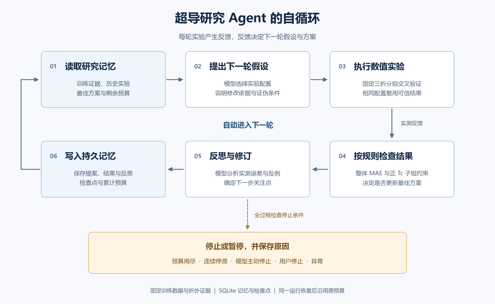
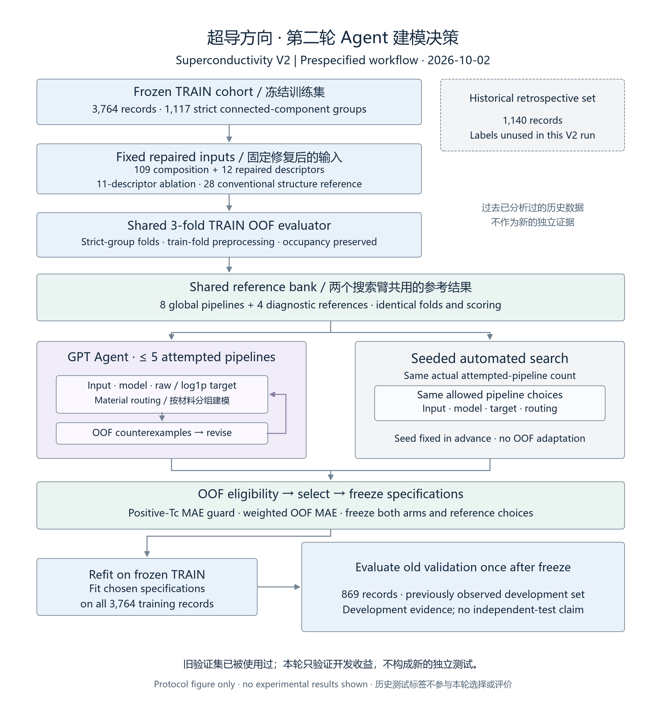
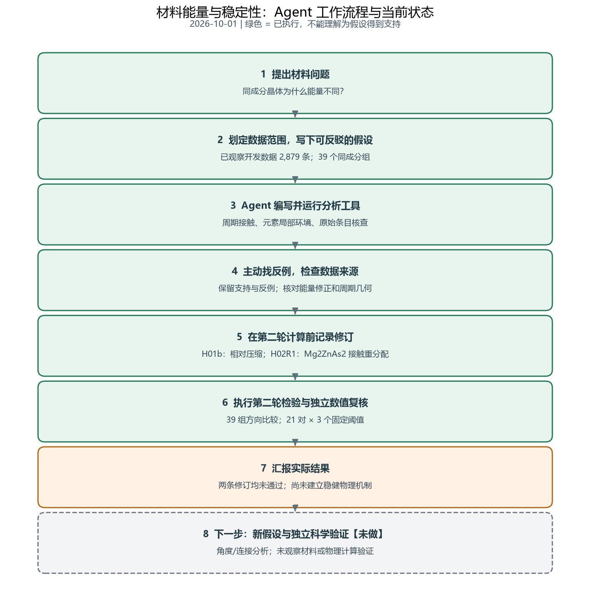
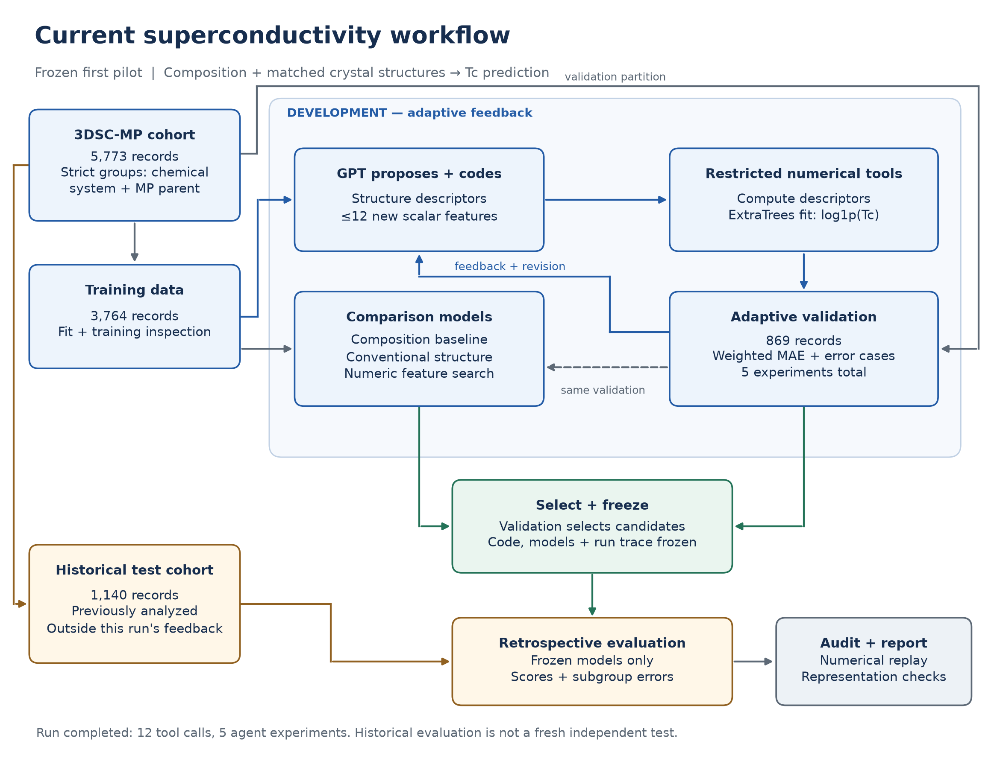
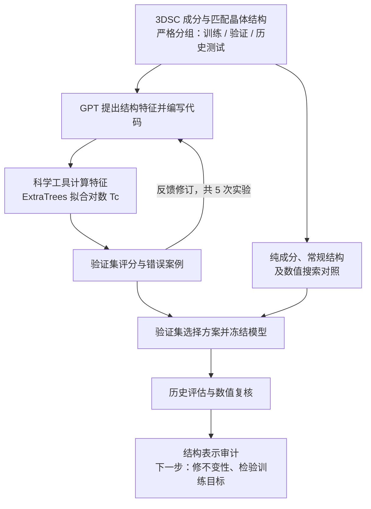
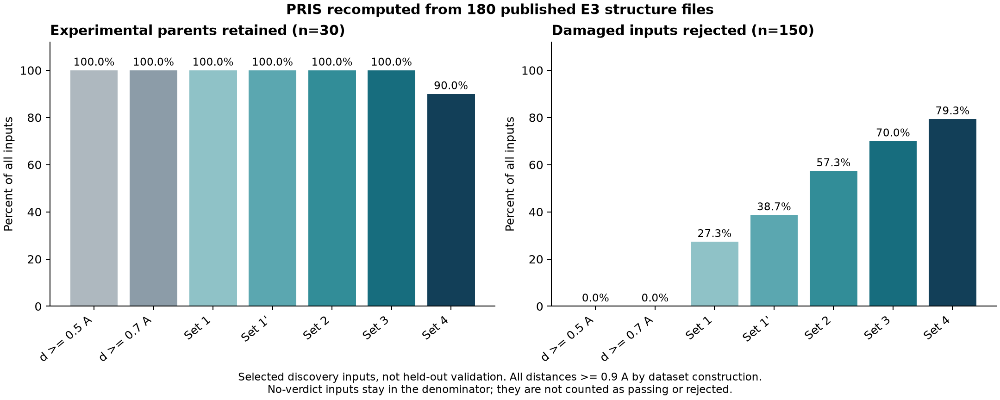

# PRIS 论文复现

[English](README.md) | [简体中文](README_zh.md)

复现日期：2026-09-14。作者原仓库：[AI4QC/PRIS](https://github.com/AI4QC/PRIS)，固定提交 `34e6c86c083759dc1ee594ae22238ea9b5ebd8f4`。论文：[arXiv:2609.01209](https://arxiv.org/abs/2609.01209)。

完整报告提供[中文版](REPORT_zh.md)和[英文版](REPORT.md)。本仓库保存实际执行的复现代码、公开原始结构、数值结果、图表、日志以及未经修改的作者分析器。**这是对公开输入完整部分的独立、部分复现，并非官方 PRIS 仓库。**没有重跑原始 200 万次候选搜索或 VASP，也没有复现缺少输入的完整留出集。

## 超导自循环新增 20 轮结果

已在原有两轮记忆上新增完成 20 个实验循环，累计 22 轮。每轮包含模型提案、固定三折训练实验、结果检查和反馈反思；原有验证集保持冻结。当前按预定规则保留方案 **A05**，训练折外加权 MAE **7.752599 K**，不代表独立泛化收益。

[完整中文汇报与逐轮结果](experiments/superconductivity-self-loop-2026-10-05/README_zh.md) · [代码及复核方法](experiments/superconductivity-self-loop-2026-10-05/README.md)

## 超导研究 Agent 自循环

控制程序已实现“提出假设 → 自动实验 → 分析反馈 → 反思修订 → 自动进入下一轮”，并持久保存记忆。真实连续两轮运行完成 4 次模型调用和 21 次回归器拟合，31 项行为与数据测试通过。两项新配置均未超过起始最佳 A05 的训练折外 MAE 7.7526 K；本次验证在事先设置的两次实验预算用完后结束，没有新增泛化收益结论。

[自循环流程图与中文汇报](experiments/superconductivity-self-loop-2026-10-02/README_zh.md) · [代码与运行方法](experiments/superconductivity-self-loop-2026-10-02/README.md) · [真实运行记录](experiments/superconductivity-self-loop-2026-10-02/evidence/status.json)



## 超导第二轮：模型与分组选择 — 2026-10-02

已完成真实 GPT 模型 / 路由选择、同尝试次数自动搜索与独立复核。旧验证加权 MAE：共享全局 G01 **8.0885 K**，Agent A05 **8.0849 K**，自动臂 G01 **8.0885 K**。该队列此前已观察，属于开发比较；子群误差与差值区间见完整报告。

[最新中文导师汇报](experiments/superconductivity-agent-2026-10-02/REPORT_zh.md) · [English](experiments/superconductivity-agent-2026-10-02/REPORT.md) · [数据 / 代码 / 全部结果](experiments/superconductivity-agent-2026-10-02/README.md)



## 导师汇报：材料能量与稳定性 — 2026-10-01

**已完成 Agent 的“假设 → 工具计算 → 反例 → 修订 → 再检验”闭环。** 使用已观察的 2,879 条开发数据，对照 39 组同成分材料；两条修订均未通过预设检验，目前尚未建立稳健物理机制。独立数值复核通过，未观察材料或物理验证尚未开展。

查看[中文导师汇报](reports/materials-agent-2026-10-01/README.md)或 [English briefing](reports/materials-agent-2026-10-01/README_EN.md)，包括流程图、已完成工作、失败结果、限制、下一步与完整对照表。本轮没有训练新预测模型或运行新 DFT。

同一批 2,879 条准备后的开发数据已在 [Hugging Face](https://huggingface.co/datasets/fgh123654/materials-energy-stability-agent-dev) 公开，可浏览数据集页面与[合并材料表](https://huggingface.co/datasets/fgh123654/materials-energy-stability-agent-dev/blob/main/materials.csv)，并从[文件目录](https://huggingface.co/datasets/fgh123654/materials-energy-stability-agent-dev/tree/main)下载完整准备结构。这些是已观察的数据，不是新实验或新测试集。



## 导师汇报进展 2026-10-01

目前两条性质预测方向同步推进：

| 方向 | 已完成工作 | 当前结论 | 汇报 |
| --- | --- | --- | --- |
| 材料形成能与稳定性 | 已有描述符基准；本轮机制探索：39 个组成组、21 对匹配结构、8 例源核查 | 本轮两条修订均未通过检验，尚未建立稳健机制；此前预测结果单独保留 | [本轮中文](reports/materials-agent-2026-10-01/README.md) / [English](reports/materials-agent-2026-10-01/README_EN.md)；[此前基准](experiments/scientific-agent-2026-09-30/REPORT_ZH.md) |
| 超导临界温度 | 12 次工具调用；5 组描述符；5773 条 3DSC 记录；数值及表示审计 | 历史 MAE 从 4.392 降至 4.364 K；区间跨零；高 Tc 误差变差；尚未证实稳定改善 | [中文](experiments/superconductivity-agent-2026-10-01/REPORT_zh.md) / [English](experiments/superconductivity-agent-2026-10-01/REPORT.md) |

### 公开超导数据集

[Hugging Face 数据集](https://huggingface.co/datasets/fgh123654/3dsc-mp-tc-pilot)保存本轮实际使用的 5773 条 3DSC-MP 研究快照。`records` 可在线查看化学式、Tc（K）及固定的训练 / 验证 / 历史评估划分（3764 / 869 / 1140）；`features` 提供 109 个成分和 28 个常规结构输入。[下载文件](https://huggingface.co/datasets/fgh123654/3dsc-mp-tc-pilot/tree/main)包含全部 5773 个 CIF、原样冻结的已制备数据、字段说明、来源、CC BY 4.0 归属声明与 SHA-256 哈希。代码和导师汇报保留在本 GitHub 仓库。

### 第一轮冻结超导流程



[矢量流程图 SVG](experiments/superconductivity-agent-2026-10-01/figures/workflow.svg)

<details>
<summary>展开详细流程图</summary>



</details>

超导历史测试队列此前已分析过，不能视为全新独立验证。第二轮已执行，见[最新汇报](experiments/superconductivity-agent-2026-10-02/REPORT_zh.md)。详见[完整流程与证据入口](experiments/superconductivity-agent-2026-10-01/README.md)。

## 使用科学工具的 GPT 扩展实验 — 2026-09-30

新增独立的[科学代理实验](experiments/scientific-agent-2026-09-30/README.md)：
GPT 实际执行了假设、代码编写、实验、反例检查与修订，完成 14 次工具调用和五组描述符。
在 721 条全新 MP 测试记录上，所选程序将形成能 MAE 从 0.3515 降至 0.3138 eV/atom
（约 10.7%）；HGB 对照为 0.2793，凸包分类改善尚不明确。
详见[中文报告](experiments/scientific-agent-2026-09-30/REPORT_ZH.md)与
[English report](experiments/scientific-agent-2026-09-30/REPORT_EN.md)。
下方原始复现结果对应另一项任务与数据集。

## 主要结果

| 实验 | 重新计算的结果 | 适用范围 |
|---|---|---|
| E3 晶体筛选 | Set 4 保留 27/30 个母体，检出 119/150 个受损结构 | 经过选择的 discovery 子集，不能视为独立留出集性能 |
| E4 体模量独立拟合 | 260/260 个拟合成功；与作者结果最大绝对差 0.000233 GPa | 使用公开能量—体积数据，没有新运行 DFT |
| E4 对称性 | 520 个结构重新计算；Law 7 通过数 61→113，逐结构无差异 | 按输入晶胞口径，对应 260 对公开结构 |
| 周期几何与实现检查 | 7 个周期几何控制和 10 个作者分析器测试通过 | 另有 1 个历史回归测试因上游文件缺失而失败 |
| 晶胞表示敏感性 | 同一 NaCl 晶体的不同晶胞表示得到不同 Set 4 判断 | 记录公开分析器行为，没有修改规则 |

打包后的六步运行全部以退出码 0 完成，见[运行摘要](results/run_logs/summary.json)。报告详细说明了分母、缺失值处理、样本筛选条件以及尚未公开的输入。



## 重新运行

使用 Python 3.12，在仓库根目录执行：

```text
python bootstrap.py --workers 4
```

该入口创建 `.venv`，安装 48 个固定版本依赖，运行 `pip check`，核验所引用源码及科学输入的哈希，然后执行六步复现流程。`python bootstrap.py --install-only` 仅安装并验证环境，不重新计算。已有的无关目录不会被覆盖。独立环境验证及上游输入的可获取性详见[依赖说明](DEPENDENCIES_zh.md)。

等价的手动安装步骤如下：

```powershell
python -m venv .venv
.\.venv\Scripts\python.exe -m pip install --no-compile -r requirements-lock.txt
.\.venv\Scripts\python.exe run_all.py --workers 4
```

macOS/Linux 将 `.\.venv\Scripts\python.exe` 替换为 `.venv/bin/python`。依赖文件记录此次运行实际使用的精确版本，并非作者未完整固定的原始环境。安装依赖需要联网；默认复现使用仓库内的数据，不调用模型 API 或 DFT 程序。

`run_all.py` 顺序运行周期几何控制、180 个 E3 结构、260 个 E4 状态方程拟合、E4 成对结构对称性审计、报告图表以及 10 个作者分析器测试。每一步的退出码保存在 `results/run_logs/summary.json`，结果写入 `results/`。

## 单独执行实验

```text
python scripts/validate_core.py
python scripts/run_structure_benchmark.py --workers 4
python scripts/refit_eos.py
python scripts/recompute_symmetry.py
python scripts/make_report_figures.py
python -m pytest -q vendor/pris/tests/test_pris_analyze.py
```

使用作者分析器处理新的 CIF/POSCAR：

```text
python vendor/pris/src/pris_analyze.py path/to/structure.cif
```

E3 输入是作者发布的 POSCAR，保留原始字节。单独构造的 NaCl/MgO/CsCl 明确属于几何控制，不是实验数据集条目。未修改作者分析器以改变其判断。

## 重绘作者图表（可选，需完整仓库）

已完成的 Fig. 1、3、5 导出文件位于 `results/author_figures/`。若要重新生成，需要获取固定版本的完整上游仓库，因为部分汇总输入没有重复放入本精简仓库：

```text
git clone https://github.com/AI4QC/PRIS.git upstream-full
git -C upstream-full checkout 34e6c86c083759dc1ee594ae22238ea9b5ebd8f4
python scripts/replot_author_figures.py --repo upstream-full --only fig1 fig3 fig5
```

仅重定向输出目录变量。Fig. 1 和 Fig. 5 使用公开汇总数据重绘。Fig. 3 重新计算说明性的尖晶石及其扰动，其他面板使用公开汇总和 DFT 数值。正文 Fig. 5 的脚本保留了旧文件名 `fig6_deployment`。

Fig. 2 已尝试执行，但发布材料缺少 `outputs/20260815_threshold_transfer/transfer.json`，因此失败。Fig. 4 需要未公开的分数分片，没有补造这些数据。

## 文件与来源

- `REPORT.md` / `REPORT_zh.md`：中英文完整结果、解释、限制与后续研究方向。
- `REPRODUCTION_AUDIT.md` / `REPRODUCTION_AUDIT_zh.md`：中英文来源及实验协议审计。
- `data/original_e3/`：30 个 COD 来源母体及 150 个归档扰动变体，附标签和哈希。
- `data/eos/`：公开能量—体积记录、参考体模量以及来源哈希。
- `data/symmetry/`：生成态与弛豫后结构配对及来源。
- `vendor/pris/`：未修改的作者分析器、选定测试及原始许可声明。
- `results/`：计算得到的测量值、比较表、图像与日志。
- `vendor_manifest.json`：所引用上游文件的来源及哈希。
- `FILE_MANIFEST.json`：最终验证后的交付文件哈希。
- `LOG_REDACTION.md`：公开日志中本机路径的脱敏说明。
- `DEPENDENCIES.md` / `DEPENDENCIES_zh.md`：独立环境验证及上游输入可获取性说明。
- `bootstrap.py`：隔离环境创建、依赖安装、核验和执行入口。
- `scripts/check_environment.py`：精确版本、源码与输入完整性以及可选上游文件检查。

首页、完整报告、来源审计及各数据/结果目录的说明均有中英文版本。机器可读数值和未经修改的上游源文件保留原始语言；两种语言的报告引用同一份计算结果。

上游代码采用随附的 MIT 许可。COD 来源结构归属于对应 COD 记录。`vendor/pris/data/bvparm2020.cif` 保留 I. D. Brown 的键价参数表声明，包括其中的非商业再分发条款。仓库不包含 ICSD 数据库、专有赝势、API 密钥或用户会议录屏。
