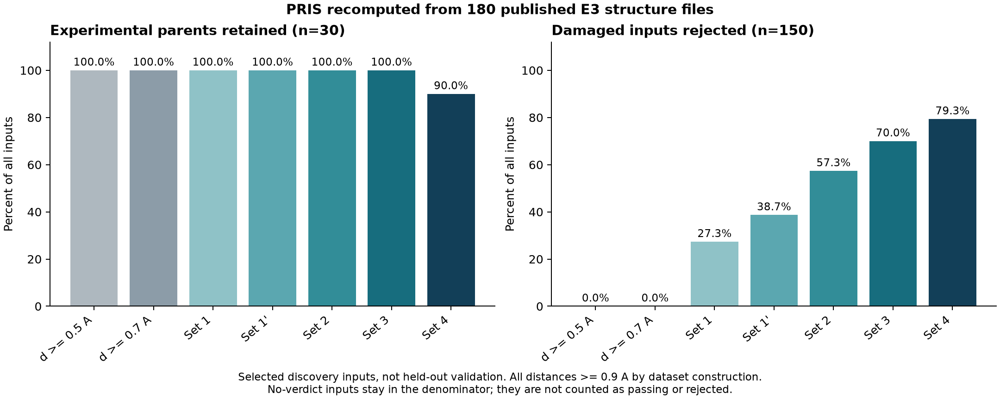
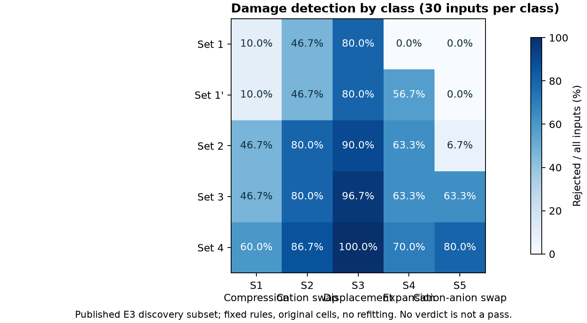
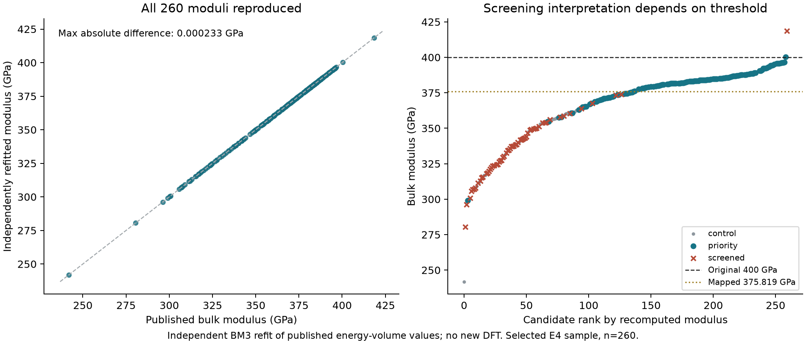
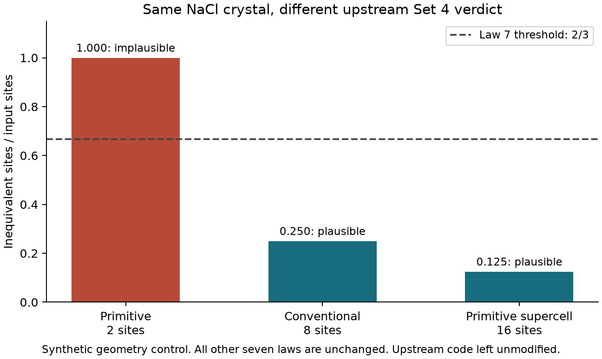

# PRIS 复现与数值核验技术报告

[English](REPORT.md) | 中文

日期：2026-09-14。论文：[Autonomous discovery of new structure-plausibility laws for explainable and rapid crystal diagnosis and screening](https://arxiv.org/abs/2609.01209)。源代码仓库：[AI4QC/PRIS](https://github.com/AI4QC/PRIS)，固定提交为 `34e6c86c083759dc1ee594ae22238ea9b5ebd8f4`。

## 1. 研究目标与范围

本研究评估了公开输入足以支持计算的 PRIS 组成部分的可复现性。分析内容包括已发布晶体结构分类器的运行、公开能量—体积数据的独立重拟合、基于原子坐标的晶体对称性复算、等价晶胞表示的影响，以及部分原文图表的重新生成。

研究目标是在可复算结果与公开输出之间建立对应关系，并识别方法和数据可用性方面的限制。本研究未复现完整的自主发现过程，也未覆盖论文全部实验。输入、逐结构输出、图表和可执行分析脚本均作为支撑记录予以保存。

## 2. 方法

### 2.1 软件与参数控制

分析使用已发布的 PRIS 分析器，其规则阈值和 PSS 系数均保持不变，未为匹配报告结果而重新调参。主要科学计算采用 Python 3.12.14；完整软件包版本记录于 [requirements-lock.txt](requirements-lock.txt)。

在新建的隔离 Python 3.12.14 环境中完成了依赖安装，并通过 `bootstrap.py` 执行验证与复现。48 个锁定版本的软件分发包全部安装成功，`pip check` 未报告依赖冲突。环境核验通过了 20 个随包源码文件和 703 个归档输入文件的哈希检查。安装与验证记录于 [依赖说明](DEPENDENCIES_zh.md)。

### 2.2 E3 结构队列与判定定义

E3 输入取自上游仓库 `dft/E3_crosscheck/tasks/`。分析队列包含 30 个 COD 实验来源母体及其 150 个固定扰动变体，共 180 个结构。各 `POSCAR.init` 从固定版本的本地检出目录归档，并经过 SHA256 核验。哈希标识所保存的检出文件字节，其换行形式可能与 Git blob 不同。来源路径、COD 标识、标签、扰动类型和哈希记录于 [数据清单](data/original_e3/manifest.csv)。

受损变体标记为 synthetic damage。上游元数据字段 `kind=experimental` 被解释为母体来源信息，而非所有变体均为实验正例的依据。

上游筛选程序使用 **discovery split**，按 `source_id` 对合格结构排序并选取前 30 个母体。筛选要求包括结构有序、含 2–16 个位点、可分配整数氧化态、五种扰动均可应用，以及换位变体不与母体等价。所有变体的最小接触距离均须至少为 0.9 Å。

判定保留公开分析器的部署语义：无法判定的样本保留在总分母中，既不计为通过，也不计为检出。即使其他必要测量缺失，只要已观测到一条规则失败，相关规则集即可判为拒绝。该约定不同于部分上游基准程序将缺失特征视为满足条件的处理方式。

### 2.3 独立状态方程拟合

体模量通过独立实现的三阶 Birch–Murnaghan 状态方程与 SciPy `least_squares`，依据已发布的逐任务体积和静态能量重新计算。公开的最终体模量仅在拟合完成后用于比较。

1,300 条任务记录包含 1,296 条 `complete`、1 条 `unconverged` 和 3 条 `failed`。按照上游分析约定保留前两类，得到 1,297 个 E(V) 点。260 个候选中，257 个具有五个可用点，3 个具有四个可用点。本研究未执行新的 DFT 计算。

### 2.4 对称性复算

对称性分析使用 260 个生成态 POSCAR 及对应的 260 个 DFT 弛豫后 CIF，共 520 个结构。按照上游补充数据导出程序的输入晶胞约定，以 `symprec=0.01 Å` 重新计算空间群编号和对称不等价位点比例。

原始 E4 选择包含 261 个候选。由于 `candidate_0248` 没有对应的已发布弛豫后 CIF，分析队列采用与公开补充数据一致的固定 260 对结构。另设敏感性分析，在求解对称性前先转换为标准原胞。对已发布弛豫后坐标的分析未重新执行产生这些坐标的 DFT 计算。

arXiv 源文件中的 260 个弛豫后 CIF、index 和 SUMMARY 在 CRLF/LF 换行归一化后，与 GitHub 对应材料一致。该比较确立了两个发布来源之间的文本一致性；归档哈希标识的是所保存的本地文件。

### 2.5 几何控制、测试与图表

分析包含七个解析周期几何控制，其中包括同一理想无限周期 NaCl 晶体的三种等价表示。控制计算用于检验周期距离及分析器输出对晶胞表示的依赖。

Fig. 3 对应的说明性 MgAl2O4 结构与五种扰动经过重新计算，同时执行了选定的上游分析器测试和历史回归测试。基于聚合数据的图表重新生成，与逐结构复算及既有 DFT 输出的再分析分别记录。

## 3. 结果

### 3.1 已完成计算概览

| 组成部分 | 结果 | 证据范围 |
|---|---|---|
| PRIS 结构分析 | 30 个 COD 实验母体与 150 个固定扰动变体，共 180 个结构全部完成处理 | 公开 E3 子集上的功能与机制检查 |
| Fig. 3 数值示例 | 尖晶石及五种扰动完成复算；10 个上游分析器测试全部通过 | 选定数值示例与分析器检查的复现 |
| E4 体模量 | 从 1,300 条记录提取 1,297 个有效 E(V) 点，独立拟合 260/260 个候选 | 公开 DFT 数值至体模量数值推导的核验 |
| E4 对称性 | 260 对、520 个结构完成复算；Law 7 通过数复现为 61→113，逐结构无差异 | 基于已发布坐标的公开对称性结果核验 |
| 等价晶体表示 | 七个周期几何控制全部通过；NaCl 表示改变 Set 4 和 PSS 输出 | 公开部署接口存在输入表示敏感性的证据 |
| 上游图表 | Fig. 1、3、5 重新生成；Fig. 2 缺少必要输入 | 可用图表组成部分的重新生成，并分别记录计算来源 |

### 3.2 E3 分类结果

| 规则集 | 实验结构通过 / 30 | 实验结构拒绝 / 无法判定 | 扰动检出 / 150 | 扰动通过 / 无法判定 |
|---|---:|---:|---:|---:|
| Set 1 | 30（100%） | 0 / 0 | 41（27.33%） | 101 / 8 |
| Set 1′ | 30（100%） | 0 / 0 | 58（38.67%） | 84 / 8 |
| Set 2 | 30（100%） | 0 / 0 | 86（57.33%） | 56 / 8 |
| Set 3 | 30（100%） | 0 / 0 | 105（70.00%） | 37 / 8 |
| Set 4 | 27（90.00%） | 2 / 1 | 119（79.33%） | 20 / 11 |

Set 4 接受了 27/30 个实验来源母体，拒绝两个，并对一个返回无法判定。因此，90.00% 的通过率不等同于 10% 的拒绝率。扰动结构中，119/150 被检出，20 个通过，11 个无法判定。

Set 4 在各扰动类别中的检出数分别为：单轴压缩 18/30、阳离子换位 26/30、随机位移 30/30、均匀膨胀 21/30，以及阴阳离子换位 24/30。相应测量与判定记录于 [逐结构结果](results/structure_benchmark/structure_results.csv)、[逐规则结果](results/structure_benchmark/law_results.csv) 和 [完整结果](results/structure_benchmark/records.json)。

被拒绝的实验来源母体为 AgAsSe2（COD 1509200）和 CrAgSe2（COD 1509271），二者均未满足 Law 7。Cr2AgTe4（COD 1509274）因 Law 8 测量不可用而无法判定。CrAgSe2 同样缺少 Law 8 测量，但已观测到的 Law 7 失败依照既定部署语义决定了整体拒绝结果。

### 3.3 状态方程一致性与阈值相关的保留率

全部 260 个候选拟合成功。相对于公开体模量，最大绝对差为 **0.000232527 GPa**，中位绝对差约为 **5.09×10⁻⁸ GPa**，最大相对差约为 **0.00009615%**。

260 个选定候选的保留率随所采用的性质阈值变化：

| DFT 阈值 | 达标候选数 | 保留数 | 筛除数 |
|---|---:|---:|---:|
| 上游 UMA—DFT 映射阈值，375.81874 GPa | 124 | 123（99.19355%） | 1 |
| 原始绝对目标，400 GPa | 2 | 1 | 1 |

约 99.2% 的保留率对应映射后的阈值。重拟合 DFT 体模量超过 400 GPa 的两个候选为 `candidate_0017`（Os，priority 组，约 400.38451 GPa）和 `candidate_0980`（Re2IrOs6，screened 组，约 418.54561 GPa）。后者在这 260 个候选中具有最高体模量，且属于筛除组。

数值分析记录于 [逐候选拟合表](results/eos/per_candidate.csv)、[E(V) 点](results/eos/energy_volume_points.csv) 和 [EOS 方法说明](results/eos/README.md)。

### 3.4 对称性一致性与标准化敏感性

按照输入晶胞约定，生成态结构中 **61/260** 通过 Law 7，弛豫后结构中 **113/260** 通过。弛豫后新增通过 **52** 个，新增未通过 **0** 个。与公开 index 比较，空间群编号、位点比例或判定存在差异的结构数为 **0**。

独立的标准原胞分析得到 **66→110** 的通过数，弛豫后新增通过 **44** 个、新增未通过 **0** 个。相对于输入晶胞约定，九个生成态判定和三个弛豫后判定发生变化。标准化可能在对称性容差内理想化坐标，因此这些变化不能全部归因于晶胞重复。[对称性方法说明](results/symmetry/README.md) 和 [逐结构比较](results/symmetry/recomputed_symmetry.csv) 分别记录了两种分析。

### 3.5 等价 NaCl 晶胞表示

未修改的公开分析器对同一理想周期 NaCl 晶体的三种表示给出以下输出：

| 表示 | 位点数 | Law 7 数值 | Set 4 判定 |
|---|---:|---:|---|
| 原胞 | 2 | 1.000 | 不合理 |
| 常规晶胞 | 8 | 0.250 | 合理 |
| 原胞 2×2×2 超胞 | 16 | 0.125 | 合理 |

其余七条单独规则的判定一致。Law 7 计算对称不等价位点轨道数与输入位点数之比，而部署入口不进行晶胞标准化。PSS 同样发生变化，其位点复杂度及部分多面体图描述符依赖输入表示。上游实现与全部受检表示均予以保留，未修改实现，也未按结果选择表示。

### 3.6 测试与图表重新生成

全新环境中的六项复跑任务均以退出码 0 完成：几何控制、E3 结构基准、独立 EOS 拟合、成对结构对称性复算、报告图表生成，以及选定的上游分析器测试。该次复跑未包含下述六个额外的历史回归测试。

选定的 10 个上游分析器测试全部通过。另有六个历史回归测试，其中五个通过，一个因发布内容缺少 `src/build_bonds.py` 而失败。[核心验证说明](results/core_validation/core_validation.md) 保留了对应日志，并将这些结果与“完整上游测试套件通过”的结论区分。

图表层面的结果如下：

- **Fig. 1：** 从已提交的聚合数据重新生成，未重新运行自主发现搜索。
- **Fig. 3：** 说明性 MgAl2O4 母体及五种扰动完成复算。母体 ρ=0.986487，压缩结构 ρ=0.756613，膨胀结构 ρ=1.282433，与正文舍入值一致。S2 阳离子换位在该示例中未触发规则。其他面板使用公开聚合数据或 DFT 数值。
- **Fig. 5：** 从公开聚合数据和 DFT 输出重新生成，文件保留上游历史名称 `fig6_deployment`。
- **Fig. 2：** 缺少输入 `outputs/20260815_threshold_transfer/transfer.json`，未能完整重新生成。
- **Fig. 4：** 完整重新生成需要未发布的正例—未标记（PU）分数分片和完整逆向设计数据集。

[图表复跑清单](results/author_figures/README.md) 记录了各图输出、日志及计算范围。

## 4. 局限性

### 4.1 抽样与结果统计约定

E3 队列是经筛选的发现集子集，并非随机独立测试集。其 0.9 Å 最小距离要求，使 0.5 Å 和 0.7 Å 距离基线对受损变体的检出率由构造条件决定为 0%。因此，该队列上的性能差异不足以证明一般性的改进。

E3 的 79.33% 检出率不能直接与论文的 87.9% 或 91.1% 比较，因为数据集、筛选程序和缺失值约定不同。本研究在分母中明确保留无法判定样本，未合并部署和基准程序的统计约定。

E4 候选经过有意选择。260 个候选队列上的保留率及阈值相关结果不能外推至完整生成空间的成功率。

### 4.2 数值再分析与第一性原理验证的区别

独立 EOS 拟合的一致性核验了公开能量—体积数值至体模量的数值处理过程，不验证底层 DFT 输入、赝势、电子收敛或机器学习势的准确性。单条 `unconverged` 记录依照上游协议保留并披露。类似地，对称性一致性核验的是已发布坐标的分析结果，而非产生弛豫后结构的计算过程。

### 4.3 公开输入不完整

完整的 5,297/3,612 留出基准、含 440 个母体的部署基准、数 GB 特征表、部分结构 blob，以及完整的 1,081 个逆向设计候选未包含于公开发布内容。可用 E3 子集和聚合曲线不能替代这些输入。涉及超过两百万次候选评估的搜索及新的 VASP 计算均未执行。缺失的图表输入和历史源文件列于第 3.6 节。

### 4.4 不同筛选策略的区别

上游 [STATUS.json](https://github.com/AI4QC/PRIS/blob/34e6c86c083759dc1ee594ae22238ea9b5ebd8f4/outputs/20260823_fig45_merged_nature_inverse_f_v1/STATUS.json) 报告，Set 4 剔除 728/1,081 个候选（67.345%），同时保留 UMA 体模量代理值 ≥400 GPa 的 45/140 个候选。所选阈值下的 PSS 剔除 61/1,081 个候选（5.643%），并保留 140/140。这些数值属于公开聚合计数，并非本研究独立复算的完整候选池结果。二者对应不同筛选策略，不能合并为单一的剔除率与保留率估计。

### 4.5 表示相关的判据

NaCl 控制计算表明，部分部署输出依赖等价晶胞表示。将全部结构统一为原胞本身不足以确立 Law 7 的科学有效性，因为原胞 NaCl 仍未满足当前阈值。晶胞表示约定及该经验判据的适用范围均有待评估。

## 5. 结论

已发布材料支持在选定 E3 队列上可重复运行 PRIS 分析器、对全部 260 个公开 EOS 拟合结果开展数值核验，并对 260 对结构的受检对称性结果实现完全一致的复算。选定的分析器测试与 Fig. 3 数值示例也成功复现。

结果同时识别了 Law 7 与 PSS 的输入表示敏感性、性质保留率的阈值依赖性，以及样本筛选和输入缺失带来的限制。这些发现支持具有明确范围的计算复现，尚不足以构成自主发现过程的端到端复现，或对论文完整总体性能结论的独立确认。

## 6. 后续工作

进一步评估需要协调不同上游分析程序的输入晶胞与原胞约定、检查周期图的邻接处理，并取得缺失的原始基准输入。任何修改后的晶胞表示流程或相关描述符，均需先在开发集上设计，并在必要时重新校准，再于固定留出集上评估。

后续比较将以未修改的分析器为基线，报告实验结构通过率、扰动检出率、可判定覆盖率和等价晶胞表示敏感性。绝对性质目标与 UMA—DFT 映射阈值将分别处理。该评估可用于检验潜在方法修改，而不将经筛选的 E3 诊断队列解释为一般性能的独立证据。

执行命令与依赖安装记录于 [README](README.md)。
