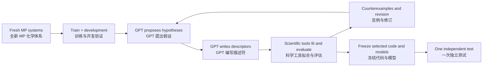

# Tool-using GPT scientific-agent pilot / 工具调用式 GPT 科学代理试验

**English:** A real Codex/GPT agent authored five descriptor programs, executed
14 scientific tool calls, inspected counterexamples and revised a hypothesis.
The selected 12-descriptor program improved formation-energy test MAE from
0.3515 to 0.3138 eV/atom (10.7%) on 721 previously unused MP structures. The
on-hull log-loss change was inconclusive. HGB's formation MAE was 0.2793.

**中文：** 本实验已接入真实 GPT 工具调用：代理自行编写了五组描述符程序，执行
14 次科学工具调用，检查反例并修订假设。在 721 条此前未用过的 MP 测试记录上，
所选程序将形成能误差降低约 10.7%；凸包分类的改善尚不确定。梯度提升对照的
形成能误差仍更低。当前结论属于限定数据与模型下的预测关联。

| Material / 材料 | Link / 链接 |
|---|---|
| English technical report | [REPORT_EN.md](REPORT_EN.md) |
| 中文技术报告 | [REPORT_ZH.md](REPORT_ZH.md) |
| Fixed protocol / 固定实验方案 | [PROTOCOL.md](PROTOCOL.md) |
| Agent tools / 代理工具 | [scientific_server.py](scientific_server.py) |
| GPT-authored selected descriptors / GPT 编写的所选描述符 | [E04/descriptor.py](experiments/E04/descriptor.py) |
| Actual agent calls / 真实调用记录 | [tool_events.jsonl](agent/tool_events.jsonl) |
| Independent test / 独立测试结果 | [test_results.json](evaluation/final/test_results.json) |
| Final audit / 最终审计 | [audit_final.json](audit_final.json) |
| Data / 数据 | [dataset_manifest.json](data/dataset_manifest.json) |
| Replay / 重放说明 | [REPRODUCE.md](REPRODUCE.md) |
| Dependencies / 依赖 | [requirements.txt](requirements.txt) |

This is a PRIS-inspired property-prediction extension. It evaluates formation
energy and on-hull classification using already DFT-relaxed structures. The
archive includes an unsuccessful infrastructure startup and the working recovery;
both are counted in usage. See [STARTUP_RECOVERY.md](STARTUP_RECOVERY.md).

本项目借鉴 PRIS 的假设、计算、反例和修订流程，当前评估形成能与凸包分类。
输入已经经过 DFT 弛豫。首次启动配置失败及其恢复记录均保留，并计入用量。
