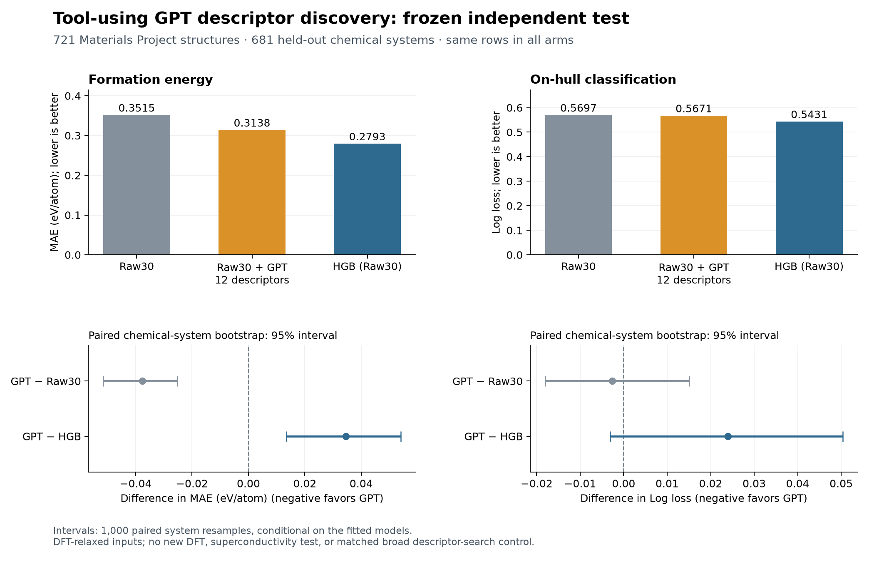

# Tool-using scientific-agent discovery of crystal descriptors

[中文报告](REPORT_ZH.md)

The agent-designed model reduced formation-energy MAE by **10.71%** relative to the raw-feature baseline on 721 new test structures, but remained worse than histogram gradient boosting (HGB). On-hull improvement was unresolved. The executed hypothesis–computation–feedback–revision workflow produced a bounded predictive gain, not universal laws or demonstrated GPT-specific superiority.

## Experiment and data

Inspired by [PRIS](https://arxiv.org/html/2609.01209v1), the agent inspected data, authored descriptor code, requested counterexamples, executed experiments and revised a hypothesis. This extends earlier tool-free proposals but does not reproduce the full PRIS campaign. The [protocol](PROTOCOL.md) fixed boundaries, fitting procedures and budgets.

The 3,600 ordered, DFT-relaxed structures come from the [public MP snapshot, Figshare v38](https://doi.org/10.6084/m9.figshare.22715158.v38), under CC BY 4.0. Target-independent identity-hash sampling required ≤60 original sites and complete original 30 features. Prior MP/3DSC parent chemical systems were excluded. Material IDs, systems and composition signatures do not cross partitions:

| Partition | Structures | Chemical systems |
|---|---:|---:|
| Training | 2,164 | 2,040 |
| Adaptive validation | 715 | 680 |
| Frozen test | 721 | 681 |

Targets are formation energy (eV/atom) and native energy above hull ≤10⁻⁸ eV/atom. The [dataset manifest](data/dataset_manifest.json) and [descriptor schema](data/descriptor_schema.json) record provenance and definitions. Exclusions do not rule out every cross-database duplicate or model-pretraining exposure.

## Observed scientific work

The GPT-5.6-sol Codex session completed **14 scientific MCP calls**: one data description, two inspections, five successful experiments, four counterexample requests, one comparison and one conclusion. The [tool trace](agent/tool_events.jsonl), [transcript](agent/recovered/events.jsonl) and [implementations](experiments/) preserve execution.

| Experiment | Descriptor hypothesis | Validation formation MAE | Validation hull log loss |
|---|---|---:|---:|
| Raw baseline | Original 30 inputs | 0.342530 | 0.565847 |
| E01 | Smooth local contact geometry | 0.319017 | 0.559556 |
| E02 | Cell openness and shape | 0.324630 | 0.561970 |
| E03 | Site-resolved electronegativity contrasts | 0.311338 | 0.552747 |
| E04 | Revised contrasts plus openness | **0.301590** | **0.552641** |
| E05 | Coordination-shell/topology alternative | 0.337721 | 0.562772 |
| HGB reference | Nonlinear model, original 30 inputs | 0.272786 | 0.543171 |

After querying E03's errors, the agent authored E04 to address very open structures: an observed code and hypothesis revision. E05's poorer development performance is consistent with useful E04 information, but its simultaneous changes do **not** isolate contact chemistry's causal contribution. All validation scores are adaptive development evidence.

## Selected descriptors and fitting

Both tasks selected E04. Its [12 descriptors](experiments/E04/descriptor.py) use directed periodic neighbors within 6 Å, retaining image multiplicities, with contact weight

$$
q_{ij}=\frac{d_{ij}}{r_i^{\mathrm{cov}}+r_j^{\mathrm{cov}}},\qquad
w_{ij}=\exp\!\left[-(q_{ij}/1.2)^6\right].
$$

These are covalent, not PRIS Shannon ionic radii; numerical denominator floors are recorded in code. Four groups comprise:

| Group | Included quantities |
|---|---|
| Openness, 2 | Log-transformed volume per atom and directed 6 Å edge count per atom |
| Coordination/contact geometry, 3 | Mean smooth coordination, weighted mean normalized distance, weighted radius mismatch |
| Site chemical contrast, 4 | Mean and spread of absolute signed electronegativity contrast and of unsigned contrast load, each normalized by smooth coordination |
| Chemical organization/coupling, 3 | Electronegativity–coordination correlation, contact electronegativity assortativity, and contrast weighted by normalized-distance deviation |

Names containing “field,” “ionic load” or “strain” are **electronegativity/geometric proxies**. They are not computed electric fields, actual charges or elastic strain.

Each candidate retains all original inputs, using fixed Huber/logistic regression. Scaling, partial-missing-column imputation, missing indicators and duplicate removal use training data only. HGB uses the original inputs. Validation selects each task's candidate, with raw as fallback. [Models](evaluation/models/) and [selection](evaluation/selection.json) freeze before test evaluation, without validation refitting or test-driven revision.

## Frozen test results

| Model | Formation MAE | Formation RMSE | Hull log loss | Hull AUROC |
|---|---:|---:|---:|---:|
| E04 plus original inputs | 0.313819 | 0.473606 | 0.567058 | 0.732464 |
| Raw-feature baseline | 0.351466 | 0.514796 | 0.569673 | 0.720632 |
| Fixed HGB reference | 0.279276 | 0.423956 | 0.543085 | 0.762668 |

The following 95% percentile intervals use 1,000 paired chemical-system bootstrap resamples; negative differences favor E04.

| Primary loss difference | Estimate | Conditional 95% interval |
|---|---:|---:|
| Formation MAE: E04 − raw | −0.037647 | [−0.051501, −0.025197] |
| Formation MAE: E04 − HGB | +0.034543 | [+0.013395, +0.054042] |
| Hull log loss: E04 − raw | −0.002614 | [−0.018057, +0.015068] |
| Hull log loss: E04 − HGB | +0.023973 | [−0.003142, +0.050320] |

Formation improves over raw, while HGB is better. Both hull intervals cross zero; HGB's lower point estimate is unresolved. Intervals omit training/search uncertainty and adaptive research choices. See [exact results](evaluation/final/test_results.json) and [predictions](evaluation/final/test_predictions_with_targets.csv.gz).

## Audit, execution and limits

Independent audits passed [560 development](audit_development.json) and [715 final checks](audit_final.json) on tool use, lineage, boundaries and numerical replay. These are implementation checks, not scientific replications.

A post hoc, label-free [representation audit](check_representation_results.json) tested five training structures. E04 passed 300 comparisons: 240 site-permutation/translation/rotation/supercell checks and 60 reconstruction checks. This does not prove universal invariance. Unselected E02's cell anisotropy failed four supercell checks; no model was revised afterward.

The initial launch could not dispatch scientific tools and ran zero experiments. One manual recovery enabled the required code-mode host; [both launches remain recorded](STARTUP_RECOVERY.md). Combined usage: 382,501 input tokens (17,880 + 364,621), 10,009 output (585 + 9,424), with 323,840 cached-input and 2,686 reasoning-output tokens as subsets. Existing ChatGPT quota was used, not a professor's API key. Six attempts, 24 calls and 900 seconds are execution limits, not a monetary cap.

Frozen [code](evaluator.py), [tests](EVALUATOR_TESTS.md), models and prepared data support replay without LLM calls. Full data regeneration additionally needs [source dependencies](source_dependencies.zip) and public raw downloads; `data_prepare.py` alone is not standalone. The API boundary is not an OS-level hostile-code guarantee.

Without matched broad descriptor-search controls, gains cannot be uniquely attributed to GPT. Already-relaxed inputs establish neither DFT savings, synthesizability, superconductivity nor universal causal laws.

Usage counts cover the two CLI launches only; parent-session development and helper-agent usage are excluded. The original authorized development audit and its clarified successor are both preserved in the [audit provenance note](AUDIT_PROVENANCE_NOTE.md).
