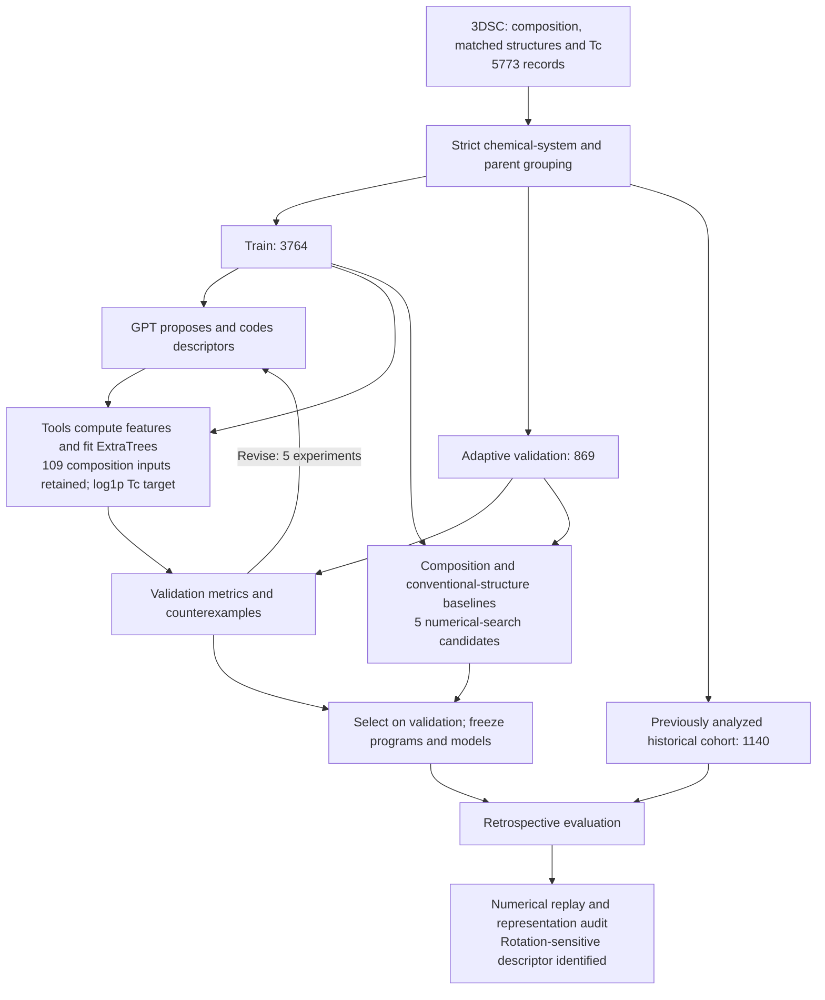

# Superconductivity agent progress report

[English report](REPORT.md) | [中文汇报](REPORT_zh.md)

**Status as of 2026-10-01:** The tool-using superconductivity workflow has completed its first pilot: 12 scientific tool calls and five descriptor experiments. Stable predictive improvement has not been established. The next proposed step is to correct representation issues and compare fixed feature and target variants.

**截至 2026-10-01：** 超导工具调用流程已完成首轮，包含 12 次科学工具调用和 5 次描述符实验。尚未证实稳定预测优势。下一轮拟先修结构表示，再用固定对照检验特征与训练目标。

## Current workflow

[Vector workflow SVG](figures/workflow.svg)

Expand detailed workflow

The historical cohort was excluded from this pilot's adaptive tools but had been analyzed in earlier work. It is **not fresh independent validation**. GPT proposes feature programs; the fixed numerical regressor predicts Tc.

## Published evidence

| Record | Link |
| --- | --- |
| Frozen historical metrics and conditional intervals | [test_results.json](evidence/test_results.json) |
| Label-free representation audit | [representation_audit.json](evidence/representation_audit.json) |
| Final numerical replay audit | [audit_final.json](evidence/audit_final.json) |
| Development replay audit | [audit_development.json](evidence/audit_development.json) |
| Dataset preparation, splits and overlap checks | [preparation_audit.json](evidence/preparation_audit.json) |
| Actual tool activity summary | [agent_activity_summary.json](evidence/agent_activity_summary.json) |
| Selected GPT-authored descriptor code | [selected_descriptor.py](evidence/selected_descriptor.py) |
| Selected development experiment | [selected_development_result.json](evidence/selected_development_result.json) |
| Numerical search | [numeric_control_results.json](evidence/numeric_control_results.json) |
| Exact-copy source hashes | [source_copy_manifest.json](evidence/source_copy_manifest.json) |

This directory is a progress-report subset with supporting measurements, audit records and selected descriptor code. It does not contain the full data, fitted model archive or end-to-end replay package. Existing repository bootstrap commands apply to the original PRIS reproduction, not to this new Tc pilot.

Data attribution: Sommer et al., [3DSC — a dataset of superconductors including crystal structures](https://pmc.ncbi.nlm.nih.gov/articles/PMC10663493/), Scientific Data (2023), [pinned public release](https://github.com/aimat-lab/3DSC/tree/2471dd51a298a854cb4f365ebd39e72c7cbf3634). Original 3DSC data are distributed under CC BY 4.0. The report does not claim new superconducting materials or a pairing mechanism.
