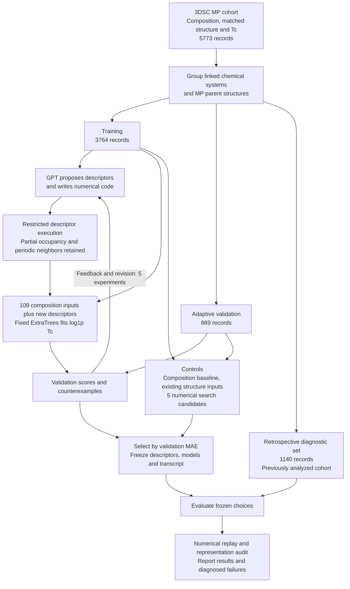
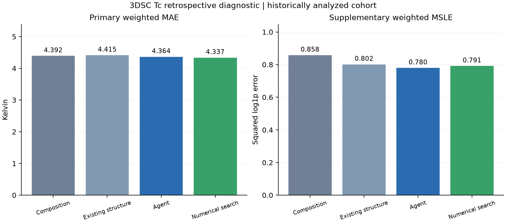

# Superconductivity critical temperature research progress

**Guohuan Feng · Advisor progress report · 2026-10-01**

[中文报告](REPORT_zh.md)

The first tool-using agent pilot for superconducting critical temperature prediction is complete. It established an auditable cycle of descriptor proposals, executable experiments, error inspection and revision. **A reliable prediction advantage has not yet been established.** The selected agent model slightly lowers overall retrospective MAE, but worsens positive-Tc and high-Tc errors; a numerical search control has a slightly better overall point estimate. The next stage will repair identified descriptor defects and test the training target through fixed comparisons before further agent search.

## Current workflow and completed work

The diagram below shows the workflow actually executed in the first pilot. GPT proposes and implements structure descriptors; a fixed ExtraTrees regressor produces numerical Tc predictions. The retrospective branch is separated from adaptive candidate selection within this run, but the entire public cohort had been analyzed previously.

[Vector workflow SVG](figures/workflow.svg)

Expand detailed workflow

Completed work includes **12 processed tool calls and 5 completed descriptor experiments**, with 3 counterexample inspections and no failed experiment attempts. Revisions progressed from bond chemistry to thresholded heteropolar descriptors, then smoother local summaries and a mixing-descriptor ablation. E04 was selected by validation weighted MAE of 8.5914 K; the numerical control selected C04 at 8.5783 K. These are adaptive development scores.

The split contains 1,117 training, 280 validation and 350 retrospective linked components. No chemical-system, MP-parent or canonical-composition overlap crosses the split. Every model retains 109 composition inputs. The fixed regressor uses 160 trees, minimum leaf size 2, seed 20261001 and training-only preprocessing; it fits `log1p(Tc)` with inverse composition-match weights. Validation is not used for refitting. Numerical search matches five candidate attempts and descriptor-count caps, but its feature pool differs from the agent's, limiting attribution of any difference specifically to GPT.

## Frozen retrospective results

**These 1,140 records are historical diagnostic evidence, not fresh independent validation.** Weighted and unweighted metrics coincide for this subset. Lower errors are better.

| Model | MAE K | RMSE K | MSLE |
|---|---:|---:|---:|
| Composition baseline | 4.3920 | 8.6633 | 0.8580 |
| Composition plus 28 existing structure inputs | 4.4147 | 9.1785 | 0.8015 |
| Agent selection E04 | 4.3641 | 9.2020 | 0.7796 |
| Numerical search selection C04 | 4.3372 | 8.8618 | 0.7914 |

Agent minus composition MAE is −0.0279 K, a 0.63% point-estimate reduction. Its paired linked-component bootstrap 95% interval is **[−0.2210, +0.1554] K**, crossing zero. Agent minus numerical-search MAE is +0.0269 K, with interval [−0.1448, +0.2392] K. These intervals use 1,000 resamples of 350 components and are conditional on the frozen models and historical cohort; they exclude training and adaptive-search uncertainty. See [numerical results](evidence/test_results.json).

| Retrospective subgroup | Records | Composition MAE K | Agent MAE K | Numerical search MAE K |
|---|---:|---:|---:|---:|
| Reported Tc = 0 | 361 | 1.5062 | 1.2874 | 1.3064 |
| Tc > 0 | 779 | 5.7294 | 5.7899 | 5.7417 |
| Tc ≥ 40 K | 11 | 42.7240 | 49.6545 | 43.4142 |

The overall MAE reduction comes from reported-zero records in this retrospective subset, while positive- and high-Tc point-estimate errors increase. RMSE also increases. Only 11 retrospective records meet the high-Tc threshold, limiting subgroup conclusions. This pattern is not identical to adaptive validation, so subgroup benefits are unstable. A recorded zero is an upstream Tc report and does not establish universal nonsuperconductivity.

## Diagnosed limitations

The [development audit](evidence/audit_development.json) and [final audit](evidence/audit_final.json) passed implementation checks, including split alignment, training-only preprocessing, frozen hashes, prediction replay and metric recomputation. These establish numerical consistency, not scientific replication.

The [representation audit](evidence/representation_audit.json) tested five training structures: 297 of 300 scalar comparisons passed. All three failures involved `new4_direction_anis` under rigid rotation, with maximum difference 0.0200143. This feature depends on Cartesian axes. The audit was performed after selection; it did not modify frozen predictions and does not establish that this defect caused prediction errors.

A separate synthetic low-occupancy counterexample exposed the denominator `max(sum_weight, 1)`: equivalent supercells can change certain weighted means when total weight is below one. The fixed training cohort check found no record triggering that boundary condition, so it cannot explain the recorded MAE. Both defects motivate checks before fitting in the next run.

Structures are geometry proxies rather than measured structures paired with every Tc specimen. Of the 5,773 records, 3,437 use artificial doping. The 3DSC algorithm modifies species and site occupancies without changing coordinates or distances; whether this limits our predictors requires further analysis. [3DSC original paper](https://www.nature.com/articles/s41597-023-02721-y)

## Proposed second stage

**The second-stage prediction experiments have not been run.** Preserve the first pilot and register six fixed combinations on shared five-fold grouped development splits within the original 3,764 training records:

| Feature inputs | Fit log1p Tc | Fit Tc directly |
|---|---|---|
| Original 109 composition inputs | Combination 1 | Combination 2 |
| Composition plus 11 structure descriptors with corrected normalization, direction term removed | Combination 3 | Combination 4 |
| The same inputs plus a rotation-invariant directional tensor statistic | Combination 5 | Combination 6 |

First correct positive-weight normalization and test reconstruction, site permutation, translation, rotations, supercells and low-occupancy boundaries. A candidate directional replacement is `3 tr(Q²) − 1`, with `Q = sum(w u uᵀ) / sum(w)` for unit bond directions; absent valid neighbors require explicit missing-value handling.

Hold the squared-error criterion and model settings fixed to isolate target transformation. Log-space fitting and selection by kelvin MAE optimize different quantities; a contribution to high-Tc underprediction is a hypothesis. [Official ExtraTrees documentation](https://scikit-learn.org/stable/modules/generated/sklearn.ensemble.ExtraTreesRegressor.html)

Report overall, positive-Tc, reported-zero and high-Tc errors plus signed high-Tc bias. Require positive-Tc MAE not to worsen against the composition control using the same target. Audit source provenance and matching of severe high-Tc errors before changing labels. Resume agent search after these diagnostics, with matched search-space controls where possible. Final generalization claims require data unused in development or historical analysis; neither the current split nor a new random seed supplies that confirmation.

The present contribution is a completed experimental workflow, preserved positive and negative results, and concrete failure diagnoses. Superconducting mechanism discovery, new-material discovery and an independent GPT prediction advantage remain unestablished.
