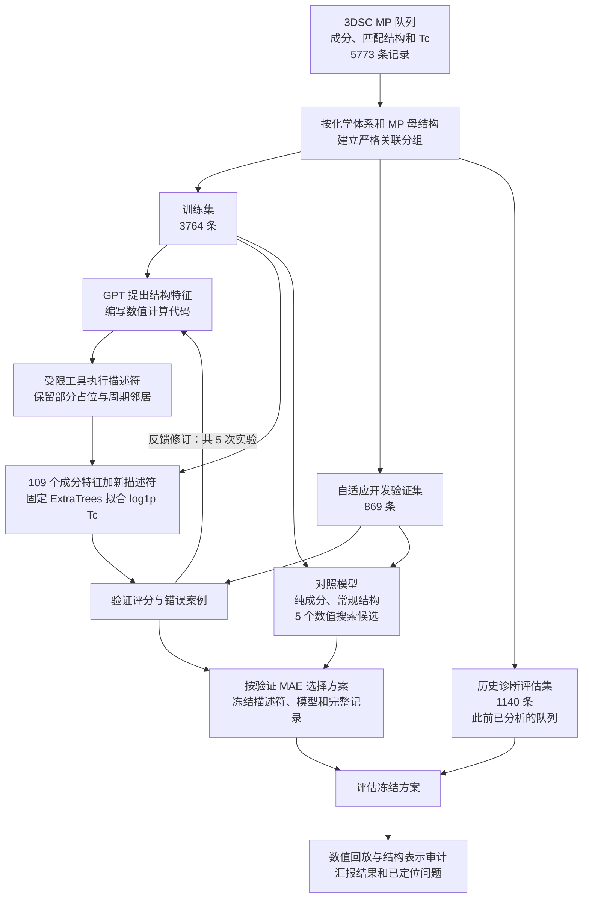

# 超导临界温度研究进展汇报

**Guohuan Feng · 导师进展汇报 · 2026-10-01**

[English report](REPORT.md)

超导临界温度预测的首轮工具调用 Agent 实验已经完成，建立了可审计的“提出结构特征—执行实验—检查误差—反馈修订”流程。**目前尚未证明稳定的预测优势。** Agent 所选模型在历史评估上的整体 MAE 略降，但正 Tc 和高 Tc 样本误差升高；数值搜索对照的整体误差点估计更低。下一阶段将先修复已定位的特征问题，再通过固定对照检验训练目标，之后决定如何继续 Agent 搜索。

## 当前流程与已完成工作

以下为首轮实际执行的流程。GPT 负责提出和编写结构描述符，固定 ExtraTrees 回归器负责输出数值 Tc。历史评估分支未参与本轮自适应候选选择，但整个公共队列此前已被分析过。

已完成 **12 次工具调用和 5 次描述符实验**，其中 3 次检查错误案例，实验失败次数为 0。特征从键合化学、硬阈值异极性描述，修订到平滑局部环境统计，并执行了混合描述符消融。按验证加权 MAE 选出 Agent 的 E04（8.5914 K）；数值搜索选出 C04（8.5783 K）。这些是用于选择模型的自适应开发分数。

训练、验证、历史评估分别包含 1117、280、350 个严格关联分组，化学体系、MP 母结构和规范成分均无跨集合重叠。各模型保留 109 个成分特征；固定回归器使用 160 棵树、最小叶节点样本数 2、种子 20261001，仅在训练数据上拟合预处理和 `log1p(Tc)`，采用成分匹配次数的倒数作为权重。验证集不参与重新拟合。数值搜索匹配 5 次候选实验与特征数量上限，但特征池与 Agent 不同，因此不足以单独归因于 GPT。

## 冻结后的历史评估结果

**这 1140 条属于历史诊断证据，不是新的独立验证。** 该子集的加权与不加权指标相同，误差越小越好。

| 模型 | MAE K | RMSE K | MSLE |
|---|---:|---:|---:|
| 纯成分基线 | 4.3920 | 8.6633 | 0.8580 |
| 成分加 28 个常规结构特征 | 4.4147 | 9.1785 | 0.8015 |
| Agent 所选 E04 | 4.3641 | 9.2020 | 0.7796 |
| 数值搜索所选 C04 | 4.3372 | 8.8618 | 0.7914 |

Agent 相对纯成分的 MAE 差为 −0.0279 K，点估计降低 0.63%；配对分组 bootstrap 的 95% 区间为 **[−0.2210, +0.1554] K，跨越零**。相对数值搜索的 MAE 差为 +0.0269 K，区间为 [−0.1448, +0.2392] K。区间来自 350 个关联分组的 1000 次重采样，条件于冻结模型和历史队列，不包括重新训练或自适应搜索的不确定性。详见[数值结果](evidence/test_results.json)。

| 历史评估子群 | 条数 | 纯成分 MAE K | Agent MAE K | 数值搜索 MAE K |
|---|---:|---:|---:|---:|
| 记录 Tc = 0 | 361 | 1.5062 | 1.2874 | 1.3064 |
| Tc > 0 | 779 | 5.7294 | 5.7899 | 5.7417 |
| Tc ≥ 40 K | 11 | 42.7240 | 49.6545 | 43.4142 |

历史评估中的整体 MAE 改善来自记录零值样本，正 Tc 和高 Tc 的误差点估计升高，整体 RMSE 也升高。高 Tc 仅 11 条，难以支持稳定子群结论。该表现与自适应验证集不同，应表述为子群收益不稳定。上游记录的 Tc 为零也不意味着所有条件下均不超导。

## 已定位的问题

[开发审计](evidence/audit_development.json)和[最终审计](evidence/audit_final.json)通过了分组对齐、训练预处理、冻结哈希、预测回放和指标重算等实现检查。这说明数值流程一致，不等同于科学结论被独立复现。

[结构表示审计](evidence/representation_audit.json)对 5 个训练结构进行了 300 项标量比较，297 项通过。3 项失败全部来自 `new4_direction_anis` 的整体旋转检查，最大差为 0.0200143。该特征依赖笛卡尔坐标轴。检查发生在选择之后，未修改冻结预测，也未证明它导致了预测误差。

另一个合成低占位反例暴露了 `max(sum_weight, 1)` 分母的问题：总权重小于 1 时，等价超胞可能改变部分加权均值。固定训练队列检查未发现触发此边界条件的记录，因此该反例不能解释已取得的 MAE。下一轮应将两类检查前移到训练之前。

结构是几何代理，未必是每条 Tc 实验样品对应的实测结构。本队列 5773 条中有 3437 条人工掺杂记录。3DSC 算法改变元素和位点占位，却不改变坐标或原子间距；这是否限制当前预测器仍需检验。[3DSC 原论文](https://www.nature.com/articles/s41597-023-02721-y)

## 第二阶段方案

**第二阶段预测实验尚未运行。** 保留首轮冻结结果，在原始 3764 条训练记录内，预先固定共享的五折分组开发划分，只比较六个组合：

| 特征输入 | 拟合 log1p Tc | 直接拟合 Tc |
|---|---|---|
| 原始 109 个成分特征 | 组合 1 | 组合 2 |
| 成分加修正归一化后的 11 个结构特征，删除方向项 | 组合 3 | 组合 4 |
| 同一组输入加旋转不变的方向张量统计量 | 组合 5 | 组合 6 |

先修正正权重的归一化，并测试原样重建、位点重排、平移、旋转、超胞与低占位边界。方向项的替换候选为 `3 tr(Q²) − 1`，其中 `Q = sum(w u uᵀ) / sum(w)`、u 为单位键方向；无有效邻居时须明确处理缺失值。

固定平方误差准则与模型参数，以隔离目标变换的作用。对数空间拟合与按 K 单位 MAE 选择优化的是不同量；对数变换参与高 Tc 低估目前只是假设。[ExtraTrees 官方文档](https://scikit-learn.org/stable/modules/generated/sklearn.ensemble.ExtraTreesRegressor.html)

同时报告整体、正 Tc、记录零值、高 Tc 的误差与高 Tc 有符号偏差；要求正 Tc MAE 不劣于采用同一训练目标的纯成分对照。先核查严重高 Tc 误差样本的实验来源和结构匹配，再决定是否修正标签。诊断完成后再恢复 Agent 搜索，尽可能补充相同特征空间的搜索对照。最终泛化确认需要未参与开发及历史分析的数据；当前划分或更换随机种子均不能提供这种确认。

目前的研究进展是完整实验流程、保留的正负结果和明确的失败诊断。尚未建立超导机制发现、新材料发现或 GPT 独立预测优势。
