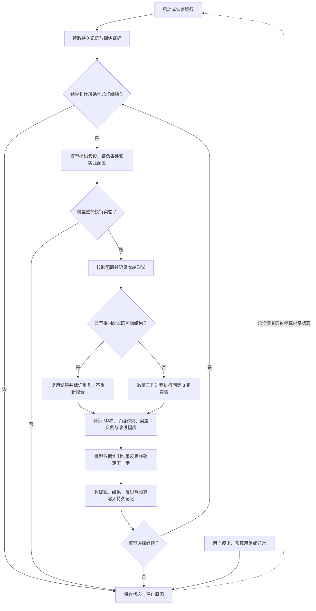

# 超导研究 Agent 自循环控制程序

本程序让超导研究 Agent 在一次启动后，自动完成“提出假设 → 执行实验 → 检查结果 → 反思 → 修改方案 → 下一轮”。每轮结果和决策进入持久记忆，后续实验由模型依据反馈选择。当前工作的成果是可持续执行的研究控制流程；预测能力是否提高，需要另行验证。

## 数据集与实验任务

任务是预测材料的超导临界温度 Tc，单位为 K。数据来自已公开的 [3DSC MP Tc pilot](https://huggingface.co/datasets/fgh123654/3dsc-mp-tc-pilot)，本控制程序沿用 [第二版实验](../superconductivity-agent-2026-10-02/REPORT_zh.md) 的训练数据和固定划分。

| 项目 | 本轮采用的内容 |
| --- | --- |
| 训练反馈 | 3,764 条记录、1,117 个严格关联组；固定 3 折分组交叉验证 |
| 输入特征 | 109 个成分特征，或成分特征加 12 个修复后的结构特征 |
| 优化指标 | 训练集折外预测的加权 MAE，越低越好 |
| 子组约束 | 正 Tc 样本的加权 MAE 不超过固定基线 G01 的 8.832166 K |
| 原有验证集 | 869 条记录；本自循环不读取其输入、标签或评估结果 |

本轮只复制明确允许的训练文件、固定划分、代码和已有训练折外结果，并核对文件哈希。反例分析也只使用训练折外预测。此前观察过的训练数据被继续用于方案开发，因此这里的指标改善不能作为独立泛化证据。

## 代码流程




`controller.py` 控制循环与停止条件，`llm_client.py` 调用模型完成提案和反思，`worker.py` 与 `workbench_adapter.py` 执行和核验实验。`runtime.py` 保存 SQLite 状态、事件日志和检查点，并防止同一运行目录被多个控制程序同时执行。

Agent 可以自行选择输入组合、全局模型、原始或 `log1p` 目标、成分规则或 KMeans 分组，以及各组的专家模型。候选回归器为 Extra Trees 和直方图梯度提升 HGB。模型超参数、数据划分、评价指标与允许动作范围固定；当前版本不自动编写任意新代码。

## 每轮如何判断结果

模型需要在实验前写出假设、修改依据和证伪条件。实验后，程序先按数值规则判断：正 Tc 子组约束是否通过，整体 MAE 是否比当前最佳方案至少降低 0.01 K。通过约束且达到改进幅度的新配置才更新最佳方案。模型随后解释实测结果和子组变化，提出下一步关注点；控制程序自动把这些内容带入下一轮提案。

重复配置复用已有结果，仍消耗一次尝试，不计为新改进。无效配置、执行失败和未达到改进条件的结果会增加停滞计数。执行失败会明确记录为没有新的科学证据。

默认每次运行最多 12 次实验尝试、30 次模型调用、3,600 秒累计子进程运行时间；连续 4 次未取得合格改进时停止。提案和反思各占一次模型调用；单次模型调用或数值工作进程的时间上限均为 240 秒。模型也可根据证据主动停止，用户可随时发出停止命令。上述总预算、停滞次数和改进阈值可在启动时设置；恢复同一运行时保留原预算和历史。

## 当前结果

启动时，程序从已有训练证据确定初始最佳方案，并固定子组约束：

| 方案 | 训练折外加权 MAE | 正 Tc 加权 MAE | 在自循环中的作用 |
| --- | ---: | ---: | --- |
| G01 | 7.912683 K | 8.832166 K | 固定正 Tc 子组约束的来源 |
| A05 | 7.752599 K | 8.505080 K | 初始最佳方案，后续候选需要超过它 |

这些数值来自已有实验，不能算成本次自循环的新结果。第二版原有验证结果和结论保持冻结，参见[原报告](../superconductivity-agent-2026-10-02/REPORT_zh.md)。

### 自循环运行证据

真实运行已完成 **2 个连续循环**，由 `gpt-5.6-sol` 提案和反思。第一轮反馈进入第二轮上下文，模型据此选择下一项实验，中间无需人工提示继续。

| 方案 | 本轮修改 | 训练折外加权 MAE | 正 Tc 加权 MAE | 结果 |
| --- | --- | ---: | ---: | --- |
| A05 | 起始最佳方案 | 7.752599 K | 8.505080 K | 保留 |
| L001 | 保留 Cu O 与 other 专家，将 Fe 阴离子组的全局回退改为 HGB raw | 7.793528 K | 8.558194 K | 通过子组约束，但整体更差 |
| L002 | 根据第一轮反思，改为 Fe 阴离子组专用 HGB raw 专家，其他配置恢复 A05 | 7.801821 K | 8.544867 K | 通过子组约束，但整体更差 |

第一轮反思指出“改变全局回退没有收益”，随后自动提出“只在 Fe 阴离子组训练 HGB 专家”的第二轮假设。两次都是新配置，共产生 **21 次回归器拟合**；4 次模型调用成功完成提案与反思，累计受控子进程耗时 **223.108 秒**。程序保留 A05，并在本次事先设定的 **2 次实验预算**用完后结束。正式默认上限为 12 次，本次 2 次用于验证闭环。

**结论：自循环控制流程已跑通；本轮没有预测精度提升，不能声称发现新超导材料或获得泛化收益。** 31 项自动测试通过，覆盖反馈进入下一轮、持久化恢复、重复配置、预算、取消、互斥和训练证据检查。

可直接核查：[运行摘要](evidence/run_summary.json)、[完整状态与两轮反思](evidence/status.json)、[第一轮反思](evidence/calls/003_reflect/decision.json)、[受该反思驱动的第二轮提案](evidence/calls/004_propose/decision.json)、[测试结果](verification.json)、[独立证据核验](demo_verification.json)。`python verify_demo.py` 可独立检查已发布的两轮证据并重算 MAE。

运行记录保留一次本地启动配置失败：CLI 0.160.0 拒绝旧的零值参数，失败发生在远程模型启动前；修正后继续，原占用额度保留，因此累计记录为 5 次额度预留、4 次成功模型调用。更早的一次失效可执行文件路径检查也未启动远程模型，未混入这次运行结果。

审阅时纠正一处模型措辞：最后反思中的“菜单已穷尽”没有证据支持。实际只用完本次两次实验预算，允许动作并未穷举；原始反思保留，但报告不采用该推断。

## 启动与查看

在本目录使用已有科学计算 Python 环境和已登录的 Codex CLI 运行。源目录应指向相邻的第二版实验目录；运行目录建议放在本机非同步文件夹中。

```sh
python controller.py run --source-dir ../superconductivity-agent-2026-10-02 --run-dir ~/tc-self-loop/runs/example
python controller.py status --run-dir ~/tc-self-loop/runs/example
python controller.py stop --run-dir ~/tc-self-loop/runs/example
python controller.py resume --source-dir ../superconductivity-agent-2026-10-02 --run-dir ~/tc-self-loop/runs/example
```

运行目录中的 `status.json` 提供当前状态，`memory_export.json` 提供事件记录；`calls/` 保存模型输入和决策，`cycles/` 保存各轮实验与反馈，`workbench/candidates/` 保存折外预测证据。完整状态保存在 `memory.sqlite`。

已持久化的模型决策和完整实验结果可以复用，从相应阶段继续。若中断导致一次模型调用是否完成无法确定，程序进入 `attention_required`，保留调用记录供检查，避免自动重复请求。部分完成的拟合不能保证完全免于重做。达到预算、停滞条件或模型主动结束的运行保持停止状态；扩展预算需建立新的运行记录。
