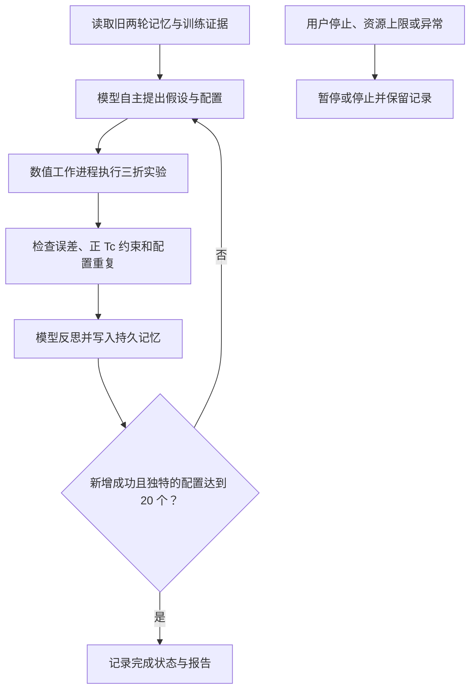
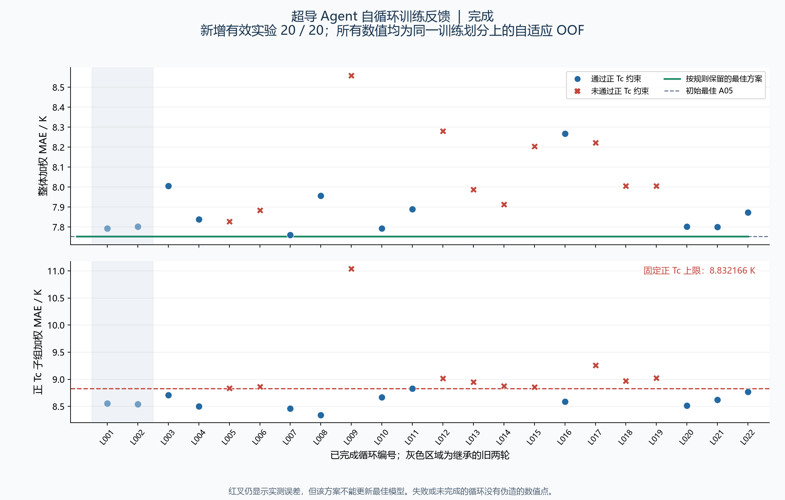

# 超导 Agent 新增二十轮自循环实验

**COMPLETE · 已完成**。本报告记录继承旧两轮记忆后，新增至少 20 个成功完成、配置不重复的实验。当前新增完成 **20 / 20**，继承 2 个旧实验。当前最佳方案为 **A05，训练折外加权 MAE 7.752599 K**。

快照生成时间：**2026-10-05T11:23:20.208615-04:00，America/New_York**。运行状态 `stopped`，当前阶段 `propose`；停止原因 `minimum_completed_experiments_reached`。正在执行但尚未完成反思的实验不计入完成数。

## 数据集和评价范围

| 项目 | 内容 |
| --- | --- |
| 数据来源 | [3DSC MP Tc pilot](https://huggingface.co/datasets/fgh123654/3dsc-mp-tc-pilot) |
| 训练反馈 | 3,764 条记录，1,117 个严格关联组；固定 3 折分组交叉验证 |
| 实际输入 | 成分 109 列，或成分 109 列加修复后的结构 12 列 |
| 主指标 | 加权训练折外 MAE，单位 K；越低越好 |
| 正 Tc 约束 | MAE 不超过固定 G01 基线的 8.832166 K |
| 独立验证 | 本续跑没有读取验证标签，也没有重新计算验证结果 |

`composition_repaired` 实际指“成分特征 + 修复后的结构特征”，不是“修复后的成分表示”。成分规则和 KMeans 是操作性分组，不等同于经验证的物理材料族。模型生成的假设和反思是待检验解释，不能作为机制证据。

数据、特征和样本划分均沿用冻结的第二版来源，归属与再使用说明见[数据来源记录](../superconductivity-agent-2026-10-02/DATA_PROVENANCE.md)和[上游许可](../superconductivity-agent-2026-10-02/UPSTREAM_LICENSE.md)。

## 自循环和本次继续条件



程序自主选择下一轮的输入、目标变换、路由和回归器。本次在新增 20 个有效实验完成前，延后模型主动停止和连续停滞停止；失败和重复尝试不充数。用户停止与资源上限始终生效。包括旧两轮的总完成下限为 22；达到下限后自动停止。

本次累计上限为 42 次尝试、105 次模型调用、14,400 秒子进程运行时间；单次模型调用 / 数值工作进程上限为 360 / 900 秒。旧运行计数被继承，没有重置。更新最佳方案仍需通过正 Tc 约束，并至少降低 0.01 K。

## 当前结果

| 项目 | 快照结果 |
| --- | ---: |
| 新增有效实验 / 要求 | 20 / 20 |
| 新增已完成循环，含失败或重复 | 20 |
| 新增已完成循环的回归器拟合 | 165 |
| 新增成功模型调用，已有完成回执 | 40 |
| 新增模型调用，含在途已预留调用 | 40 |
| 新增已计入的子进程时间 | 1752.6 秒 |
| 新增循环未通过正 Tc 约束 | 10 |
| 新增循环触发最佳方案更新 | 0 |
| 当前最佳方案相对初始 A05 的 MAE 降幅 | 0.000000 K |

初始 A05 的整体 MAE 为 7.752599 K，正 Tc MAE 为 8.505080 K。新增实验中，通过正 Tc 约束的最低整体 MAE 为 **L007：7.761155 K**。

以上均为同一训练划分反复参与方案选择后的 OOF 开发结果；不能据此宣称独立泛化提升或发现新的超导机制。报告中的改进计数是控制程序按固定规则的记录，完整性审计仍应以发布包中的核验记录为准。



[下载矢量图](figures/progress.svg)。灰色区域标出继承的旧两轮；红叉标出未通过正 Tc 约束的实测配置。

## 新增实验结果矩阵

| 实验 | 整体 MAE K | 正 Tc MAE K | 约束 | 更新最佳 | 回归器拟合 | 计入新增完成数 |
| --- | ---: | ---: | --- | --- | ---: | --- |
| [L003](evidence/cycles/L003/evaluation.json) | 8.006128 | 8.710481 | 通过 | 否 | 9 | 是 |
| [L004](evidence/cycles/L004/evaluation.json) | 7.838040 | 8.501694 | 通过 | 否 | 6 | 是 |
| [L005](evidence/cycles/L005/evaluation.json) | 7.827243 | 8.835551 | 未通过 | 否 | 6 | 是 |
| [L006](evidence/cycles/L006/evaluation.json) | 7.883749 | 8.864591 | 未通过 | 否 | 9 | 是 |
| [L007](evidence/cycles/L007/evaluation.json) | 7.761155 | 8.461477 | 通过 | 否 | 9 | 是 |
| [L008](evidence/cycles/L008/evaluation.json) | 7.957731 | 8.338205 | 通过 | 否 | 9 | 是 |
| [L009](evidence/cycles/L009/evaluation.json) | 8.558511 | 11.037285 | 未通过 | 否 | 9 | 是 |
| [L010](evidence/cycles/L010/evaluation.json) | 7.792985 | 8.669032 | 通过 | 否 | 12 | 是 |
| [L011](evidence/cycles/L011/evaluation.json) | 7.889043 | 8.829194 | 通过 | 否 | 12 | 是 |
| [L012](evidence/cycles/L012/evaluation.json) | 8.280389 | 9.016631 | 未通过 | 否 | 12 | 是 |
| [L013](evidence/cycles/L013/evaluation.json) | 7.988238 | 8.949617 | 未通过 | 否 | 6 | 是 |
| [L014](evidence/cycles/L014/evaluation.json) | 7.913146 | 8.875420 | 未通过 | 否 | 6 | 是 |
| [L015](evidence/cycles/L015/evaluation.json) | 8.204372 | 8.855926 | 未通过 | 否 | 6 | 是 |
| [L016](evidence/cycles/L016/evaluation.json) | 8.267920 | 8.586141 | 通过 | 否 | 6 | 是 |
| [L017](evidence/cycles/L017/evaluation.json) | 8.223005 | 9.256742 | 未通过 | 否 | 6 | 是 |
| [L018](evidence/cycles/L018/evaluation.json) | 8.006869 | 8.968596 | 未通过 | 否 | 6 | 是 |
| [L019](evidence/cycles/L019/evaluation.json) | 8.005762 | 9.022514 | 未通过 | 否 | 6 | 是 |
| [L020](evidence/cycles/L020/evaluation.json) | 7.802085 | 8.514591 | 通过 | 否 | 9 | 是 |
| [L021](evidence/cycles/L021/evaluation.json) | 7.801541 | 8.625429 | 通过 | 否 | 12 | 是 |
| [L022](evidence/cycles/L022/evaluation.json) | 7.873843 | 8.767759 | 通过 | 否 | 9 | 是 |

拟合次数来自完成候选的回归器计数，不含 KMeans；在途或中断未完成的工作不混入该统计。

## 每轮配置与待检验问题

ET 为 Extra Trees，HGB 为直方图梯度提升；`raw` 与 `log1p` 表示目标变换。未列出的专家组使用全局模型。下表按实际配置变化整理待检验问题，原始模型假设与反思见[完整状态记录](evidence/status.json)。

| 实验 | 实际输入 | 分组 | 全局模型 | 专家模型 | 待检验问题 |
| --- | --- | --- | --- | --- | --- |
| L003 | 成分 109 + 修复结构 12 | 成分规则 | ET/raw | cu_o=ET/raw; other=ET/raw | 相对 A05：输入改为 成分 109 + 修复结构 12；检验能否合格改进 |
| L004 | 成分 109 | 成分规则 | ET/raw | cu_o=ET/raw | 相对 A05：other → 回退全局；检验能否合格改进 |
| L005 | 成分 109 | 成分规则 | ET/raw | other=ET/raw | 相对 A05：cu_o → 回退全局；检验能否合格改进 |
| L006 | 成分 109 | 成分规则 | ET/raw | cu_o=ET/raw; other=ET/log1p | 相对 A05：other → ET/log1p；检验能否合格改进 |
| L007 | 成分 109 | 成分规则 | ET/raw | cu_o=ET/raw; other=HGB/raw | 相对 A05：other → HGB/raw；检验能否合格改进 |
| L008 | 成分 109 | 成分规则 | ET/raw | cu_o=HGB/raw; other=ET/raw | 相对 A05：cu_o → HGB/raw；检验能否合格改进 |
| L009 | 成分 109 | 成分规则 | ET/raw | cu_o=HGB/log1p; other=ET/raw | 相对 L008：cu_o → HGB/log1p；检验能否合格改进 |
| L010 | 成分 109 | 成分规则 | ET/raw | cu_o=ET/raw; fe_anion=ET/log1p; other=ET/raw | 相对 A05：fe_anion → ET/log1p；检验能否合格改进 |
| L011 | 成分 109 | 成分规则 | ET/raw | cu_o=ET/raw; fe_anion=HGB/log1p; other=ET/raw | 相对 L010：fe_anion → HGB/log1p；检验能否合格改进 |
| L012 | 成分 109 | KMeans 三组 | ET/raw | cluster0=ET/raw; cluster1=ET/raw; cluster2=ET/raw | 相对 G01：分组改为 KMeans 三组; cluster0 → ET/raw; cluster1 → ET/raw; cluster2 → ET/raw；检验能否合格改进 |
| L013 | 成分 109 | KMeans 三组 | ET/raw | cluster2=ET/raw | 相对 L012：cluster0 → 回退全局; cluster1 → 回退全局；检验能否合格改进 |
| L014 | 成分 109 | KMeans 三组 | ET/raw | cluster0=ET/raw | 相对 L012：cluster1 → 回退全局; cluster2 → 回退全局；检验能否合格改进 |
| L015 | 成分 109 | KMeans 三组 | ET/raw | cluster1=ET/raw | 相对 L012：cluster0 → 回退全局; cluster2 → 回退全局；检验能否合格改进 |
| L016 | 成分 109 | KMeans 三组 | ET/raw | cluster1=HGB/raw | 相对 L015：cluster1 → HGB/raw；检验能否合格改进 |
| L017 | 成分 109 | KMeans 三组 | ET/raw | cluster0=HGB/raw | 相对 L014：cluster0 → HGB/raw；检验能否合格改进 |
| L018 | 成分 109 | KMeans 三组 | ET/raw | cluster2=HGB/raw | 相对 L013：cluster2 → HGB/raw；检验能否合格改进 |
| L019 | 成分 109 | KMeans 三组 | ET/raw | cluster2=ET/log1p | 相对 L013：cluster2 → ET/log1p；检验能否合格改进 |
| L020 | 成分 109 | 成分规则 | HGB/raw | cu_o=ET/raw; other=HGB/raw | 相对 L007：全局改为 HGB/raw；检验能否合格改进 |
| L021 | 成分 109 | 成分规则 | ET/raw | cu_o=ET/raw; fe_anion=ET/log1p; other=HGB/raw | 相对 L007：fe_anion → ET/log1p；检验能否合格改进 |
| L022 | 成分 109 | 成分规则 | ET/log1p | cu_o=ET/raw; other=HGB/raw | 相对 L021：全局改为 ET/log1p; fe_anion → 回退全局；检验能否合格改进 |

## 代码与可追溯记录

[旧两轮及原自循环流程](../superconductivity-self-loop-2026-10-02/README_zh.md)和[第二版冻结实验](../superconductivity-agent-2026-10-02/REPORT_zh.md)保持原样。`fork_run.py` 复制经过核验的父运行并保存谱系；`controller.py` 执行完成下限与自动循环；`llm_client.py` 负责模型决策；`worker.py` 与 `workbench_adapter.py` 执行训练实验。

[运行谱系](evidence/lineage.json)记录父运行状态和哈希；[状态快照](evidence/status.json)记录每轮提案、结果、反思及预算。暂停或崩溃恢复沿用相同运行状态，不能通过恢复重置预算。

[44 项程序测试](verification.json)覆盖控制、恢复、最少完成次数和训练适配器；这些测试中的模型决策与数值实验使用模拟对象，不能代替真实运行证据。[最终独立运行审计](run_audit.json)重新计算已保存的训练折外指标、重放事件，并核对模型回执、候选配置和文件哈希。

最终完成要求为：至少新增 20 个成功且配置不同的完整循环、累计至少 22 个；运行因 `minimum_completed_experiments_reached` 停止，且没有待完成调用、提案、结果或数值工作。最终审计中的 `checks_passed` 和 `final_completion_verified` 均须为 `true`。可在发布目录执行：

```sh
python audit_run.py --run-dir evidence --output audit_check.json
```

重新生成报告:

```sh
python build_report.py --run-dir ~/tc-self-loop/runs/continuation-20
```

本报告从只读状态快照生成；状态内容的规范 JSON SHA256：`04c9fb4a3c2246f7d1610c8b3268b88d2cef1b4c6cb8addc70f0592d4eeab75f`。

UTC: `2026-10-05T15:23:20.208615+00:00`.
