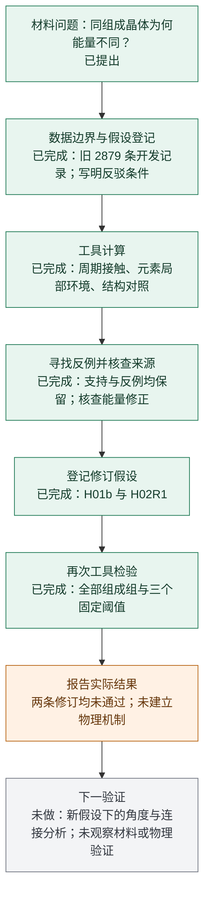

# 材料能量与稳定性：Agent 研究流程与当前进展

[English briefing](README_EN.md) | [中文汇报](README.md)

2026-10-01｜导师汇报用研究记录

**目标：让 Agent 从具体晶体结构出发，提出并检验材料能量与稳定性的解释。** 本轮已完成两条“假设 → 工具计算 → 反例 → 修订 → 再检验”研究链，使用已观察的 2,879 条开发记录。**两条修订均未通过预先写明的检验，尚未得到稳健物理机制或普遍规律。**

**公开数据入口：** [Hugging Face 数据集页面](https://huggingface.co/datasets/fgh123654/materials-energy-stability-agent-dev) · [在线材料表](https://huggingface.co/datasets/fgh123654/materials-energy-stability-agent-dev/viewer/default/development) · [materials.csv](https://huggingface.co/datasets/fgh123654/materials-energy-stability-agent-dev/blob/main/materials.csv) · [完整准备结构下载](https://huggingface.co/datasets/fgh123654/materials-energy-stability-agent-dev/resolve/main/structures.jsonl.gz?download=true) · [全部文件目录](https://huggingface.co/datasets/fgh123654/materials-energy-stability-agent-dev/tree/main)。完整结构文件为 `structures.jsonl.gz`；`features.csv.gz` 和 `targets.csv.gz` 分别保存原特征与标签。

这 2,879 条数据均已观察，包括历史训练角色 2,164 条、自适应验证角色 715 条。在线材料表已可浏览，HF Viewer 配置为 `default/development`；原 `split` 列保留历史角色，不代表新增独立测试。

| 导师需要快速了解的内容 | 当前状态 |
|---|---|
| 实际工作 | 分析 39 组同组成材料、80 个结构、43 对结构；计算周期接触与局部环境，核查原始条目，保留支持例和反例 |
| 已完成的研究结果 | 全局短接触解释缺乏一致方向；修订 H01b 未获支持；Mg₂ZnAs₂ 的修订 H02R1 只在一个阈值成立，未通过三个阈值的稳健性检验 |
| 尚未完成的验证 | 未观察材料上的独立确认、物理计算或实验验证；本轮没有拟合新预测模型或开展新 DFT |
| 下一步问题 | 在计算设置与能量修正类别匹配的同组成材料中，检验局部角度和周期连接是否提供简单接触统计遗漏的信息 |

查看可编辑的 Mermaid 流程图

绿色表示工作已经执行，不能解释为假设得到支持。

阅读 [中文主报告](REPORT_ZH.md) 查看具体材料、失败的修订和下一步依据；[方法与审计摘要](EVIDENCE.md) 说明计算定义及来源限制。已发布的证据包括 [39 组接触对照](evidence/H01_pairs.csv)、[修订组分数](evidence/H01b_group_scores.csv)、[环境阈值检验](evidence/matched_pairs_stage2.csv)、[来源核查](evidence/source_quality_report.json) 与 [进展摘要](evidence/progress_summary.json)。

本轮由当前 Codex 协调 Agent 与三个子 Agent 执行。使用的是此前已观察的数据；工具计算和数值重放不等于独立科学验证。本目录发布导师报告、图表、完整组表和经过路径清理的摘要；2,879 条准备后的输入已在 HF 公开，完整分析源码及全部重放包仍未完整公开。源数据为 Materials Project / Matbench Discovery 公开快照，记录许可证为 CC BY 4.0。
