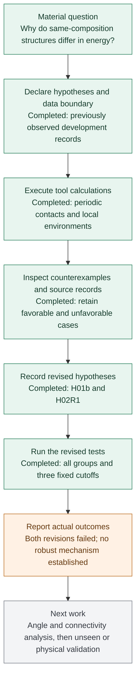

# Agent investigation of material energy and stability

[English briefing](README_EN.md) | [中文汇报](README.md)

2026-10-01 | Research progress for supervisor review

**This round completed two investigations in which agents proposed an explanation, calculated structural evidence, retained counterexamples, revised the explanation and tested it again. Both revisions failed their recorded criteria. A robust physical mechanism has not been established.**

The investigation used 2,879 previously observed development records and examined 39 repeated-composition groups containing 80 materials and 43 structure pairs. It also verified eight examples against their original source entries. The main progress is a completed research process, explicit negative results and a narrower next question. See the [progress summary](evidence/progress_summary.json).

| What has progressed | Current result |
|---|---|
| Short-contact explanation | No consistent direction across all composition groups; its element-pair revision also failed |
| Local-environment explanation | Descriptors distinguish several structures, but a proposed Mg2ZnAs2 ordering failed robustness across three fixed cutoffs |
| Source and stability checks | Bi has a nonzero oxide/peroxide correction difference; a group minimum need not lie on the database hull |
| Next investigation | Test angles and periodic connectivity within matched compositions, correction categories and computational settings |

Read the [full English report](REPORT_EN.md) for specific materials, test results and the next research question. This directory publishes the faculty report, figures and selected complete comparison tables; it does not include the full local source code, raw inputs or replay archive.

Editable Mermaid workflow

Completed work does not mean a supported hypothesis. A [static workflow figure](figures/workflow_en.png) is also available.

Selected evidence includes the [initial contact comparisons](evidence/H01_pairs.csv), [revised contact scores](evidence/H01b_group_scores.csv), [environment cutoff comparisons](evidence/matched_pairs_stage2.csv) and [source quality report](evidence/source_quality_report.json). [EVIDENCE.md](EVIDENCE.md) describes the evidence and its limits.

This round fitted no predictor, inspected no previous confirmation or final records, and performed no new DFT. It is exploratory work on already observed, previously calculated structures. Tool replay is not an additional scientific replication. H02's successful first-stage implementation was not independently snapshotted; numerical reproducibility of the final implementation cannot repair that historical gap.

The investigators are the current Codex coordinating agent and three subagents. This is distinct from the GPT CLI discovery run on 2026-09-30 and does not inherit that run's model identity or budget. Source data are the released Materials Project and Matbench Discovery snapshot, recorded as CC BY 4.0.
