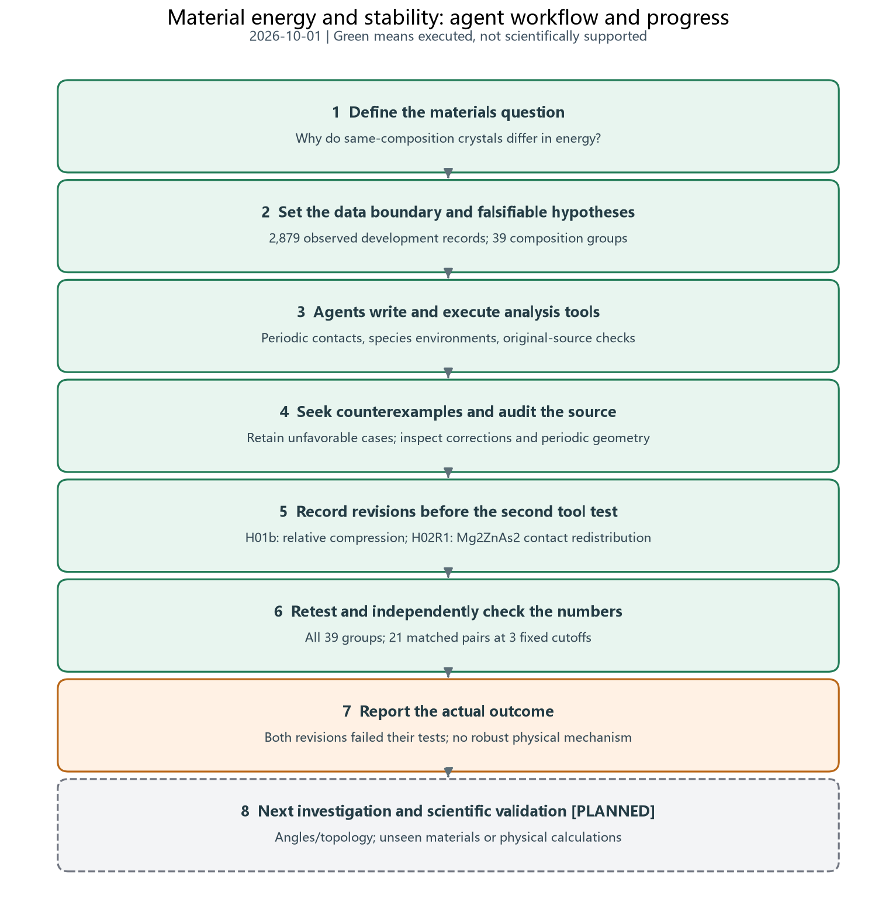
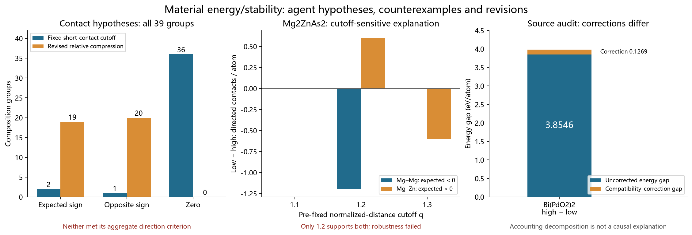

# Agent research progress on material energy and stability

2026-10-01 | Exploratory investigation of previously observed development data

**Two hypothesis, calculation, counterexample and revision cycles are complete. Both revised explanations failed their specified tests. The resulting progress is a documented set of failures, verified source associations and a more precise next research question, rather than an established physical mechanism.** See the [progress summary](evidence/progress_summary.json).

## Data and research process

The current Codex coordinating agent and three investigators examined only the old 2,879 development records: 2,164 train-role and 715 adaptive-validation-role records. They identified 39 repeated-composition groups, 80 materials and 43 unordered pairs. Exact fractional compositions were checked, so matching means equal elemental proportions, not necessarily equal cell sizes. The [composition groups](evidence/composition_groups.csv) and [pair inventory](evidence/composition_pairs.csv) preserve the comparison scope.

No predictor was fitted, no previous confirmation or final records were inspected, and no new DFT was performed. Initial examples and labels were already observed. All hypothesis revisions are exploratory, and the structures were already calculated records. This investigation establishes neither independent confirmation nor savings before DFT.

## Contact explanations and their failures

H01 defined a very short geometric contact as q less than 0.8, where q is distance divided by the sum of fixed elemental covalent radii. Across all 39 groups, higher-energy-minus-lower-energy short directed contacts per atom were positive in 2 groups, negative in 1 and zero in 36. The aggregate direction criterion failed. See the [H01 comparisons](evidence/H01_pairs.csv).

High-energy Bi(PdO2)2 contains O–Pd contacts at approximately 1.2391 angstrom: four directed edges corresponding to two undirected contacts. Two lower-energy members have no contacts below the threshold. However, native-on-hull RbUN3O11 also contains short O–U contacts. A fixed elemental-radius ratio is therefore not a universal bond, stability or physical-plausibility criterion.

H01b compared common element-pair minimum distances against the lowest-energy member of each composition group. Relative compression was positive in 19 groups and negative in 20; its equal-group mean was −0.001576. The revised criterion also failed. See the [H01b group scores](evidence/H01b_group_scores.csv). The energy-selected reference is a retrospective comparison device, not a feature naturally available at prediction time. Descriptive associations and permutation statistics do not establish causation.

## Local environments and failed cutoff robustness

H02 first selected pairs with per-atom volume difference at most 5% and minimum-q difference at most 0.03, without using energy in these matching rules. Of 43 pairs, 21 matched. Species-resolved smooth contact and electronegativity distributions distinguished the three matched pairs with energy gaps of at least 0.1 eV/atom: NdF3, Mg2ZnAs2 and Mg6GaB. Distinguishing structures does not explain energy ordering. Lower-energy NdF3 had fewer smooth Nd contacts, contrary to a universal more-contacts-lower-energy explanation. See the [first-stage environment comparisons](evidence/matched_pairs_stage1.csv).

H02R1 proposed that lower-energy Mg2ZnAs2 would have fewer Mg–Mg and more Mg–Zn contacts at each of three fixed q cutoffs. All 21 matched pairs were evaluated at every cutoff. The named case failed the required robustness:

| q cutoff | Mg–Mg difference | Mg–Zn difference | Both proposed directions hold |
|---|---:|---:|---|
| 1.1 | 0 | 0 | No |
| 1.2 | −1.2 | +0.6 | Yes |
| 1.3 | 0 | −0.6 | No |

Differences are lower-energy minus higher-energy directed contact counts divided by the total cell atom count. These contact statistics include periodic images and are not physical bond counts. Retaining only the favorable 1.2 result would hide the failed test. See the [second-stage comparisons](evidence/matched_pairs_stage2.csv).

KAgTeS3 and Na2TbO3 had distinct descriptors but nearly equal energies. Four distinct material pairs also shared hard contact matrices and local mixing tensors at some fixed cutoffs despite small energy differences. These are collisions in particular summaries, not equality of full structures or all environment descriptors.

## Source corrections and thermodynamic interpretation

Eight selected examples matched prepared structures, original entries, elemental references and periodic distances. Energy and label discrepancies were at most approximately 5.0e-11 eV/atom, below the preset 1e−6 tolerance. Five same-composition pairs were neither literal geometry duplicates nor matches under the two saved StructureMatcher settings. These checks establish consistency with the inspected source files, not proof against upstream association errors. See the [source quality report](evidence/source_quality_report.json) and [source pair comparisons](evidence/pair_comparisons.json).

Same composition does not guarantee equal corrections. For Bi mp-1423351 relative to mp-1104660:

**Corrected formation gap 3.981423 eV/atom = uncorrected energy gap 3.854566 + correction gap 0.126857.**

The source assigns peroxide and oxide categories, respectively. The correction contributes about 3.19% of the total gap and does not explain it all. The full gap cannot be attributed to contact geometry either. In contrast, the audited NdF3 and Mg2ZnAs2 pairs have equal corrections within each pair.

The eight audited entries provide GGA, no-Hubbard-U, pseudopotential, moment and element-level oxidation-state metadata. These fields do not establish experimentally measured valence, a unique electronic or magnetic state, or adequate convergence. A zero moment field does not prove physical nonmagnetism. Experimental conditions and the required convergence histories are unavailable in the inspected records.

For all 43 composition pairs, formation-energy differences equal native hull-distance differences to approximately 1e−10 eV/atom. They are related quantities here, not independent corroboration. In 30 of 39 groups, even the lowest observed member remains above the database hull. Lower energy within the selected group does not ensure stability against competing phases; experimental synthesis and finite-temperature stability require further evidence.

## Evidence limits and next investigation

Numerical replay and cross-checks verified the retained calculations. They do not create additional scientific replications. H01 and H01b preserved execution snapshots and hash-linked stage ordering. H02 preserved original hypothesis and revision records, but its successful first-stage implementation was not independently snapshotted. Filesystem timestamps and replay of the final implementation cannot repair that historical provenance limitation. See [EVIDENCE.md](EVIDENCE.md).

The next question is whether local angles and periodic connectivity reveal differences omitted by simple contact statistics, within matched compositions, correction categories and computational settings. Begin with NdF3 and Mg2ZnAs2. The anomalous Bi case first needs further source, correction-category and convergence evidence. Record the new explanation and falsification criterion before calculation, retain unfavorable outcomes, and arrange unseen-material or physical validation only after a sufficiently robust candidate explanation emerges.

This investigation was performed by the current Codex coordinating agent and three subagents. It is distinct from the 2026-09-30 GPT CLI discovery experiment; that experiment's model identity and budget do not describe this round. The source is the released Materials Project and Matbench Discovery snapshot, recorded as CC BY 4.0.
