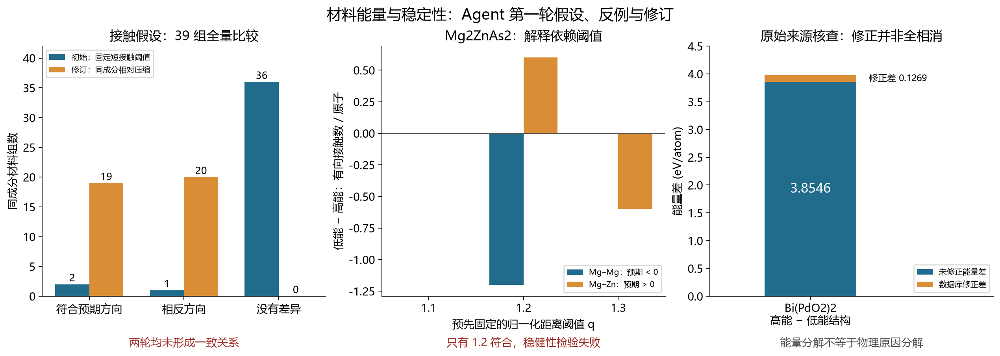

# 材料能量与稳定性：Agent 第一轮研究汇报

2026-10-01｜探索性研究

**本轮完成了真实的材料分析闭环，但还没有得到稳健的物理解释。** Agent 从同组成晶体的能量差出发，编写并运行结构分析程序，检查支持例、反例和原始数据来源，再登记修订并重新检验。两条修订 H01b、H02R1 均未通过各自预设检验。

[README 流程图](README.md) 标出已完成工作与尚未开展的验证。研究使用此前已观察的 2,879 条开发记录：2,164 条原训练角色、715 条自适应验证角色。本轮没有拟合预测模型，没有读取新确认集或未观察测试标签，也没有开展新 DFT 或实验合成。

## 研究对象与执行状态

按相同元素比例，得到 39 组同组成材料、80 个结构、43 个无序结构对。“同组成”不要求晶胞原子数相同；精确分数已另行核对。全部组均保留，没有只汇报成功案例。

| 环节 | 实际执行 | 状态 |
|---|---|---|
| 问题与初始假设 | 短接触是否对应更高能量；局部环境能否区分能量差 | 已登记并计算 |
| 接触研究 H01 | 39 组最高能与最低能成员，固定 q < 0.8 统计 | 已完成；缺乏一致方向 |
| 接触修订 H01b | 改为逐元素对、相对同组成最低能成员比较压缩 | 已登记后再检验；未获支持 |
| 环境研究 H02 | 43 对按能量无关规则筛出 21 对，比较元素局部环境 | 已完成；得到可区分结构的案例及反例 |
| 环境修订 H02R1 | Mg₂ZnAs₂ 接触重分配应在三个固定阈值均成立 | 已登记后再检验；未通过 |
| 来源与数值审计 | 原始条目、周期距离、能量修正、数值重放 | 已完成；保留来源限制 |
| 独立科学确认 | 未观察材料、物理计算或实验验证 | 未做 |

## H01：全局短接触不能直接解释能量高低

定义 q 为原子间距除以两端共价半径之和，固定 q < 0.8 为短接触；保留 6 Å 内全部有向周期边及非零自映像。主要统计为每原子的有向短接触数。这是几何统计，不是已经判定的化学键。

39 组最高能减最低能的短接触差：**正 2 组、负 1 组、零 36 组，中位数为 0**。Bi(PdO₂)₂ 高能成员 mp-1423351 有约 1.2391 Å 的 O–Pd 接触，两个较低能成员没有 q < 0.8 接触；但 MgAg₆Mo₁₀O₃₃ 的低能成员反而有更多短接触。RbUN₃O₁₁（mp-6330）也有 q≈0.6869 的 O–U 接触，数据库原生凸包距离却为 0。单个异常案例不能建立全局稳定性规则。[全部 39 组对照](evidence/H01_pairs.csv)

观察反例后，Agent 保存 H01b 修订：对相同组成的各元素对，以最低能成员的最短 q 为参照，计算 log(q_low/q_high)，保留正负方向，全部共同元素对等权、全部组成组等权。**结果为正 19 组、负 20 组，均值 −0.001576；预设方向未获支持。** 参照成员由已知能量选取，这只是事后结构对照，不能当作预测时天然可用的特征。[全部修订组分数](evidence/H01b_group_scores.csv) · [登记及审计说明](EVIDENCE.md)

## H02：可区分局部环境，仍不等于解释能量

先用相同组成、对称相对每原子体积差≤5%、最小 q 差≤0.03，筛出 21 对。筛选不使用能量。Agent 比较按元素区分的平滑接触分布、接触矩阵和电负性差分布。[全部 21 对](evidence/matched_pairs_stage1.csv)

NdF₃ 两个成员的能量差约 0.2376 eV/atom；较低能成员的 Nd 平滑配位反而更少（15.6188 对 16.3030）。Mg₂ZnAs₂ 两个成员相差约 0.1694 eV/atom，其局部环境也可区分。这些案例提供进一步调查的对象，尚未确立因果解释。KAgTeS₃、Na₂TbO₃ 则有可分辨环境，却只相差约 0.00267、0.00163 eV/atom。

H02R1 将问题收窄为：Mg₂ZnAs₂ 较低能成员是否稳健地呈现“Mg–Mg 接触减少、Mg–Zn 接触增加”？修订前固定三个 q 阈值，要求全部成立。

| 固定阈值 | Mg–Mg 差值 | Mg–Zn 差值 | 两项预期均成立 |
|---|---:|---:|---|
| q ≤ 1.1 | 0 | 0 | 否 |
| q ≤ 1.2 | −1.2 | +0.6 | 是 |
| q ≤ 1.3 | 0 | −0.6 | 否 |

差值为“较低能成员−较高能成员”的有向接触数除以晶胞原子数。**三个阈值的稳健性预言失败，不能只保留 q=1.2。** [全部 63 项阈值检验](evidence/matched_pairs_stage2.csv) · [修订与审计说明](EVIDENCE.md)

另有 7 条“材料对×阈值”记录的硬接触矩阵与局部混合张量同时相同，对应 **4 个不同材料对**，能量差均小于 0.1 eV/atom。这不是 7 次独立重复，也不表示完整结构或全部平滑环境相同。[审计摘要](EVIDENCE.md)

## 来源审计改变了需要检验的解释

八个重点材料的准备结构、周期距离与能量匹配原始条目，但这种一致性不能排除源文件上游错误或证明充分收敛。

Bi 高能成员被源记录分类为 peroxide，低能成员为 oxide；同组成的能量修正并未完全相消。3.981423 eV/atom 的总能差中，未修正差为约 3.854566，修正差约 0.126857（3.19%）。修正差不能解释全部能隙，几何短接触也不能直接承担全部解释。[来源核查](evidence/source_quality_report.json) · [结构对来源比较](evidence/pair_comparisons.json)

这 43 对同组成材料的形成能差与数据库凸包距离差共享参考，不能当成两份独立支持。39 组中，30 组的最低能可用成员仍高于数据库凸包。因此“组内更低能”不能直接写成“稳定”或“可合成”。[全部组成组](evidence/composition_groups.csv) · [全部组成对](evidence/composition_pairs.csv)

## 可复核范围与下一验证

当前程序的数值重放和独立交叉审计已完成。接触分支在本地保留两阶段执行源码快照及哈希链；环境分支保留初始假设、修订原字节、日志和最终源码，但**成功第一阶段的独立源码快照缺失**，最终重放不能补足这项历史来源限制。本次 GitHub 发布方法与审计摘要、完整组表和清理后的摘要；本轮 2,879 条 prepared inputs 已在 [Hugging Face](https://huggingface.co/datasets/fgh123654/materials-energy-stability-agent-dev) 公开，分析源码及全部重放包仍未完整公开。数据公开不构成新实验、新训练或独立验证。[方法与审计摘要](EVIDENCE.md) · [进展摘要](evidence/progress_summary.json)

下一步尚未执行：先在计算设置和修正类别匹配的同组成材料中，登记可反驳的新假设，再分析局部角度与周期连接，优先跟进 NdF₃、Mg₂ZnAs₂；Bi–Pd–O 先补查高能条目的来源、分类与收敛证据。得到稳定解释后，才安排未观察材料或物理计算验证。

本轮进展是完成了可审查的材料研究过程，并记录了两条修订解释的失败边界。现有探索不能宣称新普适规律、预测性能突破、DFT 节省或实验发现。

数据来源为 Materials Project / Matbench Discovery 公开快照，记录许可证为 CC BY 4.0；本轮数据范围与方法摘要见 [EVIDENCE.md](EVIDENCE.md)。物理背景参考 [Materials Project 相图方法](https://docs.materialsproject.org/methodology/materials-methodology/thermodynamic-stability/phase-diagrams-pds)。
