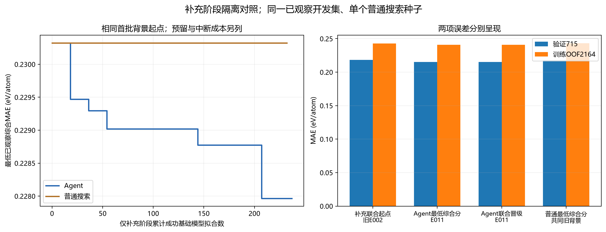
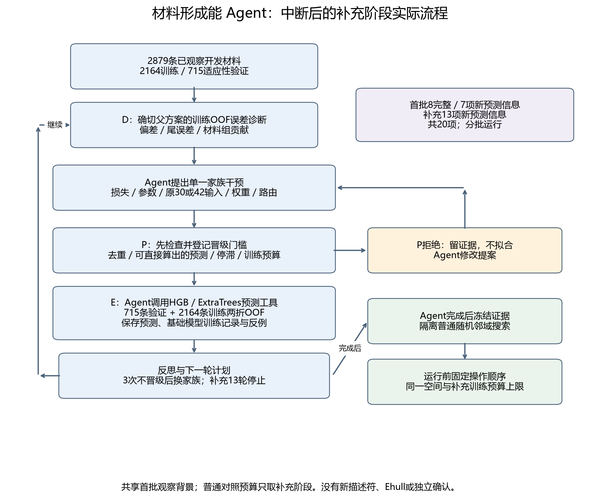

# 材料能量与稳定性：形成能 Agent 分批实验报告

**目前完成20个有效实验。** 这里的“有效”指产生此前不能从已保存预测直接算出的新结果。首批8个完整实验 + 补充13个完整实验 = 21个完整结果；剔除1个已有预测的已决重组，留下20个有效实验。

首批运行中断后已封存；补充批次修复一般高阶仿射前检、沿用共同观察背景继续实验。这里是分批计数，不能解释为连续无干预运行20轮。补充批次原90万未缓存输入Token预算未通过；登记工程追加至150万后继续完成，原manifest预算保留。

**结果：** Agent最低已观察综合误差为0.227966611（E011），相对旧20轮最佳H20_E021下降2.969%。Agent最后联合晋级方案为E011，相对同一旧基准下降2.969%。补充普通搜索最低误差为0.230324406（H_ADAPT_E004）；本次Agent最低观察综合分更低。

普通对照训练了14个新方案，均未得到比共同旧背景更低的综合误差；最终最低仍是历史方案H_ADAPT_E004，它是此前已完成的结果，不能算本次新发现。

MAE表示平均每个材料的形成能预测与真实值相差多少，单位eV/atom（每原子电子伏）。Agent最好方案的验证MAE为0.215235，训练OOF MAE为0.240698；两项均为开发误差。

**Agent最好配置（E011）：** 按含氧和不含氧把材料分为两组。全局ExtraTrees（极端随机树）模型覆盖全部训练材料；每组内部再使用HGB（直方图梯度提升树）与ExtraTrees混合，HGB占50%、ExtraTrees占50%。最终预测把全局结果与对应组内结果合并，分别占50%和50%。 HGB学习率为0.1，L2正则系数为0；使用已有42列输入，材料等权训练。

**结论边界：** 这是形成能的已观察开发实验；当前没有独立确认、没有Ehull稳定性专门评价、没有新描述符或新DFT数据。单次Agent和单个普通搜索种子的比较不能证明Agent普遍优于普通搜索。

Agent负责诊断错误、提出假设、选择实验、检查反例并决定下一轮。HGB的中文是直方图梯度提升树；它与ExtraTrees都由Agent调用，承担所选方案的数值训练和预测。循环流程完成与科学效果分别核验。

## 数据集

本地冻结开发集2879条：2164条训练、715条适应性验证；训练部分固定两折化学体系OOF。训练2040个化学体系，验证680个，体系交集为0；每个OOF训练/评价折也按体系隔离。整个开发集已经反复观察，所以这些划分不能称为新的独立确认。

OOF是训练部分内部的交叉验证预测：每个材料由没有训练过它所在化学体系的模型预测，再汇总误差。

预测目标为形成能，单位eV/atom。已有输入为原30列和E04的12列，Agent只能选择raw30或full42。没有新标签、Tc的log/hurdle移植或新描述符代码生成。体系均衡权重只由每个实际global/expert训练块计算，评价MAE保持逐材料加权。

综合分数 = 0.5 ×（验证715条MAE + 训练2164条OOF MAE），越小越好。

## 结果

| 方案 | ID | 验证MAE | 训练OOF MAE | 综合分数 |
|---|---|---:|---:|---:|
| 旧20轮最佳 | H20_E021 | 0.222492808 | 0.247390273 | 0.234941540 |
| 补充阶段联合晋级起点 | H_ADAPT_E002 | 0.218387732 | 0.242977289 | 0.230682510 |
| 首批最低已观察 | E004 | 0.217473753 | 0.243175059 | 0.230324406 |
| Agent最低已观察 | E011 | 0.215235468 | 0.240697754 | 0.227966611 |
| Agent最后联合晋级 | E011 | 0.215235468 | 0.240697754 | 0.227966611 |
| 普通搜索最低已观察 | H_ADAPT_E004 | 0.217473753 | 0.243175059 | 0.230324406 |
| 普通搜索最后联合晋级 | H_ADAPT_E002 | 0.218387732 | 0.242977289 | 0.230682510 |

Agent最低分相对本次普通最低分变化为1.024%（正值表示Agent误差更低，负值表示更高）。它是一次已观察开发比较，不能解释为独立泛化收益。

联合晋级要求综合分至少下降0.5%，并且验证与OOF的MAE都不增加。首批从H20_E021开始；补充阶段双方从H_ADAPT_E002开始，仅联合晋级才更新各自基准。0.5%是预登记调度规则，不是导师规定的门槛或统计显著性。最低观察分与联合晋级分分别保存。



## 代码流程与自循环



每轮自动执行：research_context → diagnose_errors（确切父方案的训练OOF）→ preflight_strategy → evaluate_strategy（完整新实验）→ counterexamples → record_cycle_decision；保存的下一计划传给下一轮。

借鉴超导方向的是循环组织、误差诊断、停滞转向、有限预算和普通对照；本报告的轮次与结果只统计材料形成能实验。

干预范围包括损失函数、模型参数、既有输入块、训练权重和路由。三次完整实验未联合晋级之后，下一实验必须换干预家族。补充两臂共同继承首批7个未决实验的停滞背景；E008已决重组不进入该有效信息计数。

前检先核验真实模型作用、语义去重、既有预测的一般仿射张成关系、失败或未知状态的语义配置、停滞切换和完整拟合预算。已确定的重组不重新训练；未知部分实验不盲目重跑。接受前检仅表示预测尚未由登记背景决定，不能保证假设有物理意义。

补充Agent家族次数：{"parameters": 8, "weighting": 1, "representation": 1, "loss": 1, "routing": 2}；相邻家族变化8次，强制停滞换家族8次。Agent前检17项、拒绝3项；普通前检29项、拒绝14项。

普通搜索另有1次执行前保护拒绝，明细见摘要中的execution_protective_refusals。这些返回没有模型E编号、没有新fit，不计模型失败或有效实验；证明计算耗时仍进入墙钟时间。前检接受后，执行前复核若不能确定已有预测关系，也会保护性停止该候选。

## 中断、计数和成本

表中的fit是一次HGB或ExtraTrees基础模型训练；一个完整实验会训练多个全局、组内和折内模型，因此有效实验轮数与fit次数分别计数。

首批终态为runtime_stopped，原因interrupted_session_without_verified_result，原20轮要求未完成。E009没有完整结果，其保存事件为3次fit开始、2次fit完成；预留18次fit全部计入成本，结果未知，不计入有效信息轮。

首批已决定实验：E008。E008的预测可由E002 + E001 − H20_E021确定；其实际训练成本仍保留，但不给新的未决信息计数。这里的排除依据是固定预测器关系，不是结果是否改善。

| 批次或方法 | 完整实验 | 未决信息实验 | fit预留/扣账 | fit started | fit completed | 未取得完整结果尝试 |
|---|---:|---:|---:|---:|---:|---:|
| 首批Agent封存 | 8 | 7 | 162 | 147 | 146 | 1 |
| 补充Agent | 13 | 13 | 237 | 237 | 237 | 0 |
| 补充普通搜索 | 14 | 14 | 232 | 232 | 232 | 0 |

Agent两批总预留399次基础fit、保存started384、completed383；这个合计只用于总成本，不用于声称补充对照匹配。

**资源追加已发生：** 补充阶段原未缓存输入Token限额900000，在909496用量时以budget:uncached_input_tokens:overrun停止，原资源预算没有通过。随后通过显式工程receipt将限额追加至1500000（增加600000）；最终用量998301。原终态与状态字节、哈希和原manifest保留；科学源码、目标、fit438上限、随机操作顺序和其他科学预算保持冻结。已经完成但尚未登记的原决策按原证据消费，不重复科研训练；这属于工程续跑，不能称原预算内连续无干预完成。

## 补充阶段普通对照

双方共享首批8个完整观察结果及更早的历史背景。普通搜索的操作顺序在补充Agent新实验开始前冻结，按自己的最低观察方案做随机邻域修改。普通搜索不能读取补充Agent的13个新结果来决定候选；Agent终态后只读取其fit扣账数作为预算上限，并冻结Agent证据。双方使用相同新干预域、一般仿射前检、未知配置阻断、停滞和晋级规则。

普通搜索只匹配补充Agent的fit预算上限237，实际扣账232，残余5。首批162次预留不加进对照上限。完整方案无法装入剩余预算时不启动；同预算上限不等于完全相同实用量。基础fit数量也不等于相同CPU时间。

补充源码将基础fit预留上限固定为438。墙钟限制是允许启动下一个完整候选的期限，已启动候选可在期限后完成；实际时间与Token用量见终态文件。补充Agent的其他登记限制如下，轮间Token检查不能解释为严格金额上限：

```json
{
  "min_cycles": 13,
  "max_cycles": 13,
  "max_tool_calls": 220,
  "max_experiments": 24,
  "max_investigations": 1,
  "max_wall_seconds": 10800.0,
  "max_uncached_input_tokens": 900000,
  "max_output_tokens": 60000,
  "max_transport_retries": 1,
  "max_consecutive_failures": 2,
  "max_stagnant_cycles": 2
}
```

补充Agent终态：agent_stopped；普通搜索终态：completed。保留所有失败/未知成本；缓存、诊断、只读重放与前检拒绝都不计有效新实验。

## 科学审计

数值与证据审计pass，4086项，失败0项。核对首批及补充两臂共100765条保存预测，包括身份、标签、化学体系、两项MAE、路由、折、权重、P/D绑定、联合晋级与fit事件。

独立质量审查状态：pass；已完成最终审查。数值审计与此项复核分别呈现。

独立符号审查后，首批未决7项、补充未决13项，总计20项。更早20轮的4项已决定问题只读重放4/4通过；这些重放不计新科研轮。

审计通过只说明保存执行链与数值可核对；不能证明Agent普遍优势、标签错误、材料机制或独立材料发现。未来要评价稳定性，需要单独冻结Ehull目标与协议；要检验泛化，需要另行准备未观察确认集。

## 逐轮结果

| 批次/轮次 | E | 父方案 | 家族 | D/P | 联合晋级 | 验证MAE | OOF MAE | score | 未决信息 |
|---|---|---|---|---|---|---:|---:|---:|---|
| 首批1 | E001 | H20_E021 | loss | D001/P001 | 未通过 | 0.224697 | 0.248708 | 0.236703 | 是 |
| 首批2 | E002 | H20_E021 | parameters | D001/P002 | 通过 | 0.218388 | 0.242977 | 0.230683 | 是 |
| 首批3 | E003 | E002 | parameters | D004/P003 | 未通过 | 0.220552 | 0.243251 | 0.231902 | 是 |
| 首批4 | E004 | E002 | parameters | D004/P004 | 未通过 | 0.217474 | 0.243175 | 0.230324 | 是 |
| 首批5 | E005 | E002 | parameters | D004/P005 | 未通过 | 0.218010 | 0.242966 | 0.230488 | 是 |
| 首批6 | E006 | E002 | weighting | D004/P006 | 未通过 | 0.218802 | 0.243801 | 0.231301 | 是 |
| 首批7 | E007 | E002 | representation | D004/P007 | 未通过 | 0.239927 | 0.264882 | 0.252405 | 是 |
| 首批8 | E008 | E002 | loss | D004/P008 | 未通过 | 0.220760 | 0.244571 | 0.232666 | 已决重组，排除 |
| 补充1 | E001 | H_ADAPT_E002 | parameters | D001/P002 | 通过 | 0.216834 | 0.242108 | 0.229471 | 是 |
| 补充2 | E002 | E001 | parameters | D003/P003 | 未通过 | 0.216424 | 0.242172 | 0.229298 | 是 |
| 补充3 | E003 | E001 | parameters | D003/P004 | 未通过 | 0.216381 | 0.241657 | 0.229019 | 是 |
| 补充4 | E004 | E001 | parameters | D003/P006 | 未通过 | 0.219854 | 0.243581 | 0.231717 | 是 |
| 补充5 | E005 | E001 | weighting | D003/P007 | 未通过 | 0.217510 | 0.242951 | 0.230230 | 是 |
| 补充6 | E006 | E001 | representation | D003/P008 | 未通过 | 0.237557 | 0.263754 | 0.250655 | 是 |
| 补充7 | E007 | E001 | loss | D003/P009 | 未通过 | 0.219217 | 0.244009 | 0.231613 | 是 |
| 补充8 | E008 | E001 | parameters | D003/P010 | 未通过 | 0.216156 | 0.241390 | 0.228773 | 是 |
| 补充9 | E009 | E008 | routing | D017/P011 | 未通过 | 0.216156 | 0.242592 | 0.229374 | 是 |
| 补充10 | E010 | E009 | parameters | D019/P013 | 未通过 | 0.226836 | 0.254789 | 0.240813 | 是 |
| 补充11 | E011 | E008 | routing | D017/P014 | 通过 | 0.215235 | 0.240698 | 0.227967 | 是 |
| 补充12 | E012 | E011 | parameters | D023/P016 | 未通过 | 0.216050 | 0.241084 | 0.228567 | 是 |
| 补充13 | E013 | E011 | parameters | D023/P017 | 未通过 | 0.215792 | 0.240474 | 0.228133 | 是 |

### 首批第1轮：E001 / loss

父方案H20_E021；诊断D001，前检P001。实际配置改动：hgb_loss: squared_error → absolute_error。

训练OOF诊断：{"rows": 2164, "MAE_eV_atom": 0.2473902731880717, "prediction_minus_truth_mean": -0.008381860764641019, "p90_abs_error": 0.5512320462968614, "p99_abs_error": 1.2381130367418027, "share_total_abs_error": 1.0}。

假设：D001显示父方案训练2164条OOF整体MAE为0.2473902732、带符号偏差−0.0083818608、p99绝对误差1.2381130367；含氧837条MAE为0.2881228227、偏差−0.0052105897、误差份额45.0467%，卤素组MAE为0.2809384075、份额14.7461%。高绝对误差而整体偏差接近零，提示误差并非简单常数偏移，平方损失可能过度受尾部影响。仅将所有活跃HGB的hgb_loss由squared_error改为absolute_error，保持路由、混合、输入、权重和其他参数不变，检验MAE目标对齐能否同时改善两项开发误差；如果三项门槛未同时满足，则不支持本配置带来可晋级收益的解释。该解释不构成标签错误或物理因果断言。

证伪：P001登记的联合数值门槛为score <= 0.23376683278259552，validation_MAE <= 0.22249280778196956，OOF_MAE <= 0.2473902731880717。三者必须同时满足；任一未满足即否定本配置达到晋级收益的假设。0.5%仅为调度门槛，不代表统计显著或独立确认。

结果：验证0.224696682、OOF0.248708455、综合0.236702568；联合晋级未通过；有未决预测信息。

反思：旧20轮仅作背景，E001是本阶段首个新实验。X002反例中Dy-N-U绝对误差增加0.1575576226，Li-Ru-Zr增加0.1505655623，Cs-Mo-O-S增加0.1299789121，Cl-Hg-N-Pt增加0.0975306595；退步跨组，且这些记录均无fallback，不能归因于专家回退。尾部大而平均偏差小并不保证绝对损失获益；当前配置对目标对齐的简单解释失败，不作标签错误或物理因果结论。P001预留18次learner-fit，E001实际完成18次，按600上限剩余582；本轮无前检拒绝、软件错误或未知中断，连续未晋级为1。下一轮主动由loss切换parameters，尚未触发连续3次未晋级的强制切换。随机对照尚未执行；按当前Agent累计预留量其fit上限为18，最终额度须待Agent冻结后按预登记序列结算，不宣称已完成对照或等耗时。。

下一计划：在H20_E021训练OOF含氧组MAE为0.2881228227、误差份额45.05%，卤素组MAE为0.2809384075，而绝对损失E001使验证与OOF同时退步的背景下，保持平方损失和全部路由不变，仅将ExtraTrees的et_min_samples_leaf从2降到1，能否通过更细局部分区改善误差并达到三项联合晋级门槛？这是对叶平均平滑限制的待检验解释，不由现有诊断预先断言成立。；先调用research_context核实注册状态与是否存在部分计算；调用diagnose_errors(strategy_id='H20_E021')取得确切父方案诊断。复制H20_E021完整配置，保持anion_family、global_estimator=extra_trees、blend_weight=0.5、experts={halogen:blend,other:blend,other_chalcogen:extra_trees,oxygen:blend}、min_train_per_group=150、shrinkage=0.5、full42、uniform及原HGB平方损失参数，仅将et_min_samples_leaf由2改1。以revision_of='H20_E021'、intervention_family='parameters'及新D ID调用preflight_strategy；若语义重复则检查既有结果，不重跑，可依据诊断改提案为仅et_max_features由1.0改0.75，单轮前检最多4次。接受后将返回的三个数值门槛写入中文falsification，绑定同一P ID、D ID、父方案和配置调用evaluate_strategy。完成后调用counterexamples检查跨组退步，报告验证MAE、OOF MAE、score、fit预留与实际数及错误记录，最后调用record_cycle_decision保存结果。仅真实新E计入有效轮数，不读取确认或测试标签，不改源码。。

反例比较基准：H20_E021。大误差是调查线索，不证明标签错误或材料机制。

| 反例材料 | 真实形成能 | 预测 | 绝对误差 |
|---|---:|---:|---:|
| mp-1225554 | -1.674200 | -1.234833 | 0.439367 |
| mp-1093827 | 2.910480 | 2.459158 | 0.451322 |
| mp-1194448 | -1.304671 | -1.574030 | 0.269359 |
| mp-1096318 | 1.491791 | 1.164773 | 0.327018 |
| mp-555977 | -1.548941 | -1.676457 | 0.127516 |
| mp-1102535 | 0.629909 | -0.184548 | 0.814458 |
| mp-1187619 | 0.378683 | 0.247321 | 0.131362 |
| mp-1212239 | -0.252225 | -0.865383 | 0.613158 |

### 首批第2轮：E002 / parameters

父方案H20_E021；诊断D001，前检P002。实际配置改动：et_min_samples_leaf: 2 → 1。

训练OOF诊断：{"rows": 2164, "MAE_eV_atom": 0.2473902731880717, "prediction_minus_truth_mean": -0.008381860764641019, "p90_abs_error": 0.5512320462968614, "p99_abs_error": 1.2381130367418027, "share_total_abs_error": 1.0}。

假设：D001的训练2164条OOF显示含氧组MAE为0.28812282265694306、偏差为−0.005210589688251332、p99绝对误差为1.239144762524995、总误差份额为45.04672706476624%；卤素组MAE为0.2809384074680302、偏差0.011829520943824515、p90为0.5932554507134604。高组内绝对误差与较小平均偏差提示局部拟合限制可能比整体偏移更值得检验，但不证明存在过度平滑。E001绝对损失已使两项MAE同时退步。本轮从H20_E021平方损失完整配置出发，只把et_min_samples_leaf从2降至1，检验更细局部分区能否减少叶平均造成的信息损失并取得联合收益；其余参数、路由、输入、权重、种子和折边界固定。

证伪：P002登记联合门槛：score必须≤0.23376683278259552，验证715条MAE必须≤0.22249280778196956，训练2164条两折化学体系OOF MAE必须≤0.2473902731880717；任一不满足即否定本配置达到联合晋级的收益假设，不更新晋级基准。若训练OOF或验证退步，则更细叶分区不足以改善泛化，不能把诊断直接解释为平滑限制已获证明。用counterexamples检查跨组退步与fallback，不从残差学习路由，不作独立确认或物理因果推断。

结果：验证0.218387732、OOF0.242977289、综合0.230682510；联合晋级通过；有未决预测信息。

反思：D004显示四个阴离子组MAE均较D001下降：含氧0.28143324985257734、卤素0.27647093924344945、其他硫族0.1771379942282313、其他0.2109699389683981；两折MAE也均下降。但并非各处一致改善：卤素p90由0.5932554507134604升至0.6166504476699999，含氧p90由0.5861058081816836升至0.5875571479522369，1_2元素组MAE由0.26871478562010104升至0.2696194072876518，三元素组p99升至1.4829420914367757。X003中Au-F-Rb绝对误差增加0.15092331544251625，Ni-Pt-Zn增加0.07613629611222139，N-O-P-Te增加0.06423966464675956；退步跨组且八例均无fallback。整体收益与局部尾部退步并存，不证明标签错误，也不证明过度平滑机制。此前loss家族E001为负，本轮切换parameters后晋级；连续未晋级计数按规则重置，尚无强制切换。本轮P002预留18次fit、E002实际18次；累计预留36、完成36，600上限剩余564。本轮1次前检、无拒绝、无软件错误或未知中断。旧20轮只作背景，D和X不计新科学轮数。随机对照尚未执行，按当前Agent累计预留量其上限为36次fit，最终额度待冻结后按预登记序列结算，不能宣称同耗时或对照已完成。。

下一计划：E002在更细叶分区下已联合晋级，但D004卤素组OOF MAE仍为0.27647093924344945、平均偏差仅0.001125616850725101，p90却从父方案0.5932554507134604升至0.6166504476699999，且含氧组仍贡献44.79999082712614%的绝对误差。保持E002叶样本为1及全部路由不变，仅将et_max_features从1.0降至0.75，能否通过特征子采样降低部分细分区预测的不稳定性并在E002之上再次达到联合晋级门槛？这是可否定的建模解释，不由尾部数字推定树间相关性或因果机制已成立。；先调用research_context核实E002晋级状态、预算与部分计算；调用diagnose_errors(strategy_id='E002')检查确切父方案OOF，已有D004则复用，不重跑E002。复制E002完整配置：anion_family、global_estimator=extra_trees、blend_weight=0.5、expert_estimators={halogen:blend,other:blend,other_chalcogen:extra_trees,oxygen:blend}、min_train_per_group=150、shrinkage=0.5、full42、uniform、et_min_samples_leaf=1、hgb_loss=squared_error、hgb_max_leaf_nodes=15、hgb_min_samples_leaf=20、hgb_l2_regularization=10、hgb_learning_rate=0.05；仅et_max_features由1.0改0.75。以revision_of='E002'、intervention_family='parameters'及工具返回的D ID调用preflight_strategy。若语义重复，检查该既有实验结果而不重跑，再依据诊断评估仅et_max_features=0.5的未决配置，单轮前检不超过4次。接受后把返回的三项精确数值门槛写入中文falsification，以同一P ID、D ID、父方案及配置调用evaluate_strategy。完成后调用counterexamples，并可诊断新E的训练OOF检查卤素p90与跨组权衡；报告两项MAE、score、预留和实际fit、对照余量及错误记录。最后调用record_cycle_decision；仅真实新完成E计有效轮次，不访问确认或测试标签，不改注册源。。

反例比较基准：H20_E021。大误差是调查线索，不证明标签错误或材料机制。

| 反例材料 | 真实形成能 | 预测 | 绝对误差 |
|---|---:|---:|---:|
| mp-1113832 | -2.294017 | -2.746595 | 0.452578 |
| mp-1097415 | 1.736641 | 2.272305 | 0.535664 |
| mp-1103705 | -0.393415 | -0.006934 | 0.386481 |
| mp-1232415 | -0.761294 | -0.940843 | 0.179549 |
| mp-1111955 | -2.609246 | -2.726111 | 0.116865 |
| mp-1342933 | -2.550649 | -2.263616 | 0.287033 |
| mp-1211885 | -2.810536 | -2.584958 | 0.225578 |
| mp-1110948 | -0.897079 | -1.172531 | 0.275452 |

### 首批第3轮：E003 / parameters

父方案E002；诊断D004，前检P003。实际配置改动：et_max_features: 1.0 → 0.75。

训练OOF诊断：{"rows": 2164, "MAE_eV_atom": 0.24297728903757893, "prediction_minus_truth_mean": -0.010430200811355823, "p90_abs_error": 0.5423024285795647, "p99_abs_error": 1.18337567329755, "share_total_abs_error": 1.0}。

假设：D004显示E002卤素组OOF MAE为0.27647093924344945、带符号偏差仅0.001125616850725101，但p90为0.6166504476699999，高于旧父方案0.5932554507134604；含氧组MAE为0.28143324985257734，贡献44.79999082712614%的绝对误差。保持叶样本为1、路由、模型组合、full42、uniform及全部HGB参数不变，仅将et_max_features由1.0降为0.75，检验特征子采样可能缓解细分区预测不稳定性、降低卤素尾部并带来联合收益的解释。诊断本身不证明树间相关性或因果机制。

证伪：以P003登记的E002基准为准，必须同时满足score≤0.22952909792668527、715条验证MAE≤0.21838773192058245、2164条训练两折化学体系OOF MAE≤0.24297728903757893；任一不满足即否定本配置达到联合晋级的假设。另检查卤素OOF p90是否低于0.6166504476699999，若未降低则尾部改善解释不获支持；即便尾部下降也不能替代三项联合判据或证明因果。

结果：验证0.220552193、OOF0.243251259、综合0.231901726；联合晋级未通过；有未决预测信息。

反思：D006与D004比较，卤素p90由0.6166504476699999略降至0.6136906381527492，但p99由1.0107957707960986升至1.0989582084991014，卤素MAE升至0.27684402713003403。含氧MAE升至0.28169273766838127，尽管p90降至0.581615109604246；其他硫族和other组MAE也分别升至0.17775873346847396、0.21112113512926195。第一折MAE退步至0.24900634745079855，第二折略改善至0.23749617010797558，不能用局部尾部下降替代整体联合判据。X005的reference_id为H20_E021而非E002：相对该旧基准Au-F-Rb、Ni-Pt-Zn、Cu-O-Pr-S绝对误差分别增加0.132470722070952、0.13128029240434724、0.07217960307269822，八例均无fallback，不误报为相对E002的增量。这些是开发残差线索，不是坏标签或因果证据。本轮延续parameters家族，连续真实未晋级为1，未触发强制换家族。P003预留18次fit，E003实际18次；累计预留54、完成54，600上限剩余546。本轮一次前检，无拒绝、软件错误或未知中断；D004缓存、D006和X005均不计新增轮数。随机对照尚未执行，当前按Agent预留量可用上限54次fit，最终额度及不足整配置的余量待冻结后按预登记操作结算，不宣称等耗时。旧20轮仅作背景，本轮未读取确认/测试标签或修改注册源。特征子采样0.75未取得联合收益，不足以否定所有特征比例，也不能证明不稳定性机制。下一轮转向HGB容量这一不同参数假设。。

下一计划：E002的D004显示含氧组OOF MAE为0.28143324985257734、偏差仅−0.006110737021090353、p99为1.2013106976059145、误差份额44.79999082712614%；E003降低ET特征比例未改善联合指标，四组MAE均略升。回到晋级基准E002，仅将hgb_max_leaf_nodes由15增至31，保持ET叶样本1和特征比例1.0，能否通过提高混合专家中HGB的分区容量改善含氧等组误差并通过联合晋级？这是对容量限制的可否定解释，残差本身不证明欠拟合。；先调用research_context核实晋级基准、预算、强制换家族状态及部分计算；调用diagnose_errors(strategy_id='E002')复用D004，不重跑E002或E003。复制E002完整配置：routing=anion_family、global_estimator=extra_trees、blend_weight=0.5、expert_estimators={halogen:blend,other:blend,other_chalcogen:extra_trees,oxygen:blend}、min_train_per_group=150、shrinkage=0.5、feature_set=full42、training_weight=uniform、et_min_samples_leaf=1、et_max_features=1.0、hgb_loss=squared_error、hgb_min_samples_leaf=20、hgb_l2_regularization=10、hgb_learning_rate=0.05；仅hgb_max_leaf_nodes由15改31。以revision_of='E002'、intervention_family='parameters'及返回D ID调用preflight_strategy。若语义重复，读取既有结果不重跑，再依据父诊断前检仅hgb_min_samples_leaf由20改10且hgb_max_leaf_nodes保持15的未决替代配置；单轮前检最多4次。接受后将返回三项精确数值门槛写入中文falsification，绑定同一P ID、D ID、父方案、家族和配置调用evaluate_strategy。随后调用counterexamples，明确工具实际reference_id；诊断新E的训练OOF比较含氧组MAE、尾部及跨组权衡。报告两项MAE、score、fit预留与实际数、对照额度及错误记录；最后调用record_cycle_decision，仅真实新完成E计有效轮数，未满20轮且有实质任务则继续。。

反例比较基准：H20_E021。大误差是调查线索，不证明标签错误或材料机制。

| 反例材料 | 真实形成能 | 预测 | 绝对误差 |
|---|---:|---:|---:|
| mp-1113832 | -2.294017 | -2.728143 | 0.434126 |
| mp-1097415 | 1.736641 | 2.327449 | 0.590808 |
| mp-1097263 | 0.517551 | 1.123754 | 0.606203 |
| mp-1209735 | -0.747724 | -1.396783 | 0.649059 |
| mp-1232415 | -0.761294 | -0.946095 | 0.184801 |
| mp-1200193 | -1.693106 | -1.365446 | 0.327660 |
| mp-1093827 | 2.910480 | 2.547875 | 0.362605 |
| mp-1193073 | -0.551741 | -0.147255 | 0.404486 |

### 首批第4轮：E004 / parameters

父方案E002；诊断D004，前检P004。实际配置改动：hgb_max_leaf_nodes: 15 → 31。

训练OOF诊断：{"rows": 2164, "MAE_eV_atom": 0.24297728903757893, "prediction_minus_truth_mean": -0.010430200811355823, "p90_abs_error": 0.5423024285795647, "p99_abs_error": 1.18337567329755, "share_total_abs_error": 1.0}。

假设：D004中E002含氧组OOF MAE为0.28143324985257734、带符号偏差为−0.006110737021090353、p99为1.2013106976059145、误差份额44.79999082712614%，卤素组MAE为0.27647093924344945。较小均值偏差与较大绝对误差提示可检验局部分区容量限制，但不能证明欠拟合。保持E002的ET叶样本1、特征比例1.0及其余全部配置，仅将hgb_max_leaf_nodes由15增至31，检验混合专家中更高HGB容量是否改善含氧等组误差并取得联合收益。

证伪：按P004固定门槛，只有score≤0.22952909792668527、验证MAE≤0.21838773192058245、训练OOF MAE≤0.24297728903757893三项同时满足才晋级；任一失败则本配置联合收益假设不获支持。另比较含氧组MAE是否低于0.28143324985257734及p99是否低于1.2013106976059145，局部改善不能替代联合门槛，也不能证明容量机制。

结果：验证0.217473753、OOF0.243175059、综合0.230324406；联合晋级未通过；有未决预测信息。

反思：D008相对D004，含氧MAE由0.28143324985257734升至0.28198762721700427，p90由0.5875571479522369升至0.5880689388853336，p99略降至1.1996658319318079，误差份额升至44.85173272727847%；不能用尾部局部下降证明容量假设。卤素MAE、p90、p99均未变，其他硫族也未变；other组MAE略降至0.210925223712526但p99升至1.3108721847013043。两折MAE均略升至0.248637479484741与0.2377126377380994。X007实际reference_id为H20_E021，不是E002；相对旧基准Au-F-Rb、Ir-Mg-O-Ti、Ni-Pt-Zn绝对误差分别增加0.15092331544251625、0.09186474248902243、0.07047280092404895，八例均无fallback。以上仅为已观察开发证据，不推断标签错误、欠拟合已成立或物理因果。本轮延续parameters，连续未晋级现为2，尚未强制换家族；下一次若仍未晋级则后续E须换家族。本轮前检1次、无拒绝、软件错误或未知中断；P004预留18次fit，E004实际18次，累计预留72、完成72，600上限余528。随机对照尚未执行，按当前Agent累计预留量其上限为72次fit，最终冻结后按预登记序列执行并保留不足整配置余量，不能宣称等耗时。D与X不计新增轮数；旧20轮和旧软件恢复仅作背景，未读取确认/测试标签或修改注册源。。

下一计划：E004将HGB叶节点上限15增至31后，含氧OOF MAE从0.28143324985257734升至0.28198762721700427，卤素MAE仍为0.27647093924344945，两个OOF折均略退步，未联合晋级。回到E002，仅将hgb_min_samples_leaf从20降至10并保持hgb_max_leaf_nodes=15，能否通过允许较小局部样本分区改善含氧与卤素误差并达到联合晋级？这检验叶内样本约束而非总叶节点上限的可否定解释；不由残差预断欠拟合或机制。；先调用research_context核实E002联合晋级基准、E004最低观察score、预算、连续未晋级计数和部分计算。调用diagnose_errors(strategy_id='E002')复用D004。复制E002完整配置：routing=anion_family、global_estimator=extra_trees、blend_weight=0.5、expert_estimators={halogen:blend,other:blend,other_chalcogen:extra_trees,oxygen:blend}、min_train_per_group=150、shrinkage=0.5、feature_set=full42、training_weight=uniform、et_min_samples_leaf=1、et_max_features=1.0、hgb_loss=squared_error、hgb_max_leaf_nodes=15、hgb_l2_regularization=10、hgb_learning_rate=0.05；仅hgb_min_samples_leaf由20改10。以revision_of='E002'、intervention_family='parameters'及返回D ID调用preflight_strategy。若语义重复，读取既有结果不重跑，再依据父诊断前检仅hgb_l2_regularization由10降0且叶样本保持20的未决配置；前检最多4次。接受后将返回三项精确门槛写入中文falsification，以同一P ID、D ID、父方案、家族和配置调用evaluate_strategy。完成后调用counterexamples并明确实际reference_id，再diagnose_errors新E比较含氧、卤素和两折变化。报告两项MAE、score、预留/实际fit、对照额度和错误；最后record_cycle_decision。若连续第三次不晋级，下轮计划须切换到非parameters家族并由诊断提出新E；未满20轮有实质任务则继续。。

反例比较基准：H20_E021。大误差是调查线索，不证明标签错误或材料机制。

| 反例材料 | 真实形成能 | 预测 | 绝对误差 |
|---|---:|---:|---:|
| mp-1113832 | -2.294017 | -2.746595 | 0.452578 |
| mp-1342933 | -2.550649 | -2.225645 | 0.325003 |
| mp-1097415 | 1.736641 | 2.266642 | 0.530001 |
| mp-1103705 | -0.393415 | -0.006012 | 0.387403 |
| mp-752661 | -1.925411 | -2.136033 | 0.210622 |
| mp-6280 | -3.530870 | -2.424158 | 1.106712 |
| mp-1096607 | 1.262841 | 1.996541 | 0.733700 |
| mp-1232415 | -0.761294 | -0.934911 | 0.173618 |

### 首批第5轮：E005 / parameters

父方案E002；诊断D004，前检P005。实际配置改动：hgb_min_samples_leaf: 20 → 10。

训练OOF诊断：{"rows": 2164, "MAE_eV_atom": 0.24297728903757893, "prediction_minus_truth_mean": -0.010430200811355823, "p90_abs_error": 0.5423024285795647, "p99_abs_error": 1.18337567329755, "share_total_abs_error": 1.0}。

假设：D004中E002含氧组837条OOF MAE为0.28143324985257734、偏差−0.006110737021090353、p99为1.2013106976059145、总误差份额44.79999082712614%；卤素281条MAE为0.27647093924344945、偏差0.001125616850725101、p90为0.6166504476699999。E004增大叶节点上限未联合晋级。本轮仅将E002的hgb_min_samples_leaf从20降至10，保留15叶上限及其他全部配置，检验允许更小局部样本分区是否改善含氧和卤素误差并产生联合收益；这些残差不预先证明欠拟合或物理机制。

证伪：按P005登记，相对E002须同时满足score≤0.22952909792668527、validation_MAE≤0.21838773192058245、OOF_MAE≤0.24297728903757893；任一失败即不支持本配置联合收益假设。另检查含氧MAE是否低于0.28143324985257734、卤素MAE是否低于0.27647093924344945及两折变化；局部改善不能替代三项联合门槛。

结果：验证0.218010413、OOF0.242966196、综合0.230488304；联合晋级未通过；有未决预测信息。

反思：D010相对D004：含氧MAE降至0.28110275635651455，p90降至0.5782247792727638，p99降至1.1742234938838618，但偏差变为−0.007555146331125183；卤素MAE仍为0.27647093924344945，p90与p99不变，其他硫族也不变。other组MAE升至0.21128335941402368、p99升至1.3172972113828416；1_2元素组MAE升至0.2716212005642907。折0 MAE由0.24841898625650158升至0.24872566116479247，折1由0.2375355918186563降至0.23720673005543902，整体微小改善不代表稳定跨折收益。X009实际reference_id为H20_E021，不是E002；Au-F-Rb、Cr-Cs-O-U、As-N-O-V绝对误差相对旧基准分别增加0.1621247106925665、0.1329447332559459、0.12130927509920542，八例均无fallback。以上仅为开发残差，不能推断坏标签、欠拟合成立或物理因果。本轮P005预留18次fit、E005实际完成18次；累计预留90、完成90，600上限剩余510。本轮前检1次，无拒绝、软件错误或未知中断。随机对照尚未执行，当前按Agent预留量其额度上限为90次fit，最终冻结后按预登记序列结算，不足完整配置余量保留，不能宣称同耗时或对照完成。旧20轮和软件恢复只作背景；诊断及反例不计新轮数，未读确认/测试标签或修改注册源。连续参数调整收益不足，下一轮从E002检验训练体系权重，避免把最差体系中的少量OOF样本误当已证实的训练频数偏差。。

下一计划：D004中E002含氧组贡献44.79999082712614%的OOF绝对误差，三元素组MAE为0.24846969266462743、偏差−0.02174065582827928、p99为1.4829420914367757；最差体系包括Er-La-O（1条、MAE 6.7869134292434605）和Bi-O-Pd（4条、MAE 0.6299471164630184）。E005缩小HGB叶样本后整体收益不足、两折方向相反，连续三次parameters未晋级。回到E002，仅将training_weight从uniform改为chemical_system_balanced，能否通过改变各训练体系的损失贡献改善跨体系OOF误差并达到联合晋级？这些OOF计数并不证明训练频数失衡造成误差，本轮将可否定地检验该权重选择。；先research_context核实E002晋级基准、连续3次未晋级后的家族切换要求、预算与部分计算。diagnose_errors(strategy_id='E002')复用D004。复制E002完整配置：routing=anion_family、global_estimator=extra_trees、blend_weight=0.5、expert_estimators={halogen:blend,other:blend,other_chalcogen:extra_trees,oxygen:blend}、min_train_per_group=150、shrinkage=0.5、feature_set=full42、et_min_samples_leaf=1、et_max_features=1.0、hgb_loss=squared_error、hgb_max_leaf_nodes=15、hgb_min_samples_leaf=20、hgb_l2_regularization=10、hgb_learning_rate=0.05；唯一差异training_weight=chemical_system_balanced。以revision_of='E002'、intervention_family='weighting'和返回D ID调用preflight_strategy；权重只由当次训练块的体系计数产生，global与expert分别归一。若语义重复则读取已注册结果不重跑，再根据D004前检representation家族仅feature_set从full42改raw30、权重仍uniform的未决替代配置，检验现有附加输入是否带来不稳定分区，其他参数仍为E002；每轮最多4次前检。接受后将返回的三项精确门槛写入中文falsification，以同一P ID、D ID、父方案、家族及配置evaluate_strategy。随后counterexamples并明确实际reference_id，再diagnose_errors新E比较含氧、三元素、各折和尾部权衡。报告两项MAE、score、预留及实际fit、对照余量和错误；最后record_cycle_decision，未满20轮且有实质任务则继续。。

反例比较基准：H20_E021。大误差是调查线索，不证明标签错误或材料机制。

| 反例材料 | 真实形成能 | 预测 | 绝对误差 |
|---|---:|---:|---:|
| mp-1113832 | -2.294017 | -2.757797 | 0.463780 |
| mp-572944 | -2.783505 | -2.621750 | 0.161756 |
| mp-1200774 | -0.509378 | -1.087075 | 0.577697 |
| mp-1093827 | 2.910480 | 2.504552 | 0.405928 |
| mp-1099227 | -1.745123 | -2.595305 | 0.850182 |
| mp-15639 | -1.788798 | -2.006016 | 0.217218 |
| mp-1236120 | -2.435352 | -1.879099 | 0.556253 |
| mp-1097415 | 1.736641 | 2.272829 | 0.536188 |

### 首批第6轮：E006 / weighting

父方案E002；诊断D004，前检P006。实际配置改动：training_weight: uniform → chemical_system_balanced。

训练OOF诊断：{"rows": 2164, "MAE_eV_atom": 0.24297728903757893, "prediction_minus_truth_mean": -0.010430200811355823, "p90_abs_error": 0.5423024285795647, "p99_abs_error": 1.18337567329755, "share_total_abs_error": 1.0}。

假设：D004中含氧组OOF MAE为0.28143324985257734、偏差−0.006110737021090353、p99为1.2013106976059145，占总绝对误差44.79999082712614%；三元素组MAE为0.24846969266462743、偏差−0.02174065582827928、p99为1.4829420914367757。Er-La-O仅1条且MAE为6.7869134292434605，Bi-O-Pd为4条且MAE为0.6299471164630184。可否定解释是各训练体系的损失贡献可能影响跨体系泛化；仅将E002的training_weight由uniform改chemical_system_balanced，权重按当次训练块体系计数生成、global与expert分别归一，预期改善OOF并通过联合晋级。这些OOF计数本身不证明训练频数失衡或物理机制，连续3次parameters未晋级后按要求切换weighting家族。

证伪：P006固定相对E002三项联合门槛：score≤0.22952909792668527，validation_MAE≤0.21838773192058245，OOF_MAE≤0.24297728903757893；任一不满足即本配置联合收益假设不获支持。另比较含氧、三元素、两折及p99，局部改善不能替代联合判据。0.5%是调度门槛，不代表统计显著性或独立确认。

结果：验证0.218801776、OOF0.243801036、综合0.231301406；联合晋级未通过；有未决预测信息。

反思：D012相对D004：含氧MAE升至0.28193452762811144、偏差为−0.008834863138478205，p90虽降至0.5819340236004751，p99却升至1.2285624159362103；误差份额为44.72814845704445%，份额下降不代表绝对误差改善。三元素MAE升至0.2506289296416281、偏差为−0.0222658237597543，p99略降至1.4755611254567955。折0与折1 MAE均升至0.24917140755557202和0.23843066430423854。卤素MAE升至0.28062813017977345，other升至0.21168087733538357，其他硫族降至0.17556229339479268但p99升至0.7748525261874449；整体p99由1.18337567329755升至1.2104080231165169。Er-La-O MAE略降至6.740712178822369，而Bi-O-Pd升至0.641904570739207，不支持用极少OOF样本推断频数偏差已获修复。X011实际reference_id为H20_E021，不是E002：Ag-Cu-Pd、Ag-Cl-O-Te、Bi-K-Rb绝对误差分别增加0.21110879525820092、0.12010488788287693、0.10438832394725167，八例均无fallback。这些开发残差不证明坏标签或物理因果。P006计划预留18次fit，E006实际完成18次；累计预留108、完成108，600上限余492；本轮前检1次，无拒绝、软件失败或未知中断。本轮完成家族切换，未晋级仍持续，下轮选择representation家族。随机对照尚未执行，按当前Agent累计预留量其额度上限108次fit，冻结后按预登记随机操作执行，不足完整配置余量保留；实际控制余量须届时结算，不宣称同耗时或已完成对照。旧20轮及旧软件恢复只作背景；本轮未读确认/测试标签、未改注册源，D与X不计新增轮数。权重干预失败只否定此配置的联合收益，不排除其他配置，也不能证明Agent普遍优于AutoML。。

下一计划：E006体系均衡权重使两折OOF及验证同时退步；D012含氧p99升至1.2285624159362103，三元素MAE升至0.2506289296416281。回到联合晋级基准E002，其D004含氧MAE为0.28143324985257734、误差份额44.79999082712614%，三元素p99为1.4829420914367757。仅将feature_set从full42改为既有raw30、恢复并保持E002的uniform权重，能否减少附加输入参与分区所带来的不稳定误差并通过联合晋级？这是待检验的输入块解释，现有残差不能证明附加输入有害。；先research_context核实E002晋级基准、家族切换状态、预算及部分计算；diagnose_errors(strategy_id='E002')复用D004。复制E002完整配置：routing=anion_family、global_estimator=extra_trees、blend_weight=0.5、expert_estimators={halogen:blend,other:blend,other_chalcogen:extra_trees,oxygen:blend}、min_train_per_group=150、shrinkage=0.5、training_weight=uniform、model_options={et_min_samples_leaf:1,et_max_features:1.0,hgb_loss:squared_error,hgb_max_leaf_nodes:15,hgb_min_samples_leaf:20,hgb_l2_regularization:10,hgb_learning_rate:0.05}；唯一差异feature_set=raw30。以revision_of='E002'、intervention_family='representation'及返回D ID调用preflight_strategy。若语义重复，读取既有结果不重跑；再依据D004尾部诊断前检loss家族的未决替代配置，仅hgb_loss由squared_error改absolute_error，feature_set仍full42、权重uniform、ET叶样本1及其余参数仍E002，区别于ET叶样本2的E001，不预设可接受性；每轮最多4次前检。接受后把返回三项精确门槛写入中文falsification，绑定同一P ID、D ID、父方案、家族及配置evaluate_strategy。随后counterexamples并报告实际reference_id，再diagnose_errors新E比较含氧、三元素、各折及尾部权衡。报告两项MAE、score、预留/实际fit、对照额度余量和错误；最后record_cycle_decision。只有真实新完成E计有效轮数，未满20轮且有实质任务则继续。。

反例比较基准：H20_E021。大误差是调查线索，不证明标签错误或材料机制。

| 反例材料 | 真实形成能 | 预测 | 绝对误差 |
|---|---:|---:|---:|
| mp-1095713 | 2.148332 | 2.453694 | 0.305362 |
| mp-738646 | -0.296999 | -0.515293 | 0.218294 |
| mp-1184754 | -0.354618 | 0.048615 | 0.403233 |
| mp-1096487 | 4.000119 | 3.631088 | 0.369031 |
| mp-1236120 | -2.435352 | -1.869674 | 0.565678 |
| mp-1191495 | -1.132576 | -2.417521 | 1.284945 |
| mp-1097263 | 0.517551 | 1.120473 | 0.602922 |
| mp-1113832 | -2.294017 | -2.678352 | 0.384334 |

### 首批第7轮：E007 / representation

父方案E002；诊断D004，前检P007。实际配置改动：feature_set: full42 → raw30。

训练OOF诊断：{"rows": 2164, "MAE_eV_atom": 0.24297728903757893, "prediction_minus_truth_mean": -0.010430200811355823, "p90_abs_error": 0.5423024285795647, "p99_abs_error": 1.18337567329755, "share_total_abs_error": 1.0}。

假设：D004显示E002含氧组OOF MAE为0.28143324985257734、带符号偏差−0.006110737021090353、p99为1.2013106976059145、误差份额44.79999082712614%；三元素组MAE为0.24846969266462743、偏差−0.02174065582827928、p99为1.4829420914367757。检验附加输入参与树分区可能增加跨体系预测不稳定性的解释：相对E002仅将feature_set由full42改为既有raw30，保持uniform权重及其余配置，预期降低含氧和三元素误差并联合晋级。现有残差并不证明附加输入有害。

证伪：按P007固定三项联合门槛：score≤0.22952909792668527，validation_MAE≤0.21838773192058245，OOF_MAE≤0.24297728903757893；任一不满足即否定本配置的联合收益假设。另检查含氧MAE是否低于0.28143324985257734、三元素p99是否低于1.4829420914367757及两折权衡；局部改善不能替代联合判据，不作独立确认或物理因果推断。

结果：验证0.239927035、OOF0.264882294、综合0.252404664；联合晋级未通过；有未决预测信息。

反思：D014相对D004：含氧MAE升至0.3097318043451597、p90升至0.6289524730822681、误差份额升至45.22734309063411%，偏差变为0.0048111223818301805；含氧p99虽降至1.1047193693330637，不能代表整体改善。三元素MAE升至0.2716675657498817、偏差为−0.01951374457306435、p99略降至1.462332488097251。卤素、其他硫族、other组MAE分别升至0.3041061991361051、0.20761287728661149、0.2216858943896273；两折MAE升至0.2706181828642277和0.2591464045858376，整体p99升至1.2885961000052804。X013实际reference_id为H20_E021，不是E002；Ac-Cl、Ag-Cl-O-Te、N-O-Sm-Zr相对该旧基准绝对误差分别增加0.7375275796620515、0.7291696085256315、0.6798335421856341，八例均无fallback。raw30在本配置下失败，不证明每个附加输入都有益，也不证明坏标签或物理机制。P007预留18次fit、E007实际完成18次，累计预留126、完成126，600上限余474；本轮前检1次，无拒绝、软件失败或未知中断。随机对照尚未执行，当前按Agent预留量其额度上限为126次fit，实际可用余量待冻结后按预登记随机操作结算，不足完整配置的余量保留，不宣称同耗时。连续未晋级现为5，下一E切换至loss家族。旧20轮和旧软件恢复只作背景；诊断与反例不计新轮，未读取确认/测试标签或修改注册源。整体Agent优于随机搜索或AutoML的结论仍未得到本轮证据支持。。

下一计划：E007删减输入使四个阴离子组和两折OOF MAE均退步，尽管含氧p99降至1.1047193693330637，说明局部尾部收益不能替代联合收益。回到E002的full42与uniform配置，其D004含氧MAE为0.28143324985257734、偏差−0.006110737021090353、误差份额44.79999082712614%，三元素p99为1.4829420914367757。保持ET叶样本1，仅将hgb_loss从squared_error改absolute_error，能否在保留完整输入与细ET分区时改善MAE并联合晋级？旧E001在ET叶样本2下失败，不能预先决定此条件下的结果；本解释可被联合判据否定。；先research_context核实E002晋级基准、预算、家族切换状态和部分计算，禁止盲目重跑。diagnose_errors(strategy_id='E002')复用D004。复制E002完整配置：routing=anion_family、global_estimator=extra_trees、blend_weight=0.5、expert_estimators={halogen:blend,other:blend,other_chalcogen:extra_trees,oxygen:blend}、min_train_per_group=150、shrinkage=0.5、feature_set=full42、training_weight=uniform、model_options={et_min_samples_leaf:1,et_max_features:1.0,hgb_loss:absolute_error,hgb_max_leaf_nodes:15,hgb_min_samples_leaf:20,hgb_l2_regularization:10,hgb_learning_rate:0.05}；唯一差异为hgb_loss。以revision_of='E002'、intervention_family='loss'及返回D ID调用preflight_strategy，不预设可接受性。若语义重复或预测已决定则读取已有结果不重跑，依据D004小偏差但较大MAE的诊断，前检parameters替代配置：保持完整E002平方损失配置，仅hgb_l2_regularization由10降0，检验正则收缩是否限制局部分区修正；最多4次前检，保留拒绝记录。接受后将返回的三项精确门槛写入中文falsification，绑定同一P ID、D ID、父方案、家族及配置evaluate_strategy。随后counterexamples报告实际reference_id，再diagnose_errors新E比较含氧、三元素、各折及尾部权衡。报告两项MAE、score、预留/实际fit、对照额度余量与错误，最后record_cycle_decision。只有真实新完成E计有效轮数，未满20轮且有实质任务则继续。。

反例比较基准：H20_E021。大误差是调查线索，不证明标签错误或材料机制。

| 反例材料 | 真实形成能 | 预测 | 绝对误差 |
|---|---:|---:|---:|
| mp-1183113 | -0.279010 | -1.552559 | 1.273549 |
| mp-738646 | -0.296999 | -1.124357 | 0.827359 |
| mp-1219036 | -3.024013 | -2.147782 | 0.876231 |
| mp-1182916 | -0.384625 | -1.058412 | 0.673787 |
| mp-1043698 | -2.817999 | -1.365581 | 1.452418 |
| mp-1209735 | -0.747724 | -1.801319 | 1.053594 |
| mp-1180984 | 0.336941 | -0.592614 | 0.929555 |
| mp-1113832 | -2.294017 | -2.993021 | 0.699004 |

### 首批第8轮：E008 / loss

父方案E002；诊断D004，前检P008。实际配置改动：hgb_loss: squared_error → absolute_error。

训练OOF诊断：{"rows": 2164, "MAE_eV_atom": 0.24297728903757893, "prediction_minus_truth_mean": -0.010430200811355823, "p90_abs_error": 0.5423024285795647, "p99_abs_error": 1.18337567329755, "share_total_abs_error": 1.0}。

假设：D004中E002含氧OOF MAE为0.28143324985257734，平均偏差仅−0.006110737021090353，p99为1.2013106976059145，误差份额44.79999082712614%；三元素p99为1.4829420914367757。检验尾部影响下平方损失与MAE目标不一致的解释：保持full42、uniform、ET叶样本1及全部路由参数，仅将hgb_loss改absolute_error，可能改善MAE并达到联合晋级。E001在ET叶样本2时失败不预先决定本配置结果；这些诊断不证明损失函数是误差成因。

证伪：P008固定以E002为晋级基准：score≤0.22952909792668527（至少下降0.5%）、validation_MAE≤0.21838773192058245、OOF_MAE≤0.24297728903757893，三项须同时满足。任一不满足则本配置联合收益假设不获支持；另比较含氧与三元素MAE、偏差、尾部及两折权衡，不以局部尾部改善替代联合判据。

结果：验证0.220759704、OOF0.244571393、综合0.232665549；联合晋级未通过；先验预测重组已决定，不计新信息。

反思：D016相对D004：含氧MAE升至0.28295685080473215、偏差变为−0.018139612858190417、p90升至0.59595455542835、p99升至1.2209904804271292；误差份额44.748940515738883%略降不能视作绝对收益。三元素MAE升至0.2505740224959318、偏差为−0.028975476978553186、p99升至1.5355522066157576。两折MAE分别升至0.2508925289266405和0.23825025749297538。卤素与其他硫族MAE仍为0.27647093924344945和0.1771379942282313；other组MAE升至0.21366769012441536，p90虽降至0.46973119493252485但p99升至1.3238834250601184。整体p99由1.18337567329755升至1.2205511110044551。X015实际reference_id为H20_E021，不是E002；Au-F-Rb、Li-Ru-Zr、N-O-P-Te相对该旧基准绝对误差分别增加0.18486058280263062、0.15673628809480133、0.1361085649085012，八例均无fallback。这些结果否定此配置的联合收益，不证明坏标签或物理因果，也不证明所有绝对损失方案均失败。P008计划预留18次fit，E008实际完成18次；累计预留144、完成144，600上限余456。本轮前检1次，无拒绝、软件失败或未知中断，不重复已完成实验。随机对照尚未执行，按当前Agent预留量额度上限为144次fit，冻结后按预登记随机操作结算实际控制余量，不足完整配置的余量保留，不能宣称同耗时或对照已完成。连续未晋级现为6，下轮切换parameters家族。旧20轮及旧软件恢复只作背景；诊断和反例不计新增轮，未读确认/测试标签、未改注册源。整体Agent优于随机搜索或AutoML仍无比较证据。。

下一计划：E008绝对损失使含氧OOF MAE升至0.28295685080473215、偏差变为−0.018139612858190417，三元素p99升至1.5355522066157576，两个OOF折均退步。回到E002平方损失配置，其D004含氧MAE为0.28143324985257734、偏差仅−0.006110737021090353、误差份额44.79999082712614%，说明低平均偏差仍伴随较大局部误差。仅将hgb_l2_regularization从10降至0，能否通过减弱叶输出正则收缩改善局部修正并联合晋级？这是待检验的正则约束解释，现有残差不能证明欠拟合。；先research_context核实晋级基准E002、预算、部分计算与家族切换要求；diagnose_errors(strategy_id='E002')复用D004。复制完整E002配置：routing=anion_family、global_estimator=extra_trees、blend_weight=0.5、expert_estimators={halogen:blend,other:blend,other_chalcogen:extra_trees,oxygen:blend}、min_train_per_group=150、shrinkage=0.5、feature_set=full42、training_weight=uniform、model_options={et_min_samples_leaf:1,et_max_features:1.0,hgb_loss:squared_error,hgb_max_leaf_nodes:15,hgb_min_samples_leaf:20,hgb_l2_regularization:0,hgb_learning_rate:0.05}。唯一差异为hgb_l2_regularization由10降0，使用revision_of='E002'、intervention_family='parameters'及返回D ID调用preflight_strategy。若语义重复或预测已决定，读取已有结果不重跑；依据相同D004诊断前检另一parameters配置：保持完整E002及l2=10，仅hgb_learning_rate由0.05增至0.1，在固定150次迭代下检验更新幅度约束；最多4次前检并保留拒绝记录。接受后将返回三项精确门槛写入中文falsification，以同P ID、D ID、父方案、家族及配置evaluate_strategy。随后counterexamples明确实际reference_id，再diagnose_errors新E比较含氧、三元素、各折及尾部权衡。报告两项MAE、score、预留及实际fit、对照额度余量和错误，最后record_cycle_decision。仅真实新完成E计有效轮，未满20轮且有实质任务则继续。。

反例比较基准：H20_E021。大误差是调查线索，不证明标签错误或材料机制。

| 反例材料 | 真实形成能 | 预测 | 绝对误差 |
|---|---:|---:|---:|
| mp-1113832 | -2.294017 | -2.780533 | 0.486515 |
| mp-1093827 | 2.910480 | 2.452987 | 0.457492 |
| mp-1232415 | -0.761294 | -1.012712 | 0.251418 |
| mp-1194448 | -1.304671 | -1.578922 | 0.274251 |
| mp-1096318 | 1.491791 | 1.153002 | 0.338789 |
| mp-555977 | -1.548941 | -1.697283 | 0.148342 |
| mp-1102535 | 0.629909 | -0.207353 | 0.837263 |
| mp-1264728 | -2.811102 | -2.470076 | 0.341026 |

### 补充第1轮：E001 / parameters

父方案H_ADAPT_E002；诊断D001，前检P002。实际配置改动：hgb_learning_rate: 0.05 → 0.1。

训练OOF诊断：{"rows": 2164, "MAE_eV_atom": 0.24297728903757893, "prediction_minus_truth_mean": -0.010430200811355823, "p90_abs_error": 0.5423024285795647, "p99_abs_error": 1.18337567329755, "share_total_abs_error": 1.0}。

假设：D001显示含氧OOF MAE为0.28143324985257734、平均偏差仅-0.006110737021090353但贡献44.79999082712614%的绝对误差，说明局部误差未由平均偏差充分解释。保持H_ADAPT_E002完整配置，仅将HGB学习率从0.05升至0.1，检验固定150次迭代下增大更新幅度能否改善局部修正并联合晋级；现有残差不证明欠拟合。L2=0已由P001识别为未知E009并拒绝，未拟合。

证伪：以P002固定的H_ADAPT_E002为晋级参考，必须同时满足score <= 0.22952909792668527、validation_MAE <= 0.21838773192058245、OOF_MAE <= 0.24297728903757893，任一失败则不支持本候选联合晋级假设。另比较含氧MAE、三元素p99及两个OOF折，若局部或尾部恶化则限制更新幅度解释；0.5%仅为调度门槛，所有结论限已观察开发数据，不作独立确认或机制因果判断。

结果：验证0.216834454、OOF0.242107914、综合0.229471184；联合晋级通过；有未决预测信息。

反思：D001到D003的含氧MAE从0.28143324985257734降至0.2800902363777832，偏差从-0.006110737021090353变为-0.005072828139514985，三元素p99从1.4829420914367757降至1.454838523751964；两个OOF折MAE分别从0.24841898625650158/0.2375355918186563降至0.24734429487268422/0.2368715328248506，支持平均收益不只来自一个折。但无氧p99从1.0934717907130354升至1.1174223216860937，other组p99从1.3060771556486535升至1.3665399722014655，Er-La-O单例误差也从6.7869134292434605升至6.811485193524161。X002的实际reference_id是H_ADAPT_E004而非晋级父方案，mp-1178345误差相对该参考增加0.06366762713809049，不能误写为相对H_ADAPT_E002的变化。更新幅度解释仅获得有限描述性支持，不构成欠拟合或物理机制证明；0.5%是调度规则，无独立确认。恢复批次不能写成无中断20轮，历史未知和重复拒绝均不计有效新增轮。。

下一计划：E001提高学习率后，含氧和三元素平均及部分尾部误差下降，但含氧仍贡献44.746305774269846%的OOF绝对误差且other组p99恶化。保持学习率0.1与全部路由不变，仅把HGB最大叶节点15增至31，能否提高局部分区容量并满足下一轮三项联合晋级门槛，同时缓解other尾部代价？历史H_ADAPT_E004在学习率0.05下扩大叶数未达到联合晋级，故检验的是在E001条件下的容量响应，不能预设成功。；先research_context核实E001晋级、预算和家族规则；diagnose_errors(strategy_id='E001')复用D003。复制E001完整配置：routing=anion_family、global_estimator=extra_trees、blend_weight=0.5、expert_estimators={halogen:blend,other:blend,other_chalcogen:extra_trees,oxygen:blend}、min_train_per_group=150、shrinkage=0.5、feature_set=full42、training_weight=uniform、model_options={et_min_samples_leaf:1,et_max_features:1.0,hgb_loss:squared_error,hgb_max_leaf_nodes:31,hgb_min_samples_leaf:20,hgb_l2_regularization:10,hgb_learning_rate:0.1}。唯一变化为max_leaf_nodes由15增31，以revision_of='E001'、intervention_family='parameters'、该D ID调用preflight_strategy。接受后把P返回的三项精确阈值写入中文falsification，用相同P、D、父方案、家族和完整配置evaluate_strategy。若重复、仿射已决定、失败未知、数值或资源不确定则不fit且保留拒绝；备用恢复叶数15，仅把E001的hgb_min_samples_leaf由20改10，检验叶内最小样本限制，仍先前检且每轮最多4次。完成后counterexamples核实实际reference_id，diagnose_errors新E比较含氧、other尾部、三元素和两个OOF折；核对fit及配额，最后record_cycle_decision。仅真实新增完成E计轮，未满13轮且有实质任务则继续。。

反例比较基准：H_ADAPT_E004。大误差是调查线索，不证明标签错误或材料机制。

| 反例材料 | 真实形成能 | 预测 | 绝对误差 |
|---|---:|---:|---:|
| mp-1178345 | -2.129990 | -2.412318 | 0.282328 |
| mp-1093827 | 2.910480 | 2.537732 | 0.372747 |
| mp-703516 | -2.594506 | -2.407597 | 0.186909 |
| mp-567572 | -1.297870 | -1.748262 | 0.450392 |
| mp-997086 | -1.830083 | -2.153390 | 0.323308 |
| mp-707469 | -1.021986 | -0.797352 | 0.224634 |
| mp-570485 | -0.459984 | -0.302885 | 0.157100 |
| mp-1079230 | 0.246417 | 0.353689 | 0.107272 |

### 补充第2轮：E002 / parameters

父方案E001；诊断D003，前检P003。实际配置改动：hgb_max_leaf_nodes: 15 → 31。

训练OOF诊断：{"rows": 2164, "MAE_eV_atom": 0.24210791384876743, "prediction_minus_truth_mean": -0.009799377263582976, "p90_abs_error": 0.5361165898867419, "p99_abs_error": 1.1693438483008467, "share_total_abs_error": 1.0}。

假设：E001的含氧组仍贡献44.746305774269846%的OOF绝对误差，other组p99为1.3665399722014655。保持学习率0.1、路由及其余配置不变，仅把HGB最大叶节点15增至31，检验增加局部分区容量是否改善开发预测并缓解other尾部代价；不预设欠拟合或物理机制。

证伪：依P003，相对E001必须同时满足score<=0.22832382793994072、validation_MAE<=0.21683445386970637、OOF_MAE<=0.24210791384876743，否则联合晋级假设不获支持。另以训练OOF的other组p99是否低于1.3665399722014655检验尾部缓解，并检查含氧、三元素及两个折的误差权衡；尾部改善不能替代三项联合门槛，0.5%只是调度规则，结果仅限已观察开发数据。

结果：验证0.216423751、OOF0.242172110、综合0.229297930；联合晋级未通过；有未决预测信息。

反思：D003至D005：含氧MAE由0.2800902363777832降至0.2798402101413364，p99由1.189425703793242降至1.183516790476884；other的p99由1.3665399722014655降至1.357935298445316，但MAE由0.21003045307486776升至0.21046245292484625。三元素MAE由0.24746358998957516升至0.24767224518873784，p99由1.454838523751964升至1.455364467062432。折0 MAE由0.24734429487268422升至0.24753831211065835，折1由0.2368715328248506降至0.23680590737909163，不能称为跨折一致收益。X004实际reference_id为H_ADAPT_E004，不是E001；mp-1047086相对此参考误差增加0.07014832965042483。扩大叶数在学习率0.1下有局部收益但不足以联合晋级；不能由此证明欠拟合、错误标签或物理原因。后续降低最小叶样本数是不同约束的可证伪检验，而非重复本实验。所有结论仅限已观察开发数据，0.5%是调度规则；恢复批次不称为连续无中断20轮。。

下一计划：E002扩大叶数略改善含氧与other的p99，却恶化other及三元素平均误差且未联合晋级。回到晋级基准E001的15叶、学习率0.1，仅将hgb_min_samples_leaf从20降至10，能否在固定叶数预算内改善局部分区、满足三项联合晋级门槛，并避免other平均误差上升？历史H_ADAPT_E005在学习率0.05下同类干预未联合晋级，本轮待检验的是0.1条件下的响应，不能预设成功。；先research_context核实联合晋级基准、预算与家族规则；注意原始score最低的E002不等于已晋级。diagnose_errors(strategy_id='E001')复用D003。完整候选为routing=anion_family、global_estimator=extra_trees、blend_weight=0.5、expert_estimators={halogen:blend,other:blend,other_chalcogen:extra_trees,oxygen:blend}、min_train_per_group=150、shrinkage=0.5、feature_set=full42、training_weight=uniform、model_options={et_min_samples_leaf:1,et_max_features:1.0,hgb_loss:squared_error,hgb_max_leaf_nodes:15,hgb_min_samples_leaf:10,hgb_l2_regularization:10,hgb_learning_rate:0.1}。仅min_samples_leaf相对E001由20降10；用revision_of='E001'、intervention_family='parameters'、D003进行preflight_strategy。接受后将P返回三项精确阈值写入中文falsification，以同一P、D、父方案、家族和配置evaluate_strategy。若重复、仿射已决定、失败未知或数值资源不确定则不fit，保存拒绝并读取可用既有结果；备用恢复min_samples_leaf=20，仅将E001的et_max_features由1.0降至0.75，检验树间特征随机化是否缓解other尾部和折0代价，仍先前检且本轮最多4次。完成后counterexamples核实实际reference_id，diagnose_errors新E比较含氧、other、三元素和两个OOF折；research_context核对晋级、fit与配额，最后record_cycle_decision。仅真实新增完成实验计轮，未满13轮且有实质任务则继续，连续3次不晋级必须换有效家族。。

反例比较基准：H_ADAPT_E004。大误差是调查线索，不证明标签错误或材料机制。

| 反例材料 | 真实形成能 | 预测 | 绝对误差 |
|---|---:|---:|---:|
| mp-1047086 | -1.436029 | -1.554079 | 0.118049 |
| mp-672688 | -2.023301 | -2.471052 | 0.447751 |
| mp-567572 | -1.297870 | -1.748262 | 0.450392 |
| mp-1204171 | -0.683210 | -0.553399 | 0.129811 |
| mp-1093668 | 1.060552 | 0.918740 | 0.141813 |
| mp-1206162 | -1.491940 | -2.032688 | 0.540748 |
| mp-1205052 | 1.023859 | -0.012166 | 1.036025 |
| mp-1093827 | 2.910480 | 2.555346 | 0.355134 |

### 补充第3轮：E003 / parameters

父方案E001；诊断D003，前检P004。实际配置改动：hgb_min_samples_leaf: 20 → 10。

训练OOF诊断：{"rows": 2164, "MAE_eV_atom": 0.24210791384876743, "prediction_minus_truth_mean": -0.009799377263582976, "p90_abs_error": 0.5361165898867419, "p99_abs_error": 1.1693438483008467, "share_total_abs_error": 1.0}。

假设：D003显示含氧贡献44.746305774269846%的OOF绝对误差，other组MAE为0.21003045307486776且p99为1.3665399722014655。在E001的15叶、学习率0.1条件下，仅把hgb_min_samples_leaf从20降至10，可能释放局部分区约束，改善预测并联合晋级，同时不提高other平均误差。历史0.05学习率下同类干预未联合晋级，不能预设本轮成功或据此认定欠拟合。

证伪：按P004相对E001固定联合门槛，必须同时满足score<=0.22832382793994072、validation_MAE<=0.21683445386970637、OOF_MAE<=0.24210791384876743；任一不满足即否定联合晋级假设。另以训练OOF诊断检验other MAE<=0.21003045307486776，否则否定避免other平均误差上升的子假设。比较含氧、三元素尾部和两折误差，不能用局部收益代替联合门槛；0.5%仅为调度标准，结论限已观察开发数据。

结果：验证0.216381304、OOF0.241657386、综合0.229019345；联合晋级未通过；有未决预测信息。

反思：D003至D007：含氧MAE从0.2800902363777832降至0.27891473946202733，p99从1.189425703793242降至1.158855705859041，但偏差从-0.005072828139514985变为-0.006939529410640715。other p99从1.3665399722014655降至1.336835165703191，平均误差却微升。三元素MAE从0.24746358998957516降至0.24635861648390803，p99从1.454838523751964升至1.4618357435710332。折0/折1 MAE分别从0.24734429487268422/0.2368715328248506降至0.2472123087139387/0.23610246309909025，但两折p99分别从1.252154346672165/1.0460617383222333升至1.28222606868194/1.0962241245172963。故均值改善不等于尾部普遍改善，也不能证明局部分区约束或物理机制。X006实际reference_id为H_ADAPT_E004，不是E001；mp-1200774相对此参考误差增加0.19038264436199537，mp-1093827增加0.09746267575727652。下一轮改变ExtraTrees特征抽样是在不同模型部件检验尾部与平均误差权衡，不重复已完成HGB实验。0.5%仅调度规则，所有结论限已观察开发数据；本恢复批次不称为无中断20轮。。

下一计划：E003降低HGB最小叶样本数改善两个OOF折均值，却提高两折p99，且other均值未改善、联合晋级失败。回到E001的完整配置，仅将et_max_features从1.0降至0.75，能否通过增加树间特征随机化改善other及三元素尾部，并满足三项联合晋级门槛？这是对ExtraTrees特征抽样的待检验解释，不由残差预设成功。；先research_context核对联合晋级基准E001、预算与连续不晋级2次状态；diagnose_errors(strategy_id='E001')复用D003。完整候选为routing=anion_family、global_estimator=extra_trees、blend_weight=0.5、expert_estimators={halogen:blend,other:blend,other_chalcogen:extra_trees,oxygen:blend}、min_train_per_group=150、shrinkage=0.5、feature_set=full42、training_weight=uniform、model_options={et_min_samples_leaf:1,et_max_features:0.75,hgb_loss:squared_error,hgb_max_leaf_nodes:15,hgb_min_samples_leaf:20,hgb_l2_regularization:10,hgb_learning_rate:0.1}。仅et_max_features相对E001从1.0降至0.75，以revision_of='E001'、intervention_family='parameters'、D003调用preflight_strategy。接受后将P返回的三项精确阈值写入中文falsification，以同一P、D、父方案、家族和配置evaluate_strategy。若重复、仿射已决定、失败未知或数值资源不确定则不fit，保存拒绝并读取可用既有结果；备用仅将et_max_features改0.5，其余仍为E001，仍先前检，本轮最多4次。完成后counterexamples核实实际reference_id，diagnose_errors新E比较含氧、other、三元素及两个OOF折的均值和尾部；research_context核对晋级、fit和配额，最后record_cycle_decision。若形成连续3次不晋级，下轮必须转用另一有效干预家族；只计真实新增完成实验，未满13轮且有实质任务则继续。。

反例比较基准：H_ADAPT_E004。大误差是调查线索，不证明标签错误或材料机制。

| 反例材料 | 真实形成能 | 预测 | 绝对误差 |
|---|---:|---:|---:|
| mp-1200774 | -0.509378 | -1.115837 | 0.606459 |
| mp-572944 | -2.783505 | -2.624599 | 0.158906 |
| mp-1093827 | 2.910480 | 2.500408 | 0.410072 |
| mp-1236120 | -2.435352 | -1.882597 | 0.552755 |
| mp-643009 | -0.497618 | -0.346948 | 0.150669 |
| mp-1520449 | -2.676874 | -2.762291 | 0.085418 |
| mp-1193609 | -0.006147 | -0.365394 | 0.359247 |
| mp-672688 | -2.023301 | -2.476833 | 0.453532 |

### 补充第4轮：E004 / parameters

父方案E001；诊断D003，前检P006。实际配置改动：et_max_features: 1.0 → 0.5。

训练OOF诊断：{"rows": 2164, "MAE_eV_atom": 0.24210791384876743, "prediction_minus_truth_mean": -0.009799377263582976, "p90_abs_error": 0.5361165898867419, "p99_abs_error": 1.1693438483008467, "share_total_abs_error": 1.0}。

假设：P005证明0.75候选预测已由既有方案仿射确定，不训练。按登记备用方案，仅将E001的et_max_features由1.0降至0.5，检验更强特征随机化是否改善other平均误差和other、三元素尾部并达到联合晋级。D003的other MAE为0.21003045307486776、p99为1.3665399722014655，三元素p99为1.454838523751964；这些是描述性动机，不证明树间相关性或物理原因。

证伪：联合晋级必须同时满足score<=0.22832382793994072、validation_MAE<=0.21683445386970637、OOF_MAE<=0.24210791384876743，任一失败即不支持联合晋级假设。另检验other MAE是否低于0.21003045307486776、other p99是否低于1.3665399722014655、三元素p99是否低于1.454838523751964；逐项报告未满足条件，并比较含氧与两个OOF折均值和尾部。结论仅限已观察开发数据，0.5%是调度规则。

结果：验证0.219853903、OOF0.243580674、综合0.231717289；联合晋级未通过；有未决预测信息。

反思：D003至D009：other MAE从0.21003045307486776升至0.2105376874678561，p99从1.3665399722014655升至1.3691685475235726，故other改善子假设不获支持。三元素p99从1.454838523751964小降至1.4520632744815203，但MAE从0.24746358998957516升至0.2507818570380972。含氧MAE从0.2800902363777832升至0.2812882842516、p99从1.189425703793242升至1.2055247485171992，偏差绝对值却从0.005072828139514985降至0.004226195635738241；低偏差不等于低局部误差。折0 MAE从0.24734429487268422升至0.25078428880654，折1从0.2368715328248506降至0.236377059145388；两折p99分别从1.252154346672165/1.0460617383222333升至1.2809794753719768/1.0569719460730453。更强特征随机化未产生一致收益，不能据此证明树间相关性或物理机制。X008实际reference_id为H_ADAPT_E004而非E001，mp-938535和mp-1093827相对此参考误差分别增加0.1810531155374926与0.13499859744919496。P005也表明配置不同不保证新增预测信息。所有结论限已观察开发数据，0.5%仅调度规则，无独立确认；本恢复批次不称为无中断20轮。。

下一计划：E004的特征随机化未联合晋级，含氧及other仍贡献约44.67%和32.19%的OOF绝对误差，折0代价更明显；参数家族已连续3次未晋级。回到E001，仅将training_weight由uniform改chemical_system_balanced，能否通过改变化学体系的训练贡献改善other及含氧误差并满足三项联合晋级门槛？这是训练权重响应的待检验解释，不由残差推定体系样本不均是原因。历史H_ADAPT_E006在学习率0.05下score=0.23130140610411287，不能预设E001学习率0.1下成功。；先research_context核实联合晋级基准E001、预算和必须离开parameters的状态；diagnose_errors(strategy_id='E001')复用D003。完整候选为routing=anion_family、global_estimator=extra_trees、blend_weight=0.5、expert_estimators={halogen:blend,other:blend,other_chalcogen:extra_trees,oxygen:blend}、min_train_per_group=150、shrinkage=0.5、feature_set=full42、training_weight=chemical_system_balanced、model_options={et_min_samples_leaf:1,et_max_features:1.0,hgb_loss:squared_error,hgb_max_leaf_nodes:15,hgb_min_samples_leaf:20,hgb_l2_regularization:10,hgb_learning_rate:0.1}。唯一变化为E001的training_weight，以revision_of='E001'、intervention_family='weighting'、D003调用preflight_strategy。接受后将P三项精确阈值写入中文falsification，以相同P、D、父方案、家族和配置evaluate_strategy。若重复、仿射已决定、失败未知或数值资源不确定则不fit，保留拒绝并读取既有结果；备用先diagnose_errors(strategy_id='E004')复用D009，复制完整E004即上述配置的et_max_features=0.5且原权重uniform，仅改为chemical_system_balanced，以revision_of='E004'、weighting及D009前检；本轮最多4次前检。完成后counterexamples核实实际reference_id，diagnose_errors新E比较含氧、other、三元素以及两折均值和尾部；research_context核对晋级、fit及额度，最后record_cycle_decision。只计真实新增完成实验，未满13轮且有实质任务则继续。。

反例比较基准：H_ADAPT_E004。大误差是调查线索，不证明标签错误或材料机制。

| 反例材料 | 真实形成能 | 预测 | 绝对误差 |
|---|---:|---:|---:|
| mp-938535 | -0.551327 | -1.715293 | 1.163966 |
| mp-1093827 | 2.910480 | 2.462872 | 0.447608 |
| mp-1210552 | 0.035697 | -0.379805 | 0.415502 |
| mp-703516 | -2.594506 | -2.357143 | 0.237363 |
| mp-557432 | -1.813639 | -1.604881 | 0.208757 |
| mp-1205927 | -0.387843 | -1.664459 | 1.276615 |
| mp-570763 | -1.634270 | -1.525527 | 0.108742 |
| mp-556581 | -2.117295 | -1.947659 | 0.169637 |

### 补充第5轮：E005 / weighting

父方案E001；诊断D003，前检P007。实际配置改动：training_weight: uniform → chemical_system_balanced。

训练OOF诊断：{"rows": 2164, "MAE_eV_atom": 0.24210791384876743, "prediction_minus_truth_mean": -0.009799377263582976, "p90_abs_error": 0.5361165898867419, "p99_abs_error": 1.1693438483008467, "share_total_abs_error": 1.0}。

假设：仅将E001训练权重从uniform改为chemical_system_balanced，可能通过改变化学体系的训练贡献降低含氧与other的OOF平均误差，并满足联合晋级。这是学习率0.1下的权重响应检验；残差并不证明体系样本不均是原因，历史0.05结果不预示成功。

证伪：相对晋级基准E001，须同时满足score<=0.22832382793994072、validation_MAE<=0.21683445386970637和OOF_MAE<=0.24210791384876743；任一不满足则联合晋级假设不获支持。含氧和other改善子假设分别要求OOF MAE低于0.2800902363777832和0.21003045307486776，并检查三元素、两折与p99的代价。0.5%仅为调度门槛，结论限已观察开发数据。

结果：验证0.217509738、OOF0.242951109、综合0.230230423；联合晋级未通过；有未决预测信息。

反思：D003至D011：含氧MAE从0.2800902363777832升至0.28019326128650324，偏差从-0.005072828139514985变为-0.007261821174529008，p99从1.189425703793242升至1.211186109529881；other MAE从0.21003045307486776升至0.21120717754457277，p99却从1.3665399722014655降至1.3552901283609498。含氧及other平均误差改善子假设均不获支持。三元素MAE从0.24746358998957516升至0.24963516641622951，p99从1.454838523751964降至1.4482012086434912，说明尾部局部收益不代表整体改善。折0/1 MAE从0.24734429487268422/0.2368715328248506升至0.24815797301410095/0.237744244909185；p99从1.252154346672165/1.0460617383222333升至1.254963695400779/1.1016938340824978。X010实际reference_id=H_ADAPT_E004而非E001，mp-1095713与mp-938535相对此参考误差分别增加0.16075055660930904和0.10324212979307701。权重响应未支持所提解释，不能据残差推断错误标签、样本不均因果或物理机制。下一轮检验已有输入表示，不添加描述符。历史H_ADAPT_E007的raw30在学习率0.05下score=0.2524046642544494，是不利先验证据；0.1下仍须前检后测量，不能预设简化输入有益。所有结论限已观察开发数据，0.5%仅调度规则，无独立确认；恢复批次不称为无中断20轮。。

下一计划：E005均衡权重未改善含氧及other均值，两个OOF折均值与p99均恶化。回到E001，仅将feature_set从full42改为既有raw30，能否在学习率0.1下改变模型分区、改善含氧与other的误差权衡并满足联合晋级？这是输入表示响应的检验，不由残差推断额外12维有害。历史H_ADAPT_E007在学习率0.05下raw30的score=0.2524046642544494明显不利，故不预设成功。；先research_context核实晋级基准E001、预算和必须离开weighting的状态，并读取既有H_ADAPT_E007结果，禁止重跑。diagnose_errors(strategy_id='E001')复用D003。完整候选为routing=anion_family、global_estimator=extra_trees、blend_weight=0.5、expert_estimators={halogen:blend,other:blend,other_chalcogen:extra_trees,oxygen:blend}、min_train_per_group=150、shrinkage=0.5、feature_set=raw30、training_weight=uniform、model_options={et_min_samples_leaf:1,et_max_features:1.0,hgb_loss:squared_error,hgb_max_leaf_nodes:15,hgb_min_samples_leaf:20,hgb_l2_regularization:10,hgb_learning_rate:0.1}。唯一变化是E001的feature_set；用revision_of='E001'、intervention_family='representation'及D003调用preflight_strategy。接受后把P三项精确阈值写入中文falsification，以相同P、D、父方案、家族及配置evaluate_strategy；含氧与other改善子假设以D003的均值为参照，并检查三元素及两折尾部。若重复、仿射已决定、失败未知或数值资源不确定则不fit，保存拒绝并读取既有结果。备用diagnose_errors(strategy_id='E005')复用D011，复制完整E005仅把feature_set改raw30，即上述候选的training_weight=chemical_system_balanced，以revision_of='E005'、representation、D011前检；本轮最多4次前检。完成后counterexamples核实实际reference_id，diagnose_errors新E比较含氧、other、三元素及两个OOF折均值和尾部；research_context核对晋级、fit及额度，最后record_cycle_decision。仅真实新增完成实验计轮，未满13轮且有实质任务则继续。。

反例比较基准：H_ADAPT_E004。大误差是调查线索，不证明标签错误或材料机制。

| 反例材料 | 真实形成能 | 预测 | 绝对误差 |
|---|---:|---:|---:|
| mp-1095713 | 2.148332 | 2.431243 | 0.282911 |
| mp-938535 | -0.551327 | -1.637482 | 1.086155 |
| mp-1208057 | -2.528876 | -2.164754 | 0.364122 |
| mp-560308 | -3.261345 | -2.660187 | 0.601158 |
| mp-1236120 | -2.435352 | -1.892967 | 0.542385 |
| mp-510467 | -1.785762 | -1.689420 | 0.096343 |
| mp-761132 | -2.266567 | -1.686610 | 0.579956 |
| mp-1097078 | 2.698471 | 3.477231 | 0.778760 |

### 补充第6轮：E006 / representation

父方案E001；诊断D003，前检P008。实际配置改动：feature_set: full42 → raw30。

训练OOF诊断：{"rows": 2164, "MAE_eV_atom": 0.24210791384876743, "prediction_minus_truth_mean": -0.009799377263582976, "p90_abs_error": 0.5361165898867419, "p99_abs_error": 1.1693438483008467, "share_total_abs_error": 1.0}。

假设：保持E001学习率0.1及全部模型和路由配置，仅将full42改为既有raw30，输入表示改变可能改善含氧和other组平均误差并满足三项联合晋级。D003显示两组仍贡献主要误差；历史H_ADAPT_E007在0.05下raw30不利，故此为条件响应检验，不预设额外12维有害或简化有益。

证伪：联合晋级必须同时满足score<=0.22832382793994072、validation_MAE<=0.21683445386970637、OOF_MAE<=0.24210791384876743；任一不满足即不支持晋级假设。含氧与other平均误差改善子假设分别要求训练OOF MAE低于D003的0.2800902363777832和0.21003045307486776，任一未降低则对应子假设不获支持。另检查三元素及两个OOF折均值、p90和p99，局部尾部收益不能代替联合晋级。所有结果仅限已观察开发数据。

结果：验证0.237556652、OOF0.263754340、综合0.250655496；联合晋级未通过；有未决预测信息。

反思：D003至D013：含氧MAE从0.2800902363777832升至0.3068888418920273，偏差从-0.005072828139514985变为0.005804577171386219；other MAE从0.21003045307486776升至0.22160980076484707，故两个平均误差改善子假设均不获支持。但含氧p99从1.189425703793242降至1.1042481135440483，other p99从1.3665399722014655降至1.3437608016383047，说明尾部局部收益伴随均值代价。两组p90分别从0.5827235330025115/0.47712659996804774升至0.6314693664369169/0.5040873195056678。三元素MAE从0.24746358998957516升至0.2712373446640561，p90从0.554300107000211升至0.6103172671645012，p99从1.454838523751964升至1.4677782240905606。折0/1 MAE从0.24734429487268422/0.2368715328248506升至0.268847110412989/0.25866157035052856，p90升至0.5735572571363055/0.5879311447142953，p99从1.252154346672165/1.0460617383222333升至1.3391211735379096/1.1106556588553382。raw30在两个学习率条件下均表现不利，但不能据此建立描述符物理机制或普遍优劣结论。X012实际reference_id=H_ADAPT_E004而非E001，mp-1183113和mp-1219036相对此参考误差增加0.7295041875351438和0.6784307422527007。下一轮回到full42的E001检验损失响应；历史0.05下绝对损失H_ADAPT_E008的score=0.23266554880015602是不利先验，不能预设成功。0.5%仅调度规则，结论限已观察开发数据，无独立确认，不能由残差推断错误标签；本恢复批次不称为无中断20轮。。

下一计划：E006的raw30使含氧与other均值恶化，尽管两组p99降低，两个OOF折均值和尾部均退步。回到完整E001的full42与学习率0.1，仅把hgb_loss从squared_error改absolute_error，能否改变对大残差的拟合响应，在改善含氧及other平均误差的同时满足三项联合晋级？D003低平均偏差仍伴随较大尾部误差，仅作为诊断线索；历史H_ADAPT_E008在0.05下绝对损失不利，故不预设成功。；先research_context核实晋级基准E001、预算、必须离开representation的状态，并读取既有H_ADAPT_E008结果，禁止重跑。diagnose_errors(strategy_id='E001')复用D003。完整候选为routing=anion_family、global_estimator=extra_trees、blend_weight=0.5、expert_estimators={halogen:blend,other:blend,other_chalcogen:extra_trees,oxygen:blend}、min_train_per_group=150、shrinkage=0.5、feature_set=full42、training_weight=uniform、model_options={et_min_samples_leaf:1,et_max_features:1.0,hgb_loss:absolute_error,hgb_max_leaf_nodes:15,hgb_min_samples_leaf:20,hgb_l2_regularization:10,hgb_learning_rate:0.1}。唯一变化为E001的hgb_loss，以revision_of='E001'、intervention_family='loss'及D003调用preflight_strategy。接受后将P三项精确阈值写入中文falsification，以同P、D、父方案、家族及配置evaluate_strategy，含氧及other均值子假设分别与D003的0.2800902363777832和0.21003045307486776比较。若重复、仿射已决定、失败未知或数值资源不确定则不fit，保存拒绝并读取既有结果。备用先diagnose_errors(strategy_id='E003')复用D007，复制完整E003仅将hgb_loss改absolute_error，即上述候选hgb_min_samples_leaf=10，以revision_of='E003'、loss及D007前检，检验已有较低均值与两折较高p99的权衡；本轮最多4次前检。完成后counterexamples核实实际reference_id，diagnose_errors新E比较含氧、other、三元素及两折均值、p90和p99；research_context核对晋级、fit及额度，最后record_cycle_decision。只计真实新增完成实验，未满13轮且有实质任务则继续。。

反例比较基准：H_ADAPT_E004。大误差是调查线索，不证明标签错误或材料机制。

| 反例材料 | 真实形成能 | 预测 | 绝对误差 |
|---|---:|---:|---:|
| mp-1183113 | -0.279010 | -1.526682 | 1.247672 |
| mp-1219036 | -3.024013 | -2.152508 | 0.871505 |
| mp-738646 | -0.296999 | -1.064762 | 0.767764 |
| mp-1043698 | -2.817999 | -1.357702 | 1.460297 |
| mp-1182916 | -0.384625 | -1.053826 | 0.669201 |
| mp-1209735 | -0.747724 | -1.770454 | 1.022730 |
| mp-987456 | -0.024163 | -1.226274 | 1.202110 |
| mp-1235127 | -1.296442 | -1.719085 | 0.422643 |

### 补充第7轮：E007 / loss

父方案E001；诊断D003，前检P009。实际配置改动：hgb_loss: squared_error → absolute_error。

训练OOF诊断：{"rows": 2164, "MAE_eV_atom": 0.24210791384876743, "prediction_minus_truth_mean": -0.009799377263582976, "p90_abs_error": 0.5361165898867419, "p99_abs_error": 1.1693438483008467, "share_total_abs_error": 1.0}。

假设：保持E001全部配置，仅将HGB平方损失改为绝对损失，检验改变大残差拟合响应是否能降低含氧与other的OOF平均误差，并满足三项联合晋级。D003的低平均偏差与大尾部只作为线索；历史H_ADAPT_E008在学习率0.05下不利，不预设0.1下成功。

证伪：联合晋级须同时满足score<=0.22832382793994072、validation_MAE<=0.21683445386970637、OOF_MAE<=0.24210791384876743，任一超过则联合晋级假设不获支持。含氧OOF MAE须低于0.2800902363777832、other须低于0.21003045307486776，否则相应均值改善子假设不获支持。另比较三元素、含氧、other与两个OOF折的p90及p99，尾部改善不替代均值与联合门槛。结论仅限已观察开发数据。

结果：验证0.219217349、OOF0.244008950、综合0.231613149；联合晋级未通过；有未决预测信息。

反思：D003至D015：含氧MAE由0.2800902363777832升至0.2817294487130006，偏差由-0.005072828139514985变为-0.014628727429477977，p90由0.5827235330025115升至0.5939363500220254，p99由1.189425703793242升至1.211770733120658。other MAE由0.21003045307486776升至0.213432216251726，故两个均值改善子假设均不获支持；other p90由0.47712659996804774降至0.47141631296590947、p99由1.3665399722014655降至1.3572874782420663，局部尾部收益不能替代整体改善。三元素MAE由0.24746358998957516升至0.250252919056366，p90由0.554300107000211升至0.5720856905180027，p99由1.454838523751964升至1.5122015931266266。折0/1 MAE由0.24734429487268422/0.2368715328248506升至0.2501286369410858/0.23788926270203578，p99由1.252154346672165/1.0460617383222333升至1.294355203761169/1.071599156097771；折0 p90从0.5431709788596476微降至0.5431492991263747，折1从0.5343229211536293升至0.5455315941998811。X014实际reference_id=H_ADAPT_E004，非E001；mp-1096318与mp-1225554相对此参考误差增加0.151046580409691和0.11441988253564883。绝对损失在两个已检验学习率下均未呈整体收益，不证明普遍优劣或物理机制。下一轮回到平方损失，检验正则约束响应；封存未知的历史E009禁止重跑，须由前检排除重复和仿射已决定候选。0.5%仅调度规则，全部结论限已观察开发数据，无独立确认，不由残差断言错误标签或欠拟合；恢复批次不能称作连续无中断20轮。。

下一计划：E007绝对损失使含氧及other均值恶化，两折MAE与p99均上升。回到完整E001的平方损失和学习率0.1，仅把hgb_l2_regularization从10降至0，能否通过减弱叶输出正则约束改善含氧、other局部修正并满足三项联合晋级？D003低平均偏差与较大尾部仅为诊断线索，不证明欠拟合。历史学习率0.05的L2=0候选E009处于封存未知状态，不能重跑；本候选须先通过完整语义及仿射前检。；先research_context核实晋级基准E001、预算、必须离开loss及封存未知配方；diagnose_errors(strategy_id='E001')复用D003。完整候选为routing=anion_family、global_estimator=extra_trees、blend_weight=0.5、expert_estimators={halogen:blend,other:blend,other_chalcogen:extra_trees,oxygen:blend}、min_train_per_group=150、shrinkage=0.5、feature_set=full42、training_weight=uniform、model_options={et_min_samples_leaf:1,et_max_features:1.0,hgb_loss:squared_error,hgb_max_leaf_nodes:15,hgb_min_samples_leaf:20,hgb_l2_regularization:0,hgb_learning_rate:0.1}。唯一变化是E001的L2由10降0，以revision_of='E001'、intervention_family='parameters'及D003调用preflight_strategy。接受后将P三项精确门槛写入中文falsification，以相同P、D、父方案、家族及配置evaluate_strategy；含氧及other均值子假设分别与0.2800902363777832、0.21003045307486776比较。若重复、仿射已决定、失败未知或数值资源不确定则不fit，保存拒绝并读取允许的既有结果。备用先diagnose_errors(strategy_id='E003')复用D007，复制完整E003仅将hgb_l2_regularization由10改0，即上述候选的hgb_min_samples_leaf=10，以revision_of='E003'、parameters、D007前检，检验较低均值但较高折内p99条件下的正则响应；本轮最多4次前检。完成后counterexamples核实实际reference_id，diagnose_errors新E比较含氧、other、三元素与两折MAE、偏差、p90和p99；research_context核实晋级、fit、预算及账本，最后record_cycle_decision。只计真实新增完成实验，未满13轮且有实质任务则继续。。

反例比较基准：H_ADAPT_E004。大误差是调查线索，不证明标签错误或材料机制。

| 反例材料 | 真实形成能 | 预测 | 绝对误差 |
|---|---:|---:|---:|
| mp-1096318 | 1.491791 | 1.141348 | 0.350443 |
| mp-1225554 | -1.674200 | -1.341120 | 0.333080 |
| mp-1194448 | -1.304671 | -1.554938 | 0.250267 |
| mp-1520449 | -2.676874 | -2.791022 | 0.114149 |
| mp-1102535 | 0.629909 | -0.209168 | 0.839077 |
| mp-1047086 | -1.436029 | -1.579192 | 0.143163 |
| mp-1180155 | -0.741900 | -1.149605 | 0.407704 |
| mp-1187619 | 0.378683 | 0.276097 | 0.102586 |

### 补充第8轮：E008 / parameters

父方案E001；诊断D003，前检P010。实际配置改动：hgb_l2_regularization: 10 → 0。

训练OOF诊断：{"rows": 2164, "MAE_eV_atom": 0.24210791384876743, "prediction_minus_truth_mean": -0.009799377263582976, "p90_abs_error": 0.5361165898867419, "p99_abs_error": 1.1693438483008467, "share_total_abs_error": 1.0}。

假设：保持完整E001配置，仅将HGB的L2正则从10降至0，检验减弱叶输出正则约束能否改善含氧与other局部修正并联合晋级。低平均偏差与较大尾部仅为诊断线索，不证明欠拟合。

证伪：联合晋级须同时满足score<=0.22832382793994072、validation_MAE<=0.21683445386970637、OOF_MAE<=0.24210791384876743，任一超限则联合晋级假设不获支持。含氧OOF MAE须低于0.2800902363777832、other须低于0.21003045307486776，否则对应均值改善子假设不获支持；同时检查三元素及两折偏差、p90和p99以报告权衡。0.5%仅为调度规则，所有结论限已观察开发数据。

结果：验证0.216156410、OOF0.241390481、综合0.228773446；联合晋级未通过；有未决预测信息。

反思：D003至D017：含氧MAE由0.2800902363777832降至0.2788736838333377，偏差由-0.005072828139514985变为-0.003882896374747034，p90由0.5827235330025115降至0.5818961077665141，p99由1.189425703793242降至1.156308257474061。other MAE由0.21003045307486776降至0.2093675876165286，p90由0.47712659996804774降至0.47534051638785585，但偏差由-0.01929105519074356变为-0.019589394534158835，p99由1.3665399722014655升至1.379632004329178。因此两个均值改善子假设在本开发数据获支持，但不能替代联合晋级。三元素MAE由0.24746358998957516降至0.2464906835233762，偏差由-0.021605996819401736变为-0.02061325300032542，p90由0.554300107000211降至0.5540042095560547，p99却由1.454838523751964升至1.4737587247142228。折0/1 MAE由0.24734429487268422/0.2368715328248506降至0.24669261588716337/0.23608834670951923，偏差变为-0.016305341447667182/-0.002595158572735312；折0 p90/p99降至0.5417862369463796/1.2251913646240704，折1则升至0.54745086598285/1.0654651179829189。X016实际reference_id=H_ADAPT_E004，非E001；mp-1182033与mp-560308相对此参考误差增加0.07165785448368456和0.06627993064564652。L2响应呈均值收益与局部尾部代价，不证明欠拟合或物理机制。D017的halogen及other_chalcogen OOF统计与D003相同，且两组总样本仅281与240，提示可检验专家启用门槛的作用；不把组大小直接当作已证实的逐折回退原因。下一轮从E008降低门槛，检验稀疏组的专家覆盖。0.5%仅调度规则，全部结论限已观察开发数据，无独立确认，不由残差断言错误标签；本恢复批次不能称作连续无中断20轮。。

下一计划：E008去除L2改善含氧及other均值，却未联合晋级且other、三元素及折1的p99上升；halogen与other_chalcogen的OOF统计未变。保持完整E008，仅将min_train_per_group从150降至100，能否通过改变小组专家启用范围改善halogen的OOF MAE并满足三项联合晋级，同时避免尾部代价扩大？halogen总样本281、other_chalcogen总样本240仅是门槛响应线索，实际覆盖须由工具证据核实。；先research_context核实晋级基准E001、预算、封存未知配方及必须离开parameters；diagnose_errors(strategy_id='E008')复用D017。完整候选为routing=anion_family、global_estimator=extra_trees、blend_weight=0.5、expert_estimators={halogen:blend,other:blend,other_chalcogen:extra_trees,oxygen:blend}、min_train_per_group=100、shrinkage=0.5、feature_set=full42、training_weight=uniform、model_options={et_min_samples_leaf:1,et_max_features:1.0,hgb_loss:squared_error,hgb_max_leaf_nodes:15,hgb_min_samples_leaf:20,hgb_l2_regularization:0,hgb_learning_rate:0.1}。唯一变化是E008的min_train_per_group；以revision_of='E008'、intervention_family='routing'及D017调用preflight_strategy。接受后将P三项精确门槛写入中文falsification，以相同P、D、父方案、家族和配置evaluate_strategy；halogen均值改善子假设须低于D017的0.27647093924344945，并报告other_chalcogen及含氧、other、三元素和两折尾部响应。若重复、仿射已决定、失败未知或数值资源不确定则不fit，保存拒绝并读取允许的既有结果。备用仍复制完整E008，保持min_train_per_group=150，改routing=oxygen_presence、expert_estimators={oxygen:blend,no_oxygen:blend}，其余配置完全保持，以E008、routing、D017前检，检验合并非氧训练组后的均值与尾部权衡，不按残差定义路由；本轮最多4次前检。完成后counterexamples核实实际reference_id，diagnose_errors新E比较组均值、偏差、p90、p99及两折响应；research_context核实晋级、fit、预算及账本，最后record_cycle_decision。只计真实新增完成实验，未满13轮且有实质任务则继续。。

反例比较基准：H_ADAPT_E004。大误差是调查线索，不证明标签错误或材料机制。

| 反例材料 | 真实形成能 | 预测 | 绝对误差 |
|---|---:|---:|---:|
| mp-1182033 | -0.873055 | -1.229576 | 0.356521 |
| mp-560308 | -3.261345 | -2.675107 | 0.586238 |
| mp-1195220 | -0.969552 | -1.218242 | 0.248689 |
| mp-1096216 | 2.942170 | 2.395637 | 0.546533 |
| mp-1208057 | -2.528876 | -2.189552 | 0.339323 |
| mp-1043698 | -2.817999 | -1.913825 | 0.904173 |
| mp-1096458 | 0.761984 | 0.970110 | 0.208126 |
| mp-1111508 | -1.926738 | -1.990149 | 0.063411 |

### 补充第9轮：E009 / routing

父方案E008；诊断D017，前检P011。实际配置改动：min_train_per_group: 150 → 100。

训练OOF诊断：{"rows": 2164, "MAE_eV_atom": 0.24139048129834131, "prediction_minus_truth_mean": -0.009450250010201246, "p90_abs_error": 0.5460942484284806, "p99_abs_error": 1.153837298538909, "share_total_abs_error": 1.0}。

假设：保持完整E008，仅将min_train_per_group由150降至100，可能扩大小组专家在两折OOF训练中的启用范围，使halogen平均误差下降并达到联合晋级，同时不扩大关注组与两折尾部代价。组样本总数仅是线索，实际覆盖须由工具证据核实，不从残差推断物理机制。

证伪：联合晋级须同时满足score<=0.22832382793994072、validation_MAE<=0.21683445386970637、OOF_MAE<=0.24210791384876743，任一不满足则联合假设不获支持。halogen均值子假设须OOF MAE<0.27647093924344945。尾部子假设比较D017：halogen p99<=1.0107957707960986、other_chalcogen<=0.7095163453151866、oxygen<=1.156308257474061、other<=1.379632004329178、三元素<=1.4737587247142228、折0/1<=1.2251913646240704/1.0654651179829189；任何上升均报告为尾部代价。同时报告各组偏差、p90和均值，0.5%仅为开发调度规则。

结果：验证0.216156410、OOF0.242591906、综合0.229374158；联合晋级未通过；有未决预测信息。

反思：D017至D019：halogen MAE从0.27647093924344945升至0.29048677900140824，偏差从0.001125616850725101变为-0.004888130797199986，p90从0.6166504476699999降至0.6098461961390004，p99从1.0107957707960986升至1.3964529496682223，故halogen均值改善子假设不获支持。other_chalcogen MAE从0.1771379942282313降至0.171560624686049，但偏差从-0.0071983462372248435变为-0.03815164533197488，p90从0.36052465398469946升至0.37402672833042533，p99从0.7095163453151866升至1.0046084949057719。oxygen的MAE/偏差[local artifact]；other保持0.2093675876165286/-0.019589394534158835/0.47534051638785585/1.379632004329178。三元素MAE从0.2464906835233762升至0.2474049962697762，偏差从-0.02061325300032542变为-0.02728188075783919，p90从0.5540042095560547降至0.5475485756761027，p99从1.4737587247142228升至1.492986282944546。折0/1 MAE从0.24669261588716337/0.23608834670951923变为0.2512004073967125/0.23398340388930713，偏差变为-0.020170972134587233/-0.0071571201887791775，p90从0.5417862369463796/0.54745086598285变为0.5528430533999199/0.5258703627250956，p99从1.2251913646240704/1.0654651179829189升至1.4004776873933535/1.124162711893825。因此尾部不扩大子假设不获支持。实际fit从父方案18增至24且小组OOF统计改变，表明门槛干预有效；但工具未返回逐折路由及专家训练行数明细，不能把总样本281/240当作逐折覆盖证据。X018只核实所列验证案例的实际路由，halogen案例专家训练281行，无回退，不证明OOF覆盖。X018实际reference_id=H_ADAPT_E004而非E001或E008；mp-1182033与mp-560308相对该参考误差增加0.07165785448368456和0.06627993064564652。验证MAE及所列反例与E008相同，而OOF出现组间及折间权衡。下一轮保留100门槛，检验ET叶节点正则化响应，不能由当前尾部预先断言过拟合。0.5%仅调度规则；全部结论限已观察开发数据，无独立确认，不由残差推断错误标签或物理机制，本恢复批次不称作连续无中断20轮。。

下一计划：E009降低专家门槛后halogen均值和p99恶化，other_chalcogen均值改善但偏差及p99恶化，两折p99均上升。保持完整E009及min_train_per_group=100，仅将et_min_samples_leaf从1增至2，能否通过约束ExtraTrees叶节点改善halogen及other_chalcogen的尾部，同时满足三项联合晋级？这是模型正则化响应检验，现有残差不能证明过拟合，且ET变化影响全局及多个专家，不能把结果归因于单一小组。；先research_context核实晋级基准E001、预算、封存未知配方及必须离开routing；diagnose_errors(strategy_id='E009')复用D019，注意父方案为本recovery2批次E009。完整候选为routing=anion_family、global_estimator=extra_trees、blend_weight=0.5、expert_estimators={halogen:blend,other:blend,other_chalcogen:extra_trees,oxygen:blend}、min_train_per_group=100、shrinkage=0.5、feature_set=full42、training_weight=uniform、model_options={et_min_samples_leaf:2,et_max_features:1.0,hgb_loss:squared_error,hgb_max_leaf_nodes:15,hgb_min_samples_leaf:20,hgb_l2_regularization:0,hgb_learning_rate:0.1}。唯一改动为E009的et_min_samples_leaf，以revision_of='E009'、intervention_family='parameters'及D019调用preflight_strategy。接受后将P返回三项精确门槛写入中文falsification，以相同P、D、父方案、家族及配置evaluate_strategy；halogen均值改善须低于0.29048677900140824，halogen及other_chalcogen p99改善分别须低于1.3964529496682223、1.0046084949057719，报告所有组及两折均值、偏差、p90、p99，不以局部改善替代联合晋级。若重复、仿射已决定、失败未知或数值资源不确定则不fit，保留拒绝，读取允许的既有结果；备用复制完整E009仅将et_min_samples_leaf改为4，以E009、parameters及D019前检，检验更强叶节点约束，本轮最多4次前检。完成后counterexamples核实实际reference_id，diagnose_errors新E比较小组、含氧、other、三元素及两折响应；research_context核实晋级、fit、预算及账本，最后record_cycle_decision。只计真实新增完成实验，未满13轮且有实质任务则继续。。

反例比较基准：H_ADAPT_E004。大误差是调查线索，不证明标签错误或材料机制。

| 反例材料 | 真实形成能 | 预测 | 绝对误差 |
|---|---:|---:|---:|
| mp-1182033 | -0.873055 | -1.229576 | 0.356521 |
| mp-560308 | -3.261345 | -2.675107 | 0.586238 |
| mp-1195220 | -0.969552 | -1.218242 | 0.248689 |
| mp-1096216 | 2.942170 | 2.395637 | 0.546533 |
| mp-1208057 | -2.528876 | -2.189552 | 0.339323 |
| mp-1043698 | -2.817999 | -1.913825 | 0.904173 |
| mp-1096458 | 0.761984 | 0.970110 | 0.208126 |
| mp-1111508 | -1.926738 | -1.990149 | 0.063411 |

### 补充第10轮：E010 / parameters

父方案E009；诊断D019，前检P013。实际配置改动：et_min_samples_leaf: 1 → 4。

训练OOF诊断：{"rows": 2164, "MAE_eV_atom": 0.2425919056430098, "prediction_minus_truth_mean": -0.013664046161683204, "p90_abs_error": 0.5417617587164386, "p99_abs_error": 1.231118647305631, "share_total_abs_error": 1.0}。

假设：保持本recovery2批次E009完整配置及专家门槛100，仅将ExtraTrees最小叶样本数由1增至4，检验更强叶节点约束能否降低halogen平均误差及halogen、other_chalcogen尾部误差，同时满足联合晋级。叶样本数2的P012因仿射检查超时不确定而拒绝，未训练；本次执行登记备用方案。残差不证明过拟合，ET变化影响全局及多个专家，不归因于单一组。

证伪：三项联合晋级须同时满足score<=0.22832382793994072、validation_MAE<=0.21683445386970637、OOF_MAE<=0.24210791384876743，任一未满足则联合假设不获支持。halogen均值改善须MAE<0.29048677900140824；halogen及other_chalcogen尾部改善须p99分别<1.3964529496682223及<1.0046084949057719，分别判定子假设，局部收益不能替代联合晋级。报告所有组及两个OOF折的MAE、预测减真值偏差、p90、p99。仅在已观察开发数据解释，0.5%是调度规则而非显著性。

结果：验证0.226835958、OOF0.254789211、综合0.240812584；联合晋级未通过；有未决预测信息。

反思：D019至D021，以下各项依次为MAE、预测减真值平均偏差、p90、p99（eV/atom），箭头表示E009到E010：oxygen_presence/oxygen：0.2788736838333377→0.2923686066730613，-0.003882896374747034→0.0010369658126777614，0.5818961077665141→0.6001970053392613，1.156308257474061→1.205850947022839；oxygen_presence/no_oxygen：0.21970731759078335→0.23108615572081923，-0.01983346769270474→-0.013126532158904127，0.48358620178264006→0.4924326675764658，1.2521536086947338→1.3674985432366171；n_elements/3：0.2474049962697762→0.26293523389014267，-0.02728188075783919→-0.021983893188211145，0.5475485756761027→0.5550993275640312，1.492986282944546→1.539762437597159；n_elements/1_2：0.2712428197052899→0.2670147701707027，-0.021315091099420497→-0.03471360464401811，0.5803107169062045→0.5574393468435143，1.0463595731697437→1.1342030093438247；n_elements/4_plus：0.23310394397769565→0.24423598765330967，0.0020370004694793653→0.011766029237526149，0.5172699790064749→0.5413470315376929，1.0031610023839663→1.1082221457058157；anion_family/oxygen：0.2788736838333377→0.2923686066730613，-0.003882896374747034→0.0010369658126777614，0.5818961077665141→0.6001970053392613，1.156308257474061→1.205850947022839；anion_family/halogen：0.29048677900140824→0.30711185624641574，-0.004888130797199986→0.015085375676330467，0.6098461961390004→0.6404921560695036，1.3964529496682223→1.494407005981603；anion_family/other_chalcogen：0.171560624686049→0.18979277777918893，-0.03815164533197488→-0.012673856940913771，0.37402672833042533→0.38307580626274274，1.0046084949057719→1.0135447761092091；anion_family/other：0.2093675876165286→0.21687671261697147，-0.019589394534158835→-0.023096988925676597，0.47534051638785585→0.47752882155122434，1.379632004329178→1.4030787577653028；折0：0.2512004073967125→0.2654051692904176，-0.020170972134587233→-0.01720328099721141，0.5528430533999199→0.5637378098616058，1.4004776873933535→1.4144247171115654；折1：0.23398340388930713→0.24417325254588507，-0.0071571201887791775→0.0019066379383810028，0.5258703627250956→0.5422298933572589，1.124162711893825→1.2316988828452387；四个阴离子组MAE与p99均恶化，两折MAE、p90、p99也均恶化，halogen均值及两个小组尾部改善子假设均不获支持。overall偏差绝对值减小和1_2组MAE下降不能替代联合晋级；other_chalcogen偏差改善也伴随平均及尾部代价。X020实际reference_id=H_ADAPT_E004，非E009或E001；mp-938535和mp-1205927相对此参考误差增加0.5197557408418394和0.3021756559321527。强叶节点约束未解决已见尾部问题，但不证明过拟合、欠拟合或物理机制，且叶样本数2尚未得到实验检验；不能将ET全局及多个专家的变化归因于某一个小组。下一轮回到较低score的E008，使用预定义oxygen_presence合并非氧组，检验共享专家的均值与尾部权衡，不依据残差定义路由。0.5%仅调度规则，全部结果限已观察开发数据，无独立确认，不推断错误标签；本恢复批次不能称作连续无中断20轮。。

下一计划：E009降低门槛及E010增强ET叶约束均未联合晋级，E010四个阴离子组均值与p99全部恶化。回到完整E008的叶样本数1、门槛150，仅把anion_family路由改为oxygen_presence并让oxygen、no_oxygen均用blend专家，能否通过合并非氧训练组改善非氧与halogen的OOF MAE，同时满足三项联合晋级？E008非氧MAE=0.21774809959390115，halogen=0.27647093924344945；这些是比较基准，不预设稀疏专家为误差原因。；先research_context核实晋级基准E001、预算、必须离开parameters和封存未知配方；diagnose_errors(strategy_id='E008')复用D017。完整候选为routing=oxygen_presence、global_estimator=extra_trees、blend_weight=0.5、expert_estimators={oxygen:blend,no_oxygen:blend}、min_train_per_group=150、shrinkage=0.5、feature_set=full42、training_weight=uniform、model_options={et_min_samples_leaf:1,et_max_features:1.0,hgb_loss:squared_error,hgb_max_leaf_nodes:15,hgb_min_samples_leaf:20,hgb_l2_regularization:0,hgb_learning_rate:0.1}。相对完整E008只改变路由家族及相应专家标签映射，使用revision_of='E008'、intervention_family='routing'、D017调用preflight_strategy。接受后将P返回三项精确门槛写入中文falsification，以同P、D、父方案、家族和配置evaluate_strategy；非氧MAE改善须低于D017的0.21774809959390115，halogen MAE改善须低于0.27647093924344945，同时报告other_chalcogen与other、含氧及三元素的均值和尾部代价，不把合并后训练样本变多直接当作收益证据。若重复、仿射已决定、失败未知或数值资源不确定则不fit，保留拒绝并读取允许的既有结果。备用保持上述候选其余配置仅将no_oxygen专家设extra_trees，仍以E008、routing、D017前检，检验合并非氧组使用纯ET的响应；本轮最多4次前检，不重试P012超时配方。完成后counterexamples核实实际reference_id、diagnose_errors新E比较所有组及两折MAE、偏差、p90、p99；research_context核实晋级、预算、fit及账本；最后record_cycle_decision。只计真实新增完成实验，未满13轮且有实质任务则继续。。

反例比较基准：H_ADAPT_E004。大误差是调查线索，不证明标签错误或材料机制。

| 反例材料 | 真实形成能 | 预测 | 绝对误差 |
|---|---:|---:|---:|
| mp-938535 | -0.551327 | -2.053996 | 1.502669 |
| mp-1205927 | -0.387843 | -1.865734 | 1.477891 |
| mp-1521979 | 1.279328 | -1.747804 | 3.027132 |
| mp-17273 | -1.775222 | -1.539565 | 0.235656 |
| mp-1097142 | 0.576962 | 1.199637 | 0.622675 |
| mp-1200774 | -0.509378 | -1.057496 | 0.548118 |
| mp-1214988 | -1.283248 | -0.854646 | 0.428603 |
| mp-1096458 | 0.761984 | 1.031203 | 0.269220 |

### 补充第11轮：E011 / routing

父方案E008；诊断D017，前检P014。实际配置改动：routing: anion_family → oxygen_presence; expert_estimators: {'halogen': 'blend', 'other': 'blend', 'other_chalcogen': 'extra_trees', 'oxygen': 'blend'} → {'no_oxygen': 'blend', 'oxygen': 'blend'}。

训练OOF诊断：{"rows": 2164, "MAE_eV_atom": 0.24139048129834131, "prediction_minus_truth_mean": -0.009450250010201246, "p90_abs_error": 0.5460942484284806, "p99_abs_error": 1.153837298538909, "share_total_abs_error": 1.0}。

假设：保持完整E008数值配置及门槛150，仅将阴离子家族路由改为oxygen_presence并让两组使用blend专家，合并非氧训练组可能改善非氧及halogen的OOF平均误差并联合晋级；这是共享专家响应假设，不预设稀疏专家为误差原因。

证伪：联合晋级必须同时满足P014固定门槛：score<=0.22832382793994072、validation_MAE<=0.21683445386970637、OOF_MAE<=0.24210791384876743，任一超限即不支持联合晋级。非氧均值改善须OOF MAE<0.21774809959390115，halogen均值改善须<0.27647093924344945，否则对应子假设不获支持。比较D017与新诊断所有组和两折的MAE、预测减真值偏差、p90、p99，明确other_chalcogen、other、含氧及三元素代价；合并后样本数增加不等同于收益证据。结论仅限已观察开发数据。

结果：验证0.215235468、OOF0.240697754、综合0.227966611；联合晋级通过；有未决预测信息。

反思：D017至D023，以下各项依次为MAE、预测减真值平均偏差、p90、p99（eV/atom），箭头表示E008到E011：oxygen_presence/oxygen：0.2788736838333377→0.2788736838333377，-0.003882896374747034→-0.003882896374747034，0.5818961077665141→0.5818961077665141，1.156308257474061→1.156308257474061；oxygen_presence/no_oxygen：0.21774809959390115→0.21661843682261372，-0.01296183628968518→-0.02078790521306977，0.4913882780272023→0.48240439183928624，1.109609168111653→1.2440756922947118；n_elements/3：0.2464906835233762→0.24655866693743791，-0.02061325300032542→-0.029035469362705388，0.5540042095560547→0.5506770625125661，1.4737587247142228→1.4783440136838522；n_elements/1_2：0.2683177588206945→0.2690731377287031，-0.0029316162506026065→-0.014750534851529008，0.5813579033639988→0.5472617967176986，1.0177905095628748→1.0315665685353488；n_elements/4_plus：0.2318576119757058→0.23013286396552932，0.0014789072372845642→0.0016138136217392265，0.5123492976482519→0.5018080957966684，0.9763651292045304→0.9763651292045304；anion_family/oxygen：0.2788736838333377→0.2788736838333377，-0.003882896374747034→-0.003882896374747034，0.5818961077665141→0.5818961077665141，1.156308257474061→1.156308257474061；anion_family/halogen：0.27647093924344945→0.2655517404027549，0.001125616850725101→-0.010318247351524059，0.6166504476699999→0.5369295862425232，1.0107957707960986→1.1734169987324312；anion_family/other_chalcogen：0.1771379942282313→0.1700123368589516，-0.0071983462372248435→-0.007994984931613587，0.36052465398469946→0.3667466480189165，0.7095163453151866→0.7008474013489662；anion_family/other：0.2093675876165286→0.21343630988124793，-0.019589394534158835→-0.02824730313694549，0.47534051638785585→0.4826412101720175，1.379632004329178→1.3687017651272588；折0：0.24669261588716337→0.24742730147045433，-0.016305341447667182→-0.02116740655859899，0.5417862369463796→0.5322979262467115，1.2251913646240704→1.374594112229231；折1：0.23608834670951923→0.2339682059529394，-0.002595158572735312→-0.00733123898983617，0.54745086598285→0.5330564227460495，1.0654651179829189→1.054548816312255。非氧及halogen均值改善子假设均获本开发数据支持，但两组p99上升，other均值恶化，三元素均值及p99略升；折0均值与p99恶化，折1均值及p99改善，不能把总分收益解释为所有组或两折一致改善。含氧预测误差统计不变。X022实际reference_id=H_ADAPT_E004，非E001或E008；mp-1182214、mp-570763相对此参考误差增加0.32917439259573483和0.25040145416951987。所列非氧验证案例使用1327行训练的blend专家、无回退，仅说明这些案例路由，不证明OOF覆盖或合并样本增多是因果机制。下一轮固定E011路由和数值配置，仅把非氧专家改为纯ExtraTrees，检验取消该组HGB混合后的尾部及均值权衡，不预设HGB造成尾部代价。0.5%只是调度规则；所有收益限已观察开发数据，无新独立确认，不断言错误标签或物理原因，本恢复批次不能称为连续无中断20轮。。

下一计划：E011合并非氧组后联合晋级，非氧与halogen均值改善，但非氧p99由1.109609168111653升至1.2440756922947118，halogen p99由1.0107957707960986升至1.1734169987324312，other均值恶化且折0均值和p99上升。保持完整E011，仅将no_oxygen专家从blend改为extra_trees，能否降低非氧及halogen的p99而不牺牲其均值，并满足新的三项联合晋级？这是专家组成响应检验，当前残差不能证明HGB为尾部误差原因。；先research_context核实晋级参考E011、预算、停滞状态及封存未知配方；diagnose_errors(strategy_id='E011')复用D023。完整主候选为{"routing":"oxygen_presence","global_estimator":"extra_trees","blend_weight":0.5,"expert_estimators":{"oxygen":"blend","no_oxygen":"extra_trees"},"min_train_per_group":150,"shrinkage":0.5,"feature_set":"full42","training_weight":"uniform","model_options":{"et_min_samples_leaf":1,"et_max_features":1,"hgb_loss":"squared_error","hgb_max_leaf_nodes":15,"hgb_min_samples_leaf":20,"hgb_l2_regularization":0,"hgb_learning_rate":0.1}}。相对E011仅将no_oxygen专家由blend改extra_trees，以revision_of='E011'、intervention_family='routing'、diagnosis_id='D023'调用preflight_strategy。接受后把P返回三项精确门槛写入中文falsification，用同P、D、父方案、家族和配置evaluate_strategy；非氧及halogen p99改善须分别低于1.2440756922947118和1.1734169987324312，同时检验非氧MAE不超过0.21661843682261372、halogen不超过0.2655517404027549，不能以尾部收益替代联合晋级。若重复、仿射已决定、失败未知或数值资源不确定则不fit，保留拒绝并读取允许的既有结果。备用回到完整E011（两个专家均blend），仅将hgb_min_samples_leaf从20降10，以E011、parameters、D023前检，检验更小叶样本约束能否缓解other MAE=0.21343630988124793及非氧尾部；其余配置不变。最多4次前检，不重试P012超时配方和封存未知配方。完成后counterexamples核实实际reference_id、diagnose_errors新E比较全部组和两折MAE、偏差、p90、p99；research_context核实晋级、预算、fit及账本；最后record_cycle_decision。只计真实新增完成实验，未满13轮且有实质任务则继续。。

反例比较基准：H_ADAPT_E004。大误差是调查线索，不证明标签错误或材料机制。

| 反例材料 | 真实形成能 | 预测 | 绝对误差 |
|---|---:|---:|---:|
| mp-1182214 | 0.002771 | 0.446141 | 0.443370 |
| mp-570763 | -1.634270 | -1.368795 | 0.265475 |
| mp-568020 | -0.454397 | -0.191235 | 0.263162 |
| mp-3481 | -0.396400 | -0.539397 | 0.142997 |
| mp-1111508 | -1.926738 | -1.804689 | 0.122049 |
| mp-1224448 | -0.496359 | -0.084649 | 0.411710 |
| mp-1226353 | 2.315783 | 0.041743 | 2.274040 |
| mp-1190111 | -1.082981 | -1.201611 | 0.118630 |

### 补充第12轮：E012 / parameters

父方案E011；诊断D023，前检P016。实际配置改动：hgb_min_samples_leaf: 20 → 10。

训练OOF诊断：{"rows": 2164, "MAE_eV_atom": 0.24069775371169688, "prediction_minus_truth_mean": -0.01424932277421758, "p90_abs_error": 0.5329917185558336, "p99_abs_error": 1.2391002799199593, "share_total_abs_error": 1.0}。

假设：依登记备用计划，保持完整E011的oxygen_presence路由及两个blend专家，仅把hgb_min_samples_leaf从20降10，检验减小叶样本约束能否改善other的OOF MAE及非氧尾部，同时满足三项联合晋级。该约束响应检验不预设欠拟合或任何物理机制。

证伪：联合晋级须同时满足score<=0.22682677761911027、validation_MAE<=0.21523546763324838、OOF_MAE<=0.24069775371169688；任何一项超限则联合晋级假设不获支持。局部改善子假设须other OOF MAE<0.21343630988124793且非氧p99<1.2440756922947118，任何一项失败则组合子假设不获支持。比较全部组及两折的MAE、预测减真值平均偏差、p90、p99，记录非氧和halogen均值及尾部权衡，不以局部收益代替联合晋级。结论仅限已观察开发数据。

结果：验证0.216050118、OOF0.241083929、综合0.228567024；联合晋级未通过；有未决预测信息。

反思：D023至D025，以下每组依次为MAE、预测减真值平均偏差、p90、p99（eV/atom），箭头表示E011到E012：oxygen_presence/oxygen：0.2788736838333377→0.27881211146659013，-0.003882896374747034→-0.009331609051812293，0.5818961077665141→0.5738048981748957，1.156308257474061→1.161106299187428；oxygen_presence/no_oxygen：0.21661843682261372→0.21728702742727324，-0.02078790521306977→-0.02083658691605454，0.48240439183928624→0.4835602307546784，1.2440756922947118→1.2862589061412897；n_elements/3：0.24655866693743791→0.24763719936252637，-0.029035469362705388→-0.030750297464612414，0.5506770625125661→0.5589988910889958，1.4783440136838522→1.470858112742108；n_elements/1_2：0.2690731377287031→0.268492905347996，-0.014750534851529008→-0.013324515081861174，0.5472617967176986→0.5772910029801673，1.0315665685353488→1.1303549222285534；n_elements/4_plus：0.23013286396552932→0.229926510939112，0.0016138136217392265→-0.0015155074063531106，0.5018080957966684→0.504107180645035，0.9763651292045304→1.0069783987465102；anion_family/oxygen：0.2788736838333377→0.27881211146659013，-0.003882896374747034→-0.009331609051812293，0.5818961077665141→0.5738048981748957，1.156308257474061→1.161106299187428；anion_family/halogen：0.2655517404027549→0.2697334276952344，-0.010318247351524059→-0.007721905046844061，0.5369295862425232→0.5672867237977472，1.1734169987324312→1.1484574083875554；anion_family/other_chalcogen：0.1700123368589516→0.1709532764232457，-0.007994984931613587→-0.010597674453323987，0.3667466480189165→0.3615951338692004，0.7008474013489662→0.6696807552245105；anion_family/other：0.21343630988124793→0.21279901472959278，-0.02824730313694549→-0.028457634802287145，0.4826412101720175→0.4832762870844093，1.3687017651272588→1.3882072558351306；折0：0.24742730147045433→0.24901550912564527，-0.02116740655859899→-0.02347108779131193，0.5322979262467115→0.534952693853832，1.374594112229231→1.3963182643857122；折1：0.2339682059529394→0.23315234918630265，-0.00733123898983617→-0.00930220944895726，0.5330564227460495→0.5203376669293193，1.054548816312255→1.061394817874317。other均值改善但非氧p99恶化，所以登记的局部组合子假设不获支持；非氧均值也恶化。halogen及other_chalcogen的p99下降却伴随MAE增加；含氧均值微降但偏差绝对值和p99增加。折0均值、p90、p99均恶化，折1均值及p90改善但p99恶化，不存在两折一致收益。X024实际reference_id=H_ADAPT_E004，并非E011；mp-1182214和mp-1226353相对此参考绝对误差分别增加0.3201217912484433、0.15216656064858514。所列案例均使用blend专家且无回退，不能据此证明OOF覆盖或错误标签。较小叶样本约束未解决非氧尾部问题，不证明欠拟合或过拟合。下一轮回到E011叶样本20，单独扩大最大叶节点，检验不同的分区容量响应。0.5%只是调度规则；全部结论限已观察开发数据，无新独立确认，不推断物理机制，本恢复批次不称为连续无中断20轮。。

下一计划：E012减小HGB叶样本约束改善other均值，却恶化非氧均值及p99、两折p99，三项联合晋级均失败。回到完整E011的叶样本20，仅将hgb_max_leaf_nodes从15增至31，能否改变分区容量、降低非氧p99并保持非氧和other均值不恶化，同时满足三项联合晋级？E011非氧MAE=0.21661843682261372、p99=1.2440756922947118、other MAE=0.21343630988124793。这是容量响应检验，不能由残差断言欠拟合；历史E002在不同路由及L2下扩大叶数未晋级，不预设成功。；先research_context核实E011基准、预算、停滞、封存未知配方及本批12/13进度；diagnose_errors(strategy_id='E011')复用D023。完整主候选为{"routing":"oxygen_presence","global_estimator":"extra_trees","blend_weight":0.5,"expert_estimators":{"oxygen":"blend","no_oxygen":"blend"},"min_train_per_group":150,"shrinkage":0.5,"feature_set":"full42","training_weight":"uniform","model_options":{"et_min_samples_leaf":1,"et_max_features":1,"hgb_loss":"squared_error","hgb_max_leaf_nodes":31,"hgb_min_samples_leaf":20,"hgb_l2_regularization":0,"hgb_learning_rate":0.1}}。相对E011仅把hgb_max_leaf_nodes由15改31，以revision_of='E011'、intervention_family='parameters'、diagnosis_id='D023'调用preflight_strategy。接受后把返回三项精确门槛写入中文falsification，以相同P、D、父方案、家族、配置evaluate_strategy；非氧p99须低于1.2440756922947118，非氧MAE不超过0.21661843682261372且other MAE不超过0.21343630988124793，局部收益不能代替联合晋级。若重复、仿射已决定、失败未知或数值资源不确定则不fit，保存拒绝并读取允许的既有结果；不重试本轮T0085非氧纯ET配方、P012超时配方或封存未知配方。备用回到完整E011（最大叶15、最小叶样本20、两专家blend），仅将hgb_l2_regularization由0增至10，以E011、parameters、D023前检，检验叶输出正则化是否缓解非氧尾部，其他设置不变。本轮最多4次前检。完成后counterexamples核实实际reference_id，diagnose_errors新E比较全部组及两折MAE、偏差、p90、p99；research_context核实晋级、fit、预算、账本和有效新增计数；最后record_cycle_decision。仅真实新增完成实验计轮；达到13个有效轮后可依据证据stop，且不得超过13轮上限，若发生真实运行故障须如实报告最低轮数未达。。

反例比较基准：H_ADAPT_E004。大误差是调查线索，不证明标签错误或材料机制。

| 反例材料 | 真实形成能 | 预测 | 绝对误差 |
|---|---:|---:|---:|
| mp-1182214 | 0.002771 | 0.437089 | 0.434318 |
| mp-1226353 | 2.315783 | -0.018251 | 2.334033 |
| mp-568020 | -0.454397 | -0.203014 | 0.251383 |
| mp-1520449 | -2.676874 | -2.824493 | 0.147619 |
| mp-3481 | -0.396400 | -0.539230 | 0.142830 |
| mp-1193073 | -0.551741 | -0.050297 | 0.501444 |
| mp-1095713 | 2.148332 | 2.382534 | 0.234202 |
| mp-572944 | -2.783505 | -2.644807 | 0.138698 |

### 补充第13轮：E013 / parameters

父方案E011；诊断D023，前检P017。实际配置改动：hgb_max_leaf_nodes: 15 → 31。

训练OOF诊断：{"rows": 2164, "MAE_eV_atom": 0.24069775371169688, "prediction_minus_truth_mean": -0.01424932277421758, "p90_abs_error": 0.5329917185558336, "p99_abs_error": 1.2391002799199593, "share_total_abs_error": 1.0}。

假设：保持完整E011，仅将hgb_max_leaf_nodes从15增至31，检验分区容量响应能否降低非氧OOF p99、保持非氧及other均值不恶化，并实现三项联合晋级。D023尾部误差仅为诊断线索，不证明欠拟合；历史E002不同路由及L2条件下未晋级，不预设本次成功。

证伪：联合晋级必须同时满足P017固定门槛：score<=0.22682677761911027、validation_MAE<=0.21523546763324838、OOF_MAE<=0.24069775371169688；任一不满足则联合晋级假设不获支持。局部组合子假设要求非氧OOF p99<1.2440756922947118、非氧MAE<=0.21661843682261372且other MAE<=0.21343630988124793，任一失败则局部组合不获支持。比较全部组及两折MAE、偏差、p90、p99；局部收益不替代联合晋级，0.5%仅调度规则，结论限已观察开发数据。

结果：验证0.215791764、OOF0.240473942、综合0.228132853；联合晋级未通过；有未决预测信息。

反思：D023至D027，以下各组依次为MAE、预测减真值平均偏差、p90、p99（eV/atom），箭头表示E011到E013：oxygen_presence/oxygen：0.2788736838333377→0.2792593102762848，-0.003882896374747034→-0.004065843245033538，0.5818961077665141→0.5888794492580469，1.156308257474061→1.1744562918150594；oxygen_presence/no_oxygen：0.21661843682261372→0.21601022491309718，-0.02078790521306977→-0.020615512668109397，0.48240439183928624→0.4857921302626533，1.2440756922947118→1.2656873310252321；n_elements/3：0.24655866693743791→0.24633639602231752，-0.029035469362705388→-0.02887672542454811，0.5506770625125661→0.5546469662294733，1.4783440136838522→1.4669313263820938；n_elements/1_2：0.2690731377287031→0.26710441506340404，-0.014750534851529008→-0.015737476352436552，0.5472617967176986→0.5708261241367345，1.0315665685353488→1.0269472067741066；n_elements/4_plus：0.23013286396552932→0.2301722763818605，0.0016138136217392265→0.0016717144209650824，0.5018080957966684→0.50511870179085，0.9763651292045304→0.9816850971060186；anion_family/oxygen：0.2788736838333377→0.2792593102762848，-0.003882896374747034→-0.004065843245033538，0.5818961077665141→0.5888794492580469，1.156308257474061→1.1744562918150594；anion_family/halogen：0.2655517404027549→0.264922512335739，-0.010318247351524059→-0.008240131767891462，0.5369295862425232→0.5368834841683197，1.1734169987324312→1.149954949476839；anion_family/other_chalcogen：0.1700123368589516→0.1689212448755738，-0.007994984931613587→-0.007920360827782613，0.3667466480189165→0.3607099659069889，0.7008474013489662→0.670075194521568；anion_family/other：0.21343630988124793→0.21297921057468927，-0.02824730313694549→-0.028710200601905513，0.4826412101720175→0.486085755375808，1.3687017651272588→1.337272846041155；折0：0.24742730147045433→0.2479172390888531，-0.02116740655859899→-0.02112191949490199，0.5322979262467115→0.5409507917834268，1.374594112229231→1.348357936136902；折1：0.2339682059529394→0.23303064553307878，-0.00733123898983617→-0.00730681997522208，0.5330564227460495→0.527301706686864，1.054548816312255→1.1027291599404196。非氧及other MAE均下降，满足均值不恶化条件，但非氧p99上升，登记的局部组合子假设不获支持。halogen与other_chalcogen的均值及尾部改善，other的p99下降而p90和偏差绝对值增加；含氧均值、偏差绝对值、p90、p99均恶化。折0均值及p90恶化而p99改善，折1均值及p90改善而p99恶化，不能声称两折一致收益。总体OOF p99由1.2391002799199593降至1.2269509623781536，也不能替代非氧p99或联合晋级判据。X026实际reference_id=H_ADAPT_E004，并非E011；mp-1182214、mp-570763相对此参考绝对误差分别增加0.3072247149767554和0.22974624916199105。所列八个案例使用非氧blend专家且无回退，只说明这些开发验证案例的路由，不能证明全部OOF覆盖、错误标签或物理机制。增加叶节点没有实现登记的尾部与联合晋级目标，不由此断言欠拟合或过拟合，也不将该单一配置结果外推至所有容量设置。13个新增有效实验中E001和E011获联合晋级，其余未晋级；负结果仍提供新增预测信息，缓存诊断、前检拒绝和封存未知计算不计有效轮。初批7个有效实验加恢复批13个有效实验应按技术恢复分别记述，不能称连续无中断20轮。0.5%仅调度规则；全部结论限2879条已观察开发数据，没有新独立确认，最终E011的科学泛化支持仍未独立建立。。

下一计划：；。

反例比较基准：H_ADAPT_E004。大误差是调查线索，不证明标签错误或材料机制。

| 反例材料 | 真实形成能 | 预测 | 绝对误差 |
|---|---:|---:|---:|
| mp-1182214 | 0.002771 | 0.424192 | 0.421421 |
| mp-570763 | -1.634270 | -1.389450 | 0.244820 |
| mp-568020 | -0.454397 | -0.189589 | 0.264808 |
| mp-29443 | -0.347895 | 0.093470 | 0.441365 |
| mp-1224448 | -0.496359 | -0.075384 | 0.420976 |
| mp-3481 | -0.396400 | -0.518096 | 0.121696 |
| mp-1095713 | 2.148332 | 2.376662 | 0.228330 |
| mp-1080849 | -0.369891 | -0.603662 | 0.233771 |

## 保存文件

- [公开开发数据](https://huggingface.co/datasets/fgh123654/materials-energy-stability-agent-dev)（本地冻结字段和划分以manifest为准）
- [科学审计概要](SCIENTIFIC_AUDIT_SUMMARY.json)
- [结构化摘要](AUDIT_SUMMARY.json)
- [两批Agent逐轮表](agent_cycles.csv)
- [普通搜索逐轮表](ordinary_search_results.csv)
- [补充预算与哈希登记概要](REGISTRATION_SUMMARY.json)
- [补充协议](PROTOCOL.md)
