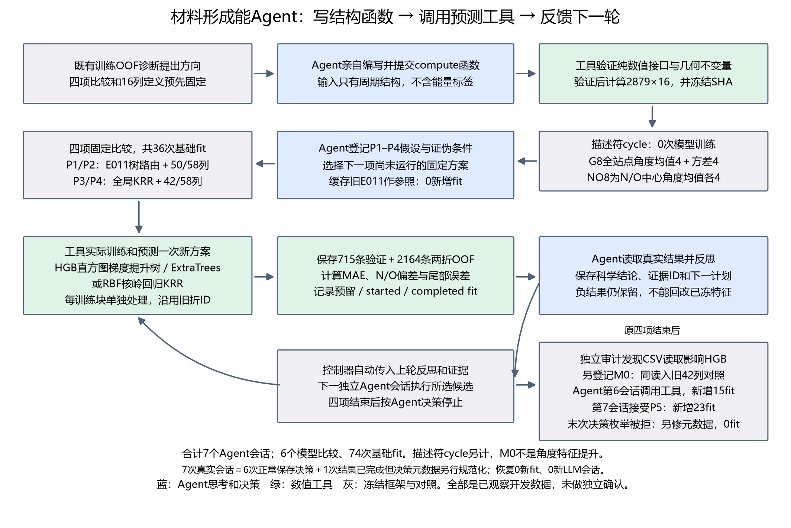
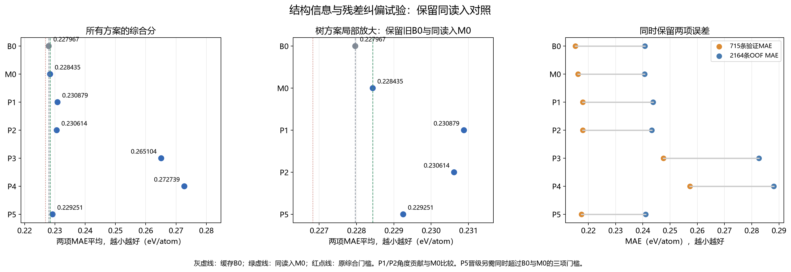

# 材料能量 Agent：结构特征与误差修正实验

**结论：本轮完成 6 项科学对比，累计 74 次实际拟合；没有方案达到晋级条件，最佳综合误差仍为原 E011 的 0.22797 eV/atom。**

## 数据集与任务

- 2879 个材料：2164 个训练、715 个验证；按化学体系隔离，并沿用已保存的两折训练 OOF。
- 预测目标：每原子的形成能，单位 eV/atom。本轮尚未开展新的凸包稳定性实验。
- 输入：原 42 列数值特征及已有弛豫晶体结构；Agent 实际编写了新增 16 列局部键角统计。
- [已发布的开发数据集](https://huggingface.co/datasets/fgh123654/materials-energy-stability-agent-dev)。本报告新增结构特征、运行与审查结果未声称全部已收入该数据页。

## 实际代码流程

训练误差诊断 → 实际隔离 Agent 写特征函数 → 工具检查数值与结构不变性 → 冻结假设和参数 → 工具训练与评估 → Agent 根据真实结果反思并选择下一步。

Agent 负责提出和执行受约束的实验、读取反馈与决定后续行动；HGB、ExtraTrees、KRR、Ridge 是被调用的数值工具。首批四项对比和键角定义已事先限定，本轮没有检验 Agent 策略是否优于随机搜索。

## 结果

综合误差是“验证 MAE 与训练 OOF MAE 的平均值”，越低越好。

| 对比 | 综合误差（eV/atom） | 本轮新增拟合 |
|---|---:|---:|
| 原 E011 缓存基准 | **0.22797** | 0 |
| P1：增加全局键角 8 列 | 0.23088 | 15 |
| P2：再加 N/O 中心键角 8 列 | 0.23061 | 15 |
| P3：旧 42 列改用 KRR | 0.26510 | 3 |
| P4：新 58 列使用 KRR | 0.27274 | 3 |
| M0：相同浮点读入的旧 42 列树对照 | 0.22843 | 15 |
| P5：严格内折 OOF 残差修正 | 0.22925 | 23 |

M0 用来排除浮点读入方式的混杂：P1、P2 相比 M0 仍变差。P5 减少了含氮材料的平均偏差，且 RMSE 略有下降，但总体 MAE 变大，所以没有采用。

共有 7 次真实隔离 Agent 会话：6 次正常保存决策；最后一次科学计算完成，但决策状态字段不匹配导致原控制器失败。失败记录保留，之后只补齐元数据，没有追加拟合或 LLM 会话。不能把这次运行描述为全流程无故障。

这些是已经多次观察的开发集结果，没有新的独立确认集证据，也不能据此宣布发现材料物理机制。

## 供导师核查

- [完整中文报告](REPORT_ZH.md)
- [精确结果表](comparison.csv) · [实验结果 JSON](experiment_results.json)
- [实际执行源码快照](code/README.md) · [Agent 编写的键角函数](code/approved_compute.py)
- [公开协议概要](protocols/pilot_public_summary.json) · [同读入对照登记](protocols/matched_control_public_summary.json) · [严格嵌套纠偏登记](protocols/nested_residual_public_summary.json)
- [质量与运行故障说明](audit_summary.json) · [源码字节哈希](source_snapshot_receipt.json) · [公开文件清单](manifest.json)

原始终端日志、登录信息和本机绝对路径没有发布。公开协议和审查内容是清理本机路径后的版本，保留对应原件 SHA256；公开源码按原字节复制。源码目录供审阅，尚不是完整独立复跑包。
