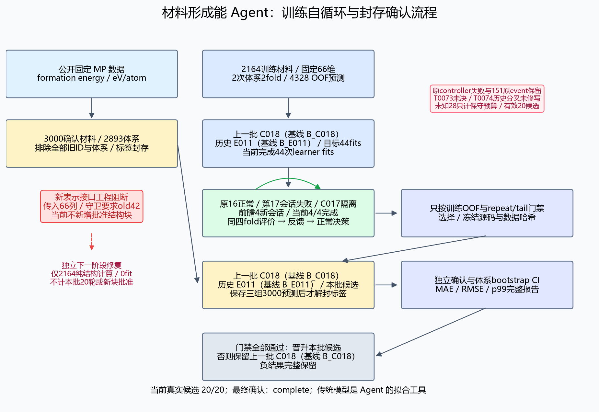
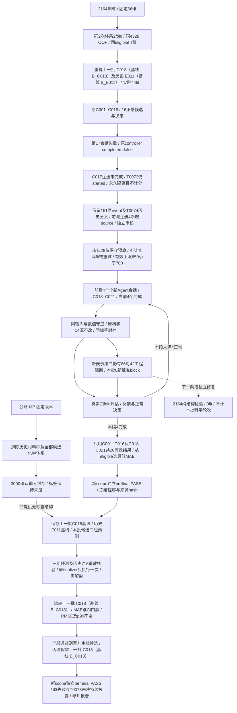
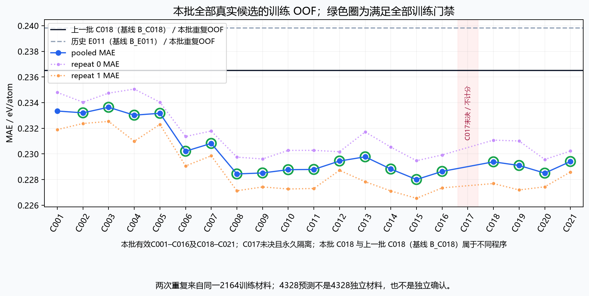
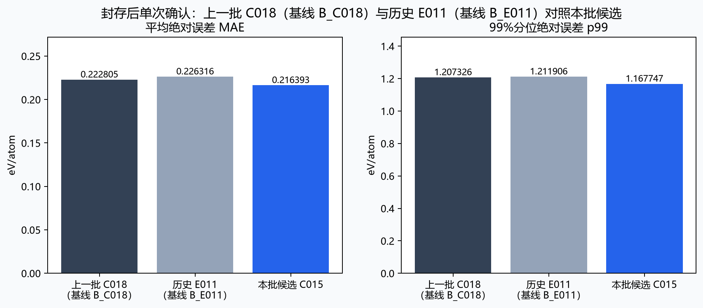
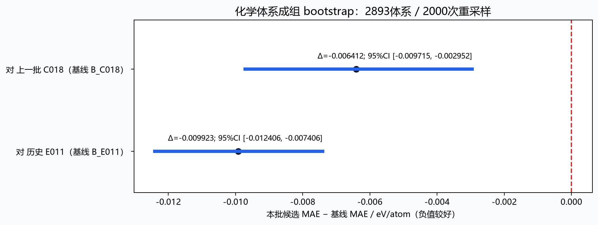

# 材料形成能 Agent：20轮实验与3000材料验证

**新3000材料验证：MAE 0.222805 → 0.216393 eV/atom，↓2.88%。** 选定 **本批候选 C015**，对照上一批 C018（基线 B_C018）；化学体系配对95%置信区间 [-0.009715, -0.002952] eV/atom，区间全部小于0，支持平均误差降低；5项晋升门槛全部通过。全部预注册门禁通过，晋升本批候选。

已完成 **20/20 个有效真实候选**、**622 次已知模型拟合**；实际开始 **21 个 Agent 会话（含1次未决失败）**，保存 20 条正常循环决策。最终确认状态：**complete**；独立终审：**PASS**。

**数据速览：2164个训练材料**用于拟合和选模；**旧715材料**仅作历史重放诊断；**新3000材料（2893个化学体系）**只在程序冻结、三组预测保存后解封，用于最终确认。

**自循环流程：Agent提出假设 → 编写预测程序 → 四组OOF验证（两次化学体系2fold）→ 依据误差反思 → 完成20个有效候选 → 选定并冻结程序 → 保存两组历史基线与本批候选的三组预测 → 解封新3000标签并检验晋升门槛。**

研究目标是预测材料每原子形成能（eV/atom）。本报告没有计算新的 DFT、能量高于凸包、合成成功率或超导温度。

**编号说明：上一批 C018（基线 B_C018） 是上一阶段的程序，在本批固定划分上作为基线重新评价；C001–C021 是本批登记编号；有效科学比较只包含 C001–C016 与 C018–C021，C017 未完成并永久隔离。** 因此“本批候选 C018”与“上一批 C018（基线 B_C018）”属于不同阶段、不同程序，不能只按 C018 字样认定是同一个模型。原协议、源码及结果中的 identifier 保持不变；科学身份以各阶段的 protocol SHA 和程序 code/byte SHA 区分，见 [协议摘要](protocol_summary.json) 与 [原样源码哈希](publication_manifest.json)。

## 原失败与前瞻隔离续行范围

**原运行在16个正常候选后，第17个会话失败；原 `controller_outcome.completed=false` 永久保留。** S020 的纯数组预检通过，并注册了 C017；随后真实评价调用 T0073 留有 `started`，没有 authoritative finish。C017 没有完成结果，永久隔离、不重跑、不参与选择。不能将这一会话称作纯预测器拒绝，或据未观察到新fit/活worker推定科学活动为零。

| 阶段 | 已完成候选 | 实际会话 | 正常保存决策 | 状态 |
|---|---:|---:|---:|---|
| 原运行（含失败第17会话） | 16 | 17 | 16 | 原失败结果保持 false |
| 其中 C017 / T0073 | 0 | 已含在原第17会话 | 0 | 已注册、评价未决、永久隔离 |
| 前瞻新阶段 C018–C021 | 4/4 | 4 | 4 | complete |
| 合计有效比较 | 20/20 | 21 | 20 | 登记候选数 21；目标21登记、21会话、20正常决策 |

原151条账本event作为不可修改prefix保留，其中 T0074 的 previous hash 跳过未结束的 T0073、指向 T0072，存在唯一历史分叉。原完整线性链不能标成 PASS；续行只追加独立审查的未来行为，不闭合 T0073、不修写原失败事件。

新增阶段沿用原14个科学源码、同一输入/划分/目标/eligible门禁和封存3000材料；manifest、guard、server、driver及新增transport副本按额外4份源码单独绑定和审阅。新transport仅对入口中的历史T0073作明确例外，原authoritative T0073仍保持 started。原科学源码没有套用这个例外。

**未知28只作最坏情况保守预算扣账。** 已知运行的理论最大622，加未知28为有效最坏650，低于700硬上限；不将这28写入实际fit日志、不称其已完成，也不重试原评价。只有4个全新真实候选及其正常决策实际完成后，才能形成20个有效比较；续行 outcome 独立记录，原失败 outcome 永久保持失败。

新scope独立prefinal审核通过后，才允许原finalizer做一次最终确认；新scope terminal审核必须确认原失败/未决/历史分叉保留、20有效比较/21真实会话/20正常决策、额外来源哈希和三组最终数值，才能发布最终结果。prelaunch、mock或旧范围审核的PASS都不能代替它。见 [续行范围与guard记录](continuation_scope_summary.json) 和 [原失败、未决与账本证据](original_failure_evidence.json)。

## 本批结构探索的工程阻断

**本批没有完成至少6个新结构block的探索目标。** 冻结接口把2164×66的当前输入传给只接受2164×42原始特征的表示守卫；R002通过几何检查后，在真实模型拟合前被工程接口拒绝。R001是另一个Agent代码的空邻居广播错误。两者均不是结构特征的预测成绩，不能据此认为新结构信息无效。

本批保持全部科学源码、协议和已存证据不变，继续完成20个新的预测程序与训练策略比较，使用既有固定66维信息。所有表示提交、拒绝、原程序与证据保留在 [结构提交记录](representation_submissions.json) 和 [工程阻断记录](representation_interface_summary.json)。

下一阶段修复在独立目录进行，只将调用方的 `ctx.X` 换成 `ctx.old_X`，用2164真实结构做无标签、无模型的接口检验。其纯计算、工程失败或通过均不计作本批批准新block、科学轮次或准确度提升；本批活动源码没有应用该修复。

**独立修复纯接口检验已通过**：2164×12有限候选特征，现有数值novelty守卫通过；0模型拟合、0新科学候选、0本批批准block。之前工程receipt输出路径错误也保留。这个结果证明接口修复可执行，没有证明预测准确度改善。

## 数据集

| 数据 | 数量 | 作用 |
|---|---:|---|
| 训练材料 | 2164 | 唯一模型训练与候选选择来源；两次化学体系2fold |
| 已见715材料 | 715 | 历史重放与回归诊断；不作独立确认或选择依据 |
| 上一批已见确认材料 | 1000 | 已知历史；不参与本批选择、新确认或重算成绩 |
| 本批封存确认材料 | 3000 / 2893体系 | 从固定3300候选中无标签选取；只最终评价一次 |

[公开开发数据（2879材料）](https://huggingface.co/datasets/fgh123654/materials-energy-stability-agent-dev) · [上一批结果](https://github.com/Guohuan-Feng/pris-reproduction/tree/main/reports/materials-agent-2026-10-06-evolving) · [固定 MP 数据源版本](https://doi.org/10.6084/m9.figshare.22715158.v38)

公开开发数据链接包含训练与既有715材料；本批3000确认数据尚未另行上传。新确认材料 ID 与化学体系排除历史使用和所有旧候选buffer；数据来自同一公开 MP 快照，不是外部来源复制、未见预训练证明或新DFT测量。使用的结构已由DFT弛豫。

确认集 seed：`materials-accuracy-agent-confirmation-20261007-v1`；prefit manifest SHA：`f8f59a779becbc3c24ac0f419b654d6ded3645d9399fc2e0f0cb59aa3e542633`。

## 实际代码流程

默认输入为 old42（30原始组成/几何特征 + E04的12维）及上一批固定 R004的24维图邻域特征，共66维。协议允许至多2个经守卫审核的新结构block；至少6个新block是探索目标，受本批工程阻断限制，不能算作20轮完成。

每个实际 LLM 会话自己提出可证伪假设、提交表示或训练代码、调用真实实验，并依据训练反馈写反思。每个完成候选包含两个重复的化学体系2fold，共4个训练block；C017未决会话另列，不冒充完成反思。4328 OOF预测对应2164个唯一材料，每材料2次；这些重复不是独立确认。

训练eligible门禁全部要求：每个repeat MAE至少下降0.5%；pooled/平均 MAE至少下降1%；两个repeat RMSE的算术均值不增加；每个repeat p99绝对误差不超过上一批 C018（基线 B_C018）对应值的1.02倍。这里的平均repeat RMSE不同于合并4328误差的pooled RMSE。

完成20个本批真实候选后，从eligible方案中按pooled OOF MAE选最低者，候选ID破同分；若没有eligible，最低方案仅作诊断。代码、输入与选择结果先冻结，再保存上一批 C018（基线 B_C018）、历史 E011（基线 B_E011）、本批选定候选的三组预测，核验历史715重放后才释放新确认标签。

最终晋升要求同时满足：训练eligible；对上一批 C018（基线 B_C018）的新3000 MAE严格降低；按2893化学体系成组bootstrap的95%区间上界小于0；RMSE及p99均不增加。不能仅凭比历史 E011（基线 B_E011）更好宣称超越上一批 C018（基线 B_C018）。

[CatBoost的官方训练接口](https://catboost.ai/docs/en/concepts/python-reference_catboostregressor_fit) 是 Agent 新增的可调用拟合工具；任务环境固定版本 `1.2.10`，加入工具不保证准确度改善。传统模型执行拟合，Agent负责假设、程序、实验安排与反思。

数值/AST/时间/内存/几何守卫提供有限检查，不是通用OS安全隔离或科学正确性证明。学习器fit次数按可信API记录；程序内任意数值学习运算不一定能够等价换算成模型fit次数。

## 训练实验结果

| 基线 | 当前状态 | pooled MAE | 平均repeat RMSE | repeat0 MAE | repeat1 MAE |
|---|---|---:|---:|---:|---:|
| 上一批 C018（基线 B_C018） | complete | 0.236518 | 0.368705 | 0.237290 | 0.235747 |
| 历史 E011（基线 B_E011） | complete | 0.239812 | 0.372870 | 0.241365 | 0.238259 |

| 本批候选 | 状态 | 新block | pooled MAE | mean repeat RMSE | p99 | eligible / 未通过项 |
|---|---|---|---:|---:|---:|---|
| 本批候选 C001 | complete | 固定66 | 0.233348 | 0.365248 | 1.158824 | 未通过: repeat_1_p99 |
| 本批候选 C002 | complete | 固定66 | 0.233206 | 0.364720 | 1.138748 | 通过 |
| 本批候选 C003 | complete | 固定66 | 0.233640 | 0.364108 | 1.154588 | 通过 |
| 本批候选 C004 | complete | 固定66 | 0.233024 | 0.363731 | 1.174186 | 通过 |
| 本批候选 C005 | complete | 固定66 | 0.233171 | 0.363481 | 1.140519 | 通过 |
| 本批候选 C006 | complete | 固定66 | 0.230213 | 0.357776 | 1.140411 | 通过 |
| 本批候选 C007 | complete | 固定66 | 0.230822 | 0.359219 | 1.122195 | 通过 |
| 本批候选 C008 | complete | 固定66 | 0.228441 | 0.356502 | 1.099380 | 通过 |
| 本批候选 C009 | complete | 固定66 | 0.228518 | 0.356220 | 1.100792 | 通过 |
| 本批候选 C010 | complete | 固定66 | 0.228773 | 0.357010 | 1.101530 | 通过 |
| 本批候选 C011 | complete | 固定66 | 0.228794 | 0.358761 | 1.093056 | 通过 |
| 本批候选 C012 | complete | 固定66 | 0.229449 | 0.357235 | 1.107089 | 通过 |
| 本批候选 C013 | complete | 固定66 | 0.229775 | 0.361205 | 1.136281 | 通过 |
| 本批候选 C014 | complete | 固定66 | 0.228824 | 0.356729 | 1.114940 | 通过 |
| 本批候选 C015 | complete | 固定66 | 0.228007 | 0.356351 | 1.101092 | 通过 |
| 本批候选 C016 | complete | 固定66 | 0.228639 | 0.356577 | 1.108900 | 通过 |
| 本批候选 C017 | 永久隔离；科学评价未决（T0073） | 固定66 | 待完成 | 待完成 | 待完成 | 待完成 |
| 本批候选 C018 | complete | 固定66 | 0.229386 | 0.356694 | 1.115976 | 通过 |
| 本批候选 C019 | complete | 固定66 | 0.229102 | 0.357427 | 1.106646 | 通过 |
| 本批候选 C020 | complete | 固定66 | 0.228505 | 0.356871 | 1.103500 | 通过 |
| 本批候选 C021 | complete | 固定66 | 0.229410 | 0.360820 | 1.153859 | 通过 |

每个候选的假设、证伪标准、repeat/fold/group/tail完整数值保存在 [candidate_results.json](candidate_results.json)、[候选表](results.csv) 与 [实际Agent决策](decisions.json)。所有失败、负结果和未eligible方案均保留。训练成绩来自自适应反复观察，不能当作未经选择的泛化证明。

## 拟合前的预测程序提交与拒绝

保存的预测程序提交共 **24** 次；纯验证拒绝 1 次，虚构数组预检拒绝 2 次。提交数与真实候选轮数分开统计，验证器拒绝和mock模型调用不增加科学轮次或真实fit次数。

| 提交 | 保存状态 | 关联候选 | 拟合前真实fit | 拒绝原因 |
|---|---|---|---:|---|
| S001 | registered_candidate | C001 | 0 | — |
| S002 | registered_candidate | C002 | 0 | — |
| S003 | registered_candidate | C003 | 0 | — |
| S004 | rejected_by_validation | — | 0 | ValueError: AST construct Invert forbidden |
| S005 | registered_candidate | C004 | 0 | — |
| S006 | registered_candidate | C005 | 0 | — |
| S007 | rejected_by_synthetic_preflight | — | 0 | ValueError: Invalid current-training numeric arrays |
| S008 | registered_candidate | C006 | 0 | — |
| S009 | registered_candidate | C007 | 0 | — |
| S010 | registered_candidate | C008 | 0 | — |
| S011 | registered_candidate | C009 | 0 | — |
| S012 | registered_candidate | C010 | 0 | — |
| S013 | registered_candidate | C011 | 0 | — |
| S014 | registered_candidate | C012 | 0 | — |
| S015 | registered_candidate | C013 | 0 | — |
| S016 | rejected_by_synthetic_preflight | — | 0 | ValueError: Invalid current-training numeric arrays |
| S017 | registered_candidate | C014 | 0 | — |
| S018 | registered_candidate | C015 | 0 | — |
| S019 | registered_candidate | C016 | 0 | — |
| S020 | registered_candidate | C017 | 0 | — |
| S021 | registered_candidate | C018 | 0 | — |
| S022 | registered_candidate | C019 | 0 | — |
| S023 | registered_candidate | C020 | 0 | — |
| S024 | registered_candidate | C021 | 0 | — |

全部提交的原程序审阅快照、原始字节哈希、申请metadata、AST/虚构数组预检与拒绝收据保存在 [预测程序提交记录](predictor_submissions.json)。收据的公开版本删除本机路径等私有信息，同时保留原始与公开文件的不同哈希。S编号只标识提交历史；注册并完成真实OOF比较的C编号才是科学候选。

## 最终确认与结论

S020 的“预检真实fit=0”仅描述虚构数组预检阶段。C017 随后的真实评价 T0073 仍未决，科学活动未知；不能把这个预检0推广成整场会话0科学活动。

| 新3000材料 | MAE | RMSE | p90 | p99 | bias（预测−真值） |
|---|---:|---:|---:|---:|---:|
| 上一批 C018（基线 B_C018） | 0.222805 | 0.350386 | 0.488478 | 1.207326 | -0.002646 |
| 历史 E011（基线 B_E011） | 0.226316 | 0.355549 | 0.512842 | 1.211906 | -0.012173 |
| 本批候选 C015 | 0.216393 | 0.334314 | 0.484748 | 1.167747 | -0.009435 |

| 比较 | ΔMAE（候选−基线） | 95%体系bootstrap区间 |
|---|---:|---|
| 对上一批 C018（基线 B_C018） | -0.006412 | [-0.009715, -0.002952] |
| 对历史 E011（基线 B_E011） | -0.009923 | [-0.012406, -0.007406] |

| 预注册晋升门禁 | 结果 |
|---|---|
| 训练eligible | 通过 |
| 确认MAE降低 | 通过 |
| 对上一批 C018（基线 B_C018）的95%CI上界<0 | 通过 |
| 确认RMSE不增 | 通过 |
| 确认p99不增 | 通过 |

95%区间为按化学体系重采样2000次的估计；同来源、单个固定确认集仍有局限，不能推断物理机制、合成能力或普遍优势。历史715的单次诊断数值包含于完整最终metadata，不能重新解释为独立验证。

## 真实工作量、审阅与公开范围

当前learner fit事件：started **622**，completed **622**，failed **0**。状态计数与正在运行的fit日志可能暂有延迟；终审核对每个实际fit和全部哈希。

当前真实候选 20/20；新增经批准表示block 0；700为fit reservation硬上限，计划理论最大622 = 两基线44 + 20候选×4block×7最多560 + 最终三组最多18，并不是已完成622次拟合。历史上一批拟合不重新计入本批。

另计保守未知预算 28；已知fit starts仍只按原日志计数。前瞻续行时的有效最坏预算为650，并不是650次已完成fit。

独立终审状态：**PASS**。最终结果链完整且独立终审PASS之前，当前目录为待发布草稿。

- [完整最终metadata与链状态](final_summary.json)
- [两基线全部repeat/fold结果](baseline_results.json)
- [计数与预算](accounting.json)
- [实际会话记录摘要](sessions.csv)
- [数据边界](data_boundary_summary.json)
- [所有结构提交与拒绝](representation_submissions.json)
- [工程阻断与独立后续修复metadata](representation_interface_summary.json)
- [所有预测程序提交、纯验证拒绝与收据哈希](predictor_submissions.json)
- [原失败 outcome、未决调用与历史分叉](original_failure_evidence.json)
- [前瞻续行 manifest、来源与预算](continuation_scope_summary.json)
- [协议摘要与原始source哈希](protocol_summary.json)
- [独立审阅摘要](audit_summary.json)
- [工程、预检与中途审阅历史（保留早期失败）](nonterminal_review_history.json)
- [源码审阅快照](source/README.md)
- [公开文件与原样源码哈希](publication_manifest.json)

公开内容包含实际代码审阅快照、全部候选结果和导师流程图；不包含认证、原始私有CLI上下文、本机路径、runtime配置或确认标签。代码快照依赖冻结数据与历史工程，不是独立可运行复现包。
