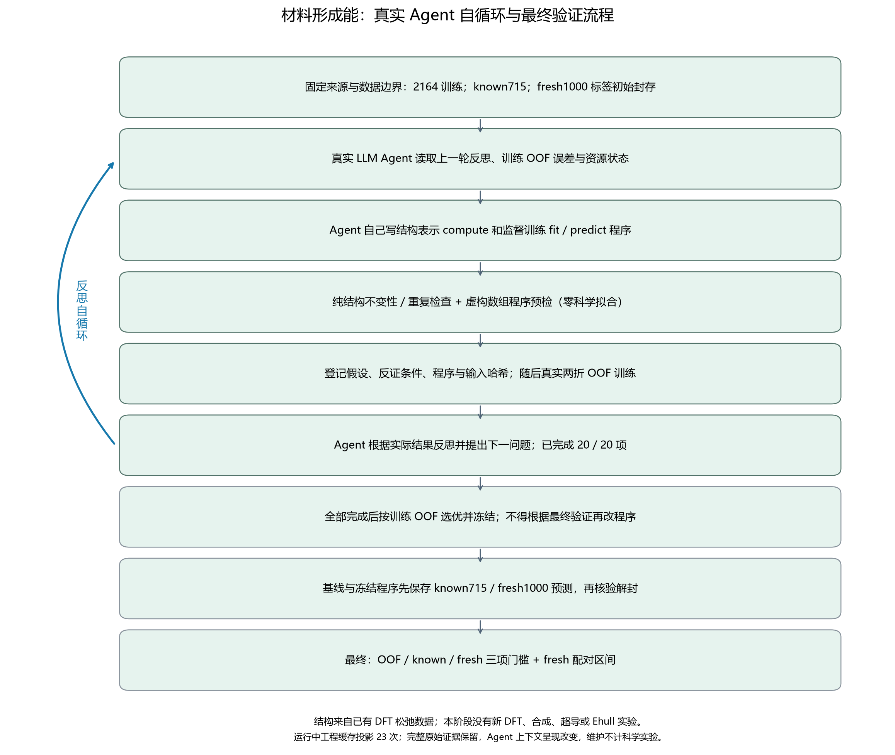
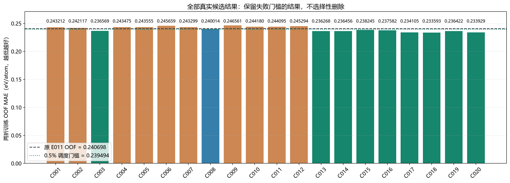
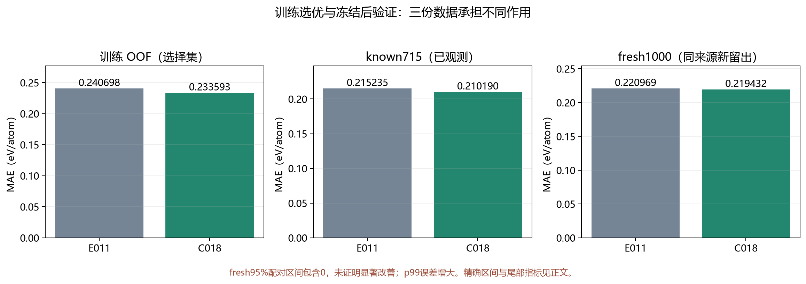
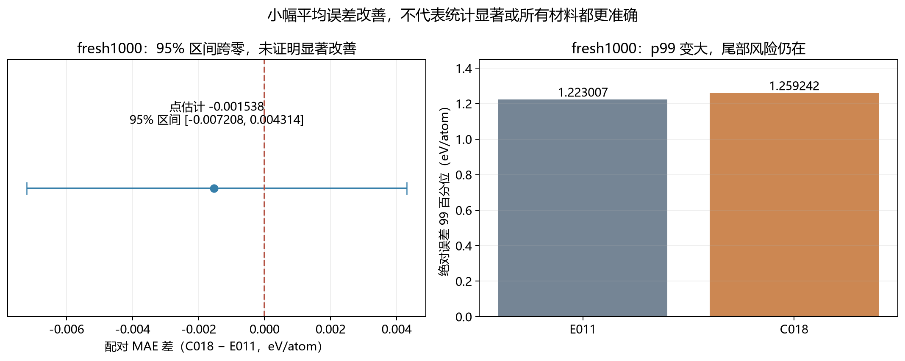

# 材料形成能：扩大探索范围的自循环 Agent

**当前结论：原预登记三门槛通过；fresh 平均误差小幅改善，尚未证明统计显著，p99 尾部误差变大。**

实际完成 20 / 20 项候选实验；其中 10 项训练 OOF MAE 低于 E011，9 项达到预先登记的 0.5% OOF 调度门槛。所有结果均保留在 [results.csv](results.csv)，完整保存的 OOF 指标、两折与分组诊断见 [candidate_results.json](candidate_results.json)。OOF 门槛是安排后续验证的标准，不代表统计显著或物理机制。

| 核心结果 | E011 MAE | 冻结 C018 MAE | 相对降低 |
|---|---:|---:|---:|
| 训练2164 两折OOF（选择集） | 0.240698 | 0.233593 | 2.952% |
| known715（历史已观测） | 0.215235 | 0.210190 | 2.344% |
| fresh1000（同来源新留出） | 0.220969 | 0.219432 | 0.696% |

**本次 fresh 改善仅约0.70%（MAE降低 0.001538 eV/atom）；95%配对区间 [-0.007208, 0.004314] 确实包含0，未证明统计显著。绝对误差99百分位 p99 从 1.223007 升至 1.259242 eV/atom，尾部风险更大。**

**冻结 C018：原42列 + R004的24列图邻域结构统计；0.8×原目标E011 + 0.2×signed-log目标HGB。**最终只比较这个组合与原42列E011，没有最终留出上的成对消融，因此不能把fresh改善单独归因于R004或目标变换。C003的训练OOF对照支持训练阶段的表示观察，不能替代独立留出归因。

任务是形成能预测；本次结果不证明稳定性/Ehull、化学机制或新材料发现，也不构成突破。

## 数据集与任务

| 数据 | 数量 | 作用 |
|---|---:|---|
| 已观测训练材料 | 2164 | 固定化学体系两折 OOF；Agent 只用这一份反馈选择候选 |
| known 验证材料 | 715 | 历史上已观测；本阶段搜索不返回新分数，冻结后再评价 |
| fresh 同来源新留出 | 1000 / 980 化学体系 | 固定 ID 与输入；保存两臂预测、核验冻结记录后才解封标签 |

预测目标是 `formation_energy_per_atom`，单位 eV/atom。原有 30 个数值特征与冻结 E04 的 12 个特征合计 42 列；新结构表示由 Agent 编写。结构来自既有 DFT 松弛数据，因此包含 DFT 得到的信息。本阶段没有运行新 DFT、合成实验、超导实验，也没有完成能量高于凸包（Ehull）的新评估。

来源固定为 [Matbench Discovery Figshare22715158v38](https://doi.org/10.6084/m9.figshare.22715158.v38)。fresh 是此前登记的本地实验未使用的新 ID 与化学体系；仍来自同一公开版本，不是外部数据库或新实验验证。未知模型预训练暴露、未映射的结构相似性不由此排除。

既有开发集浏览入口：[Hugging Face 数据集](https://huggingface.co/datasets/fgh123654/materials-energy-stability-agent-dev)。该链接不代表本轮 fresh 文件或标签已上传。

## 代码流程

[Mermaid 流程源文件](workflow.mmd) · [SVG 流程图](workflow.svg)

传统模型是 Agent 调用的拟合工具；本阶段的表示函数、训练程序、实验选择与反思由实际 LLM 会话产生。

1. Agent 读取训练 OOF 诊断与前一轮反思，提出可反证的假设。
2. Agent 编写纯结构 `compute(structure)` 和 `fit(X_train,y_train)` / `predict(state,X_eval)`；允许不同的结构统计、训练期变换、分组与组合。
3. 工具检查结构不变性、重复列与有限值，并用虚构数组和算术模型替身预检预测程序；预检不计科学拟合。
4. 先登记假设、反证条件及代码哈希，再做真实两折训练。每折的 `fit` 只接收该折训练数组；每块最多 6 个可信 API 学习器拟合。
5. Agent 接收实际 OOF 误差、分组诊断，保存反思和下一问题；控制器把记录送入下一实际 LLM 会话。
6. 20 项完成后，按 OOF MAE 选出最优新程序并冻结。两臂预测保存后才允许 fresh 标签解封；验证后不再调参或换候选。

本轮扩大了表示与监督程序的探索范围；并没有证明该 Agent 策略优于随机搜索或专家策略。AST 数值检查与资源限制也不是一般操作系统安全沙箱；几何与推断一致性检查是有限探针。

## 实际工作量

下表只计本次恢复阶段；首次失败阶段在后面的表格独立列出，不能计成完成实验。

| 项目 | 已记录数量 |
|---|---:|
| 完成候选 / 尝试候选 | 20 / 20 |
| 实际 Agent 会话启动 / 已结束 / 保存决策 | 20 / 20 / 20 |
| 批准结构表示 / 已在完成实验使用 | 12 / 12 |
| 结构提交 / 预测程序提交 | 14 / 21 |
| 学习器拟合预留 / 实际开始 / 完成 / 失败 | 223 / 223 / 223 / 0 |
| 已完成的 Agent 程序训练调用 | 42 |
| 实际服务器 MCP 调用 / 科学执行失败 / 仍运行 | 96 / 0 / 0 |
| 非缓存输入 token / 输出 token | 983813 / 64207 |
| 搜索耗时 / 最终验证耗时（秒） | 4109.7 / 45.8 |

所有已启动会话的 token 记录完整。

拟合数量计算可信 `train_model` 学习器的实际启动与完成事件，和预算预留分别列出。Agent 自己写的数值参数运算并不能普遍识别成独立学习器；因此另列程序 `fit` 调用数，避免宣称计数覆盖每一种内部学习运算。

扣除首次失败阶段费用后，本阶段原协议登记剩余上限：244 个学习器拟合预留、174 次 MCP 调用、776515 非缓存输入 / 115618 输出 token；搜索 7057.079 秒，总工作 10657.079 秒。达到资源上限或科学结果未知时停止，不能重跑以填满轮数。

真实搜索拟合 212 次 + 冻结后最终验证 11 次 = 223 次完成拟合；首次失败阶段只有12次预留、0次实际拟合。

### 已完成科学结果的传输恢复

96 次实际服务器工具调用中，95 次返回直接成功；另有1次响应交付错误，随后通过实际只读上下文取回结果。不能称所有调用都原样成功送达 Agent。

`T0025 evaluate_candidate(C005)` 的服务器科学执行已完成，10次可信学习器拟合均完成、0次失败，完整 `result.json` 保留。但 CLI 的 item 7 记录 `Error executing tool evaluate_candidate`；原交付错误保持，未覆盖。

随后实际 `T0026 research_context` 成功返回完整 C005 结果与实际计数；`T0027 record_cycle_decision` 引用 T0025/T0026 的恢复证据并明确不重跑。**科学评估只执行一次；只读取回结果不计作新候选或新的科学拟合。**C005 的负结果保留在所有候选结果中。

[transport_delivery_summary.json](transport_delivery_summary.json) 绑定独立终前审计、原结果、恢复决策和三次服务器响应 SHA。独立审计验证保存结果与实际 CLI 恢复内容一致；报告程序读取该已保存审计，不重新运行 CLI 或重复原始日志审查。

### 首次失败阶段与合并资源计费

首次尝试在任何可信学习器拟合前失败，生产隔离进程无法导入同目录数值模块。保存了失败记录；修复后重新冻结新阶段，并禁止重跑此前同一候选。首次提出的程序尚未得到科学检验，因此不能称为负结果。

| 项目 | 首次失败阶段 | 合并已记录费用 |
|---|---:|---:|
| 完成候选 | 0 | 20；首次失败不计入20项 |
| 实际 LLM 会话 | 1 | 21 |
| 实际 MCP 调用 | 6 | 102 |
| 拟合预留 / 实际开始 / 实际完成 | 12 / 0 / 0 | 235 / 223 / 223 |
| 非缓存输入 / 输出 token | 23485 / 4382 | 1007298 / 68589 |
| 科学执行时间（秒） | 142.921 | 4298.484 |

首次失败阶段 fresh 标签未解封。上述计费已经从恢复阶段预算中扣除；不会把失败预留说成真实训练。

### 运行中的 Agent 上下文缓存维护

截至本报告生成时，记录了 23 次工程缓存投影，涉及 12 项表示与 19 项已完成候选。两类维护严格限定字段：

1. 从 `representation.summary.invariance` 的派生缓存删去重复的 `subprocesses` 环境与性能记录。
2. 从**已完成** `experiment.summary` 的最外层派生缓存删去 `artifact_hashes`、`numeric_input_hashes`、`folds`、`code_sha256` 四个重复证据字段。其中最外层 `folds` 是训练执行回执；**OOF 内的 `OOF.folds` 与 `OOF.groups` 均保留**。

完整 `runtime_receipts`、原始 `result.json` 与实际 MCP 响应继续保存；所有 OOF 数值、scope、假说、反证条件、决策与实际计数保留。每次维护保存修改前后 state、前后 server 快照和执行程序 SHA；[cache_maintenance_summary.json](cache_maintenance_summary.json) 列出两类精确投影及其证据绑定。完整上下文快照含本机与会话元数据，保留用于内部审计，不直接发布。

**这改变了 Agent 下一轮收到的上下文呈现，不能称完整 prompt 字节相同，也不能据此作严格受控的 Agent 策略比较。**维护与两个 watcher 只做工程检查；不会计作新科学实验、拟合、LLM 会话或 MCP 科学调用。科学执行的正常 walltime 持续计时，没有减去维护时间或重置预算；维护暂停时间未单独测量，不能另报精确秒数。

报告程序核对两种精确字段投影、原始文件哈希与前后 server 字节绑定；严格终审15994项与独立数值复核1984项全部通过；这验证已保存证据与数值，不证明改善显著或物理机制。这些文件记录可验证缓存变更与证据保留，PID 声明本身不能证明历史操作系统暂停行为。

### 输入计算资源的事前追加

原控制器已在完整结算的候选边界因输入 token 上限自然停止；使用事前登记的输入资源追加。原失败 outcome 和全部实验保留，不重跑已完成候选。

| 输入资源上限 | 原始登记 | 条件追加登记 |
|---|---:|---:|
| 全程非缓存输入 token（含首次失败） | 800000 | 1200000 |
| 恢复阶段非缓存输入 token（扣首次23485） | 776515 | 1176515 |

仅增加非缓存输入 token；256 个拟合预留、120000 输出 token、180 次 MCP 调用、7200 秒搜索、10800 秒总工作与20项候选的全程上限保持。数据、两折、表示/训练 API、OOF 选优、先预测后解封及三项门槛均不变。原协议、13项科学源码以及旧 launch/outcome/failure 保持原始字节；续接采用同一 backend/server/transport 和原 task_prompt，另加透明预算提示。

**续接 prompt 增加了正式登记的计算资源提示；`summary_context` 仍显示历史原始预算，额外提示只覆盖输入额度。**因此完整 prompt 字节发生变化，不能把这次运行说成原800k登记下的完全相同上下文实验。

搜索时钟从原控制器 launch 开始连续计算，原控制器停止、审查等待与续接均计入，不能重置。若第20项的科学动作和决策已完成，仅最后输入结算超过原上限，则保存独立完成回执，不新增 LLM 或科学实验。

**追加启用后的20项完成，应报告为“在正式追加的1.2M输入预算下完成”，不能宣称原800k预算内成功。**独立终审必须核对两段 outcome、完整边界与真实退出观察；[resource_amendment_summary.json](resource_amendment_summary.json) 给出登记、启用状态与哈希。

原恢复控制器的输入上限停止，与首次隔离模块导入失败分开记录。前者已有完整候选、正常科学反馈与保存决策，没有因此作废或重跑这些候选；后者为0项完成、0次实际拟合的工程失败。

| 恢复阶段的实际段落 | 已完成候选 | 实际Agent会话 | 非缓存输入 / 输出token | MCP调用 | 实际开始 / 完成拟合 |
|---|---:|---:|---:|---:|---:|
| 原恢复控制器：自然输入cap停止 | 17 | 17 | 813029 / 55960 | 84 | 176 / 176 |
| 同root续接：后续新候选 | 3 | 3 | 170784 / 8247 | 12 | 36 / 36 |
| 冻结后两臂最终验证 | — | 0 | 0 / 0 | 0 | 11 / 11 |

上方全程总账为“首次失败费用 + 原恢复控制器 + 同root续接 + 最终验证”；原恢复费用不会再次重复相加。在运行中的会话用量尚未返回时，续接 token 只列已保存的真实用量回执。

完整20项搜索回执 SHA：`89539f06c287227f100fc55bef955b40a4bf205c711d86fff7879c620489beab`。它独立绑定原/续接 launch/outcome、全部 transport 与连续搜索时钟。

最终冻结的外部资源锚 SHA：`3b8a10f2641e765020dbe83e82f2c0e5165ee3eae975f6c930ae9298eefb99af`。锚内容与正式追加、完整搜索回执及冻结选优的关系见资源摘要；完整终审负责核对。

最终外部完成绑定 SHA：`16ea5186610da20f2240d54e443cda404017800722981a71118a2d1e2cc79549`。它关联外部资源锚与原始冻结、预测、解封及最终指标文件。

## 实验结果

| 候选 | 结构块 | OOF MAE | 相对 E011 的 MAE 差 | OOF 门槛 | 完成拟合 |
|---|---|---:|---:|---|---:|
| C001 | R002 | 0.243212 | 0.002514 | 未通过 | 10 |
| C002 | R003 | 0.242117 | 0.001420 | 未通过 | 10 |
| C003 | R004 | 0.236569 | -0.004129 | 通过 | 10 |
| C004 | R005 | 0.243475 | 0.002777 | 未通过 | 10 |
| C005 | R006 | 0.243555 | 0.002857 | 未通过 | 10 |
| C006 | R007 | 0.245659 | 0.004961 | 未通过 | 10 |
| C007 | R008 | 0.243299 | 0.002601 | 未通过 | 10 |
| C008 | R009 | 0.240014 | -0.000684 | 未通过 | 10 |
| C009 | R010 | 0.246561 | 0.005864 | 未通过 | 10 |
| C010 | R011 | 0.244180 | 0.003482 | 未通过 | 10 |
| C011 | R013 | 0.244095 | 0.003397 | 未通过 | 10 |
| C012 | R014 | 0.245294 | 0.004596 | 未通过 | 10 |
| C013 | R004 | 0.236268 | -0.004430 | 通过 | 12 |
| C014 | R004+R009 | 0.236456 | -0.004242 | 通过 | 10 |
| C015 | R004 | 0.238245 | -0.002453 | 通过 | 12 |
| C016 | R004+R003 | 0.237582 | -0.003116 | 通过 | 10 |
| C017 | R004 | 0.234105 | -0.006593 | 通过 | 12 |
| C018 | R004 | 0.233593 | -0.007104 | 通过 | 12 |
| C019 | R004 | 0.236422 | -0.004276 | 通过 | 12 |
| C020 | R004+R009 | 0.233929 | -0.006769 | 通过 | 12 |

原 E011 训练 OOF MAE 为 **0.240698 eV/atom**。负的 MAE 差表示候选更好，正的表示更差。本轮只按 OOF 选优；历史的验证/OOF 平均综合分数不是本轮选择指标。

## 冻结后的最终验证

冻结候选为 **C018**，选优依据为训练 OOF；先预测后解封记录的哈希已经核验。

| 数据与门槛 | E011 MAE | 冻结程序 MAE | 是否通过 |
|---|---:|---:|---|
| 训练 OOF：相对基线降低至少 0.5% | 0.240698 | 0.233593 | 通过 |
| known715：不变差 | 0.215235 | 0.210190 | 通过 |
| fresh1000：MAE 严格降低 | 0.220969 | 0.219432 | 通过 |

fresh 配对 MAE 差（冻结程序 − E011）为 **-0.001538 eV/atom**；按化学体系进行 2000 次 bootstrap 的 95% 区间为 **[-0.007208, 0.004314]**，化学体系簇数 980。**本次区间确实包含0，因此只能报告小幅点估计改善，未证明误差降低具有统计显著性。**区间不参与原预登记三门槛；规则通过与统计证据充分是两件事，也不证明化学机制或通用有效性。

fresh p99绝对误差：1.223007 → 1.259242 eV/atom。平均误差降低时，99百分位仍变大；尾部风险应作为下一阶段明确目标。

**三门槛联合结果：通过；保留方案：chosenAgentprogram。**

## 下一阶段的预登记验证

1. 在训练开发范围内，预先固定多seed与化学体系分组重复划分，检查小幅改善是否稳定；控制预算并完整保留负结果。
2. 设计结构块与目标变换的成对消融：原42列E011、加入R004、只加入目标变换组合、两者同时加入；同一划分与seed配对，单列p99尾部指标。
3. 先冻结候选与评价规则，再使用独立的新cohort确认。已经看过的这1000条只能作为历史验证，不能反复据它挑方案。

上述为后续研究设计；本次报告没有启动这些新拟合或新Agent会话。

## 审计与可审阅的材料

严格终审15994项与独立数值复核1984项PASS，两个审计结果与本次最终result SHA均已绑定。
[final_audit_summary.json](final_audit_summary.json) 给出审计文件SHA、检查数量、程序SHA和共同绑定的最终result SHA。

- [逐候选指标与假设](results.csv)
- [完整候选 OOF、两折、分组与证据字段](candidate_results.json)
- [两种上下文缓存投影与维护回执摘要](cache_maintenance_summary.json)
- [实际会话与用量](sessions.csv)
- [已完成结果的响应交付错误与只读恢复](transport_delivery_summary.json)
- [输入资源追加的登记与启用摘要](resource_amendment_summary.json)
- [Agent 保存的反思与下一步](decisions.json)
- [预算与实际计数](accounting.json)
- [冻结协议公开摘要](protocol_summary.json)
- [代码审阅快照](source/README.md)
- [公开文件清单与字节哈希](publication_manifest.json)

这是已审计的待发布报告包；远程发布成功由独立publication receipt与远程commit核验。代码快照保留实际源码字节并绑定哈希，不是独立可运行包；原始配置、私有路径、认证内容、会议媒体与 CLI 原始日志不发布。
