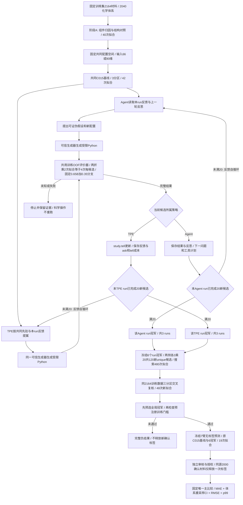
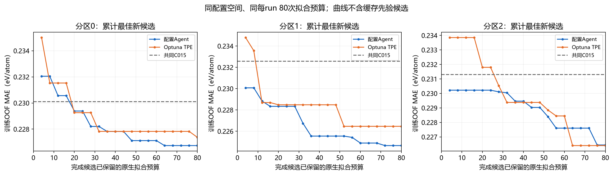
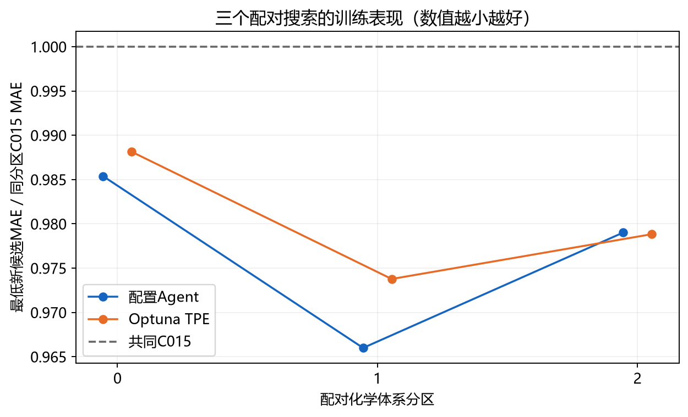
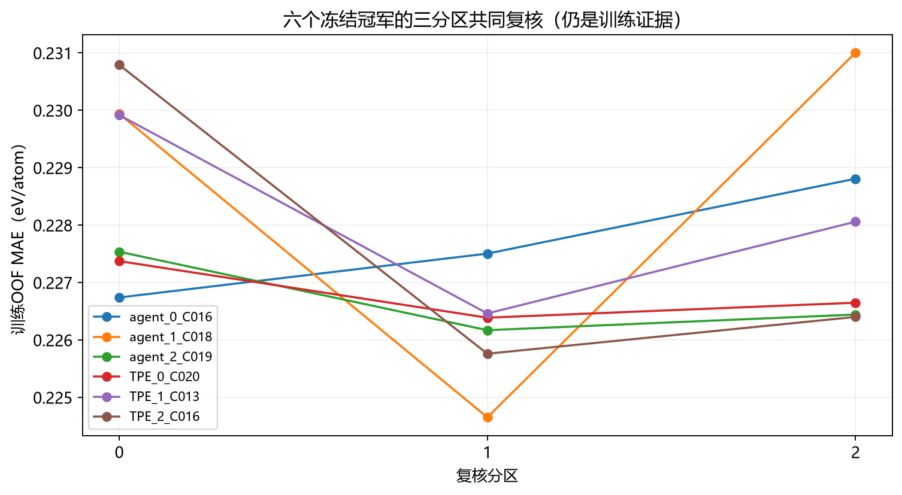

# 材料形成能：配置 Agent 与普通搜索的受控对照

当前状态：**搜索与交叉复核已完成**。

训练数据：**2164个材料 / 2040个化学体系**。实际完成新候选：**Agent 60 个，TPE 60 个**；未完成候选不计入。
训练预选全局冠军：**agent_2_C019**；三分区平均MAE **0.226717**，相比同分区C015平均 **0.231322**，下降 **1.99%**。训练门槛：**未通过**。
确认评分：**未执行**；训练门槛未通过，**不晋升**。

本轮目标是形成能 `formation_energy_per_atom`（eV/atom）。Agent 根据训练反馈现场选择机制和参数，固定可信生成器生成 Python 程序。

本轮未读取或使用 `energy_above_hull` 标签，也未建立稳定性分类任务；形成能误差下降不能直接视为发现稳定材料。LINEGRAPH24 是24维结构描述符，本轮没有训练 ALIGNN 神经网络。

## 数据与代码流程

- [公开整理数据集](https://huggingface.co/datasets/fgh123654/materials-energy-stability-agent-dev)：已核对revision `11d4111608864bb8ecc4a8a8f50360097deb82a7` 的development含2879条，划分为2164 train＋715 validation；本轮2164训练ID与该train完全一致，与721历史test零交集。
- 固定2164训练材料、2040化学体系；三组按化学体系隔离的两折分区，种子为20261009、20261010、20261011。
- Hugging Face仓库提供30维原始特征；本研究后续构建42维、追加R004成66维、再追加LINEGRAPH24成90维。721历史test、此前3000确认材料和本轮新2000确认材料的逐材料目标不在此Hugging Face整理仓库；这不表示其上游Materials Project数据在公网不存在。
- 输入为固定66维，或追加LINEGRAPH24形成90维。阶段A允许探索结构输入；其训练误差差值的CI包含0，仍属探索信号。
- 每个候选拟合 Ridge 趋势与 CatBoost 残差；最终预测固定为0.65×共同B＋0.35×新分支。配置Agent和TPE使用相同空间、训练评价器、80次拟合预算与7200秒上限。
- 已公开代码来源：[实际C015基线程序](https://github.com/Guohuan-Feng/pris-reproduction/blob/2715cb9a5664b753af28d5286cd5a7e395bac13f/reports/materials-agent-2026-10-07-controlled/C015_predictor.py) · [LINEGRAPH24结构描述符程序](https://github.com/Guohuan-Feng/pris-reproduction/blob/2715cb9a5664b753af28d5286cd5a7e395bac13f/reports/materials-agent-2026-10-07-controlled/LINEGRAPH24_compute.py)。两链接固定到已核对提交；本轮grammar与六冠军源码副本另见本报告的可读代码。
- TPE包含1个共同C015先验；没有拒绝时为4个新随机启动候选＋16个新引导候选。先验读缓存不算新候选。
- 715、721及以前的3000材料结果均为历史已见数据，不参与本轮选模。未来2000确认材料来自同一MP数据源、未用化学体系；并非新DFT计算、合成验证或跨数据源泛化。

下图为注册流程；实际完成数与停点记录见下一节。

## 实际进展与开销

阶段B实际完成原生拟合 **570** 次；当前保留拟合预算 **570** 次，未闭合拟合 **0** 个。预算保留与已完成拟合分别记账，失败/未知操作不免费，也不重跑。
实际MCP工具调用 290 次；已知非缓存输入 token 3324028、输出 token 240219。TPE提案与tell更新的CPU/墙钟开销单独保存在公开聚合JSON，未计成材料拟合。

|搜索|分区|已完成新候选|真实CLI进程启动|正常完成会话|已保存反思|保留拟合预算|最低新候选MAE|
|---|---:|---:|---:|---:|---:|---:|---:|
|agent_0|0|20/20|20|19|20|80/80|0.226740|
|TPE_0|0|20/20|0|0|0|80/80|0.227374|
|agent_1|1|20/20|20|20|20|80/80|0.224652|
|TPE_1|1|20/20|0|0|0|80/80|0.226462|
|agent_2|2|20/20|20|20|20|80/80|0.226443|
|TPE_2|2|20/20|0|0|0|80/80|0.226402|

实际实验CLI已知输入总token 27048188，其中缓存 23724160、非缓存 3324028；已知会话墙钟合计 12753.10 秒。未完整记录的用量不按零使用解释。
这里的费用范围是外部实际科学CLI会话与材料模型拟合；根对话、工程分析和独立评审自身的模型推理用量没有计量，不能称为全部计算费用。

原运行在首个会话后因只读context参数审计不一致而停止。原controller和transport的失败状态仍保留；独立审查确认42基线＋首候选4次拟合均已知完成，恢复阶段只复用这些证据，没有重跑。
恢复版在原始参数被MCP框架转换前核对会话身份，并把上一轮反思、下一问题和工具计划明确传给下一轮。原版只保存反思、没有在context返回它；这项记忆接口是前瞻修复。全局与Agent0时钟继承原值，调试时间没有获得退款。
当前实际CLI进程启动 60 个，正常transport完成 59 个，另有1个经独立科学审查接纳的历史失败会话；其余尚未正常完成的会话单列。原首会话输入总token 127115，缓存 103808，非缓存 23307，输出 1985 全部保留收费。完成20个科学候选与反思，不等于原transport正常完成20次。

### 一次行政成本阈值续行

原恢复controller在累计非缓存输入150万或输出20万token的会话启动阈值自然停止；原失败结果与已闭合证据保留。条款在达到阈值前、仅依据成本预测登记，未依据候选效果临时增加科学搜索。
独立停点审查与新源码冻结后，单独授权一次累计500万非缓存输入／30万输出token的启动阈值续行。这是累计阈值，全部既有费用继续收费；最后一次已启动会话可能跨过阈值，仍按实际用量记账。
停点已收费非缓存输入 1526071、输出 108215；已完成科学候选 69 个，已实际启动CLI会话 29 个。
已完成20候选的run直接跳过；正在进行的Agent从下一未使用会话继续。既有候选、反思、工具记录、材料拟合、会话数量及全局／每run时钟均继承，没有科学重试或计数退款。
共同配置空间、每run80次材料拟合上限与7200秒墙钟上限相同；Agent推理token、控制器开销和实际墙钟消耗分别记录，总计算费用没有匹配。
前瞻条款原SHA256：`df4c170ce441996f6e975f2d6e1d48f2a3bf387b6f551ce5e86cb1c9bd0e6fd4`；设计审查原SHA256：`589c753a899a55732a8637d0e44d4ff399afd643921a148a3c34015b944acec3`。设计审查本身没有授权执行或标签释放。

停点审查首版13,405项检查中，仅历史首会话的工具计数字段规则不兼容：原transport结果 research_tool_calls 为null，但同会话authoritative记录、4组started/finished工具记录、客户端交付及原2673项独立证据确认4次工具调用、4次材料拟合。原失败结果永久保留。后续停点复核仅按source绑定证据处理这个历史单例，不更改原记录、科学规则或统计量，没有科学重试。
原FAIL停点审查SHA256：`c885b78a709463b73da5069774a3d6a8957bd4decd0d2ba797d4c07fad798fd2`；当前绑定停点复核SHA256：`e1ee0d74320fb46aac4db75df345edac278ef7ed82541c782456817062a84991`，其保存状态：`PASS_KNOWN_PARTIAL_WITH_REGISTERED_STOP`。此处只披露实际绑定状态，审查记录本身不授权执行或释放标签。

搜索曲线只统计真实完成拟合的新候选，不补足失败轮数。曲线的共同C015水平线不算候选；最低新候选可能仍差于C015。已完成拟合与已完成LLM反思分别统计。

## 共同复核与结论

训练阶段预选全局冠军：**agent_2_C019（agent）**，三分区平均MAE 0.226717。训练门槛：**未通过**。
全局冠军先按训练表现选出，再检查门槛；失败时不改挑第二名。共同复核仍使用同2164训练数据，不能当作独立确认。

|冠军|趋势机制|输入维数|目标变换|损失|Ridge α|Cat深度/轮数|学习率/L2|
|---|---|---:|---|---|---:|---|---|
|agent_0_C016|oxygen_gated|90|identity|RMSE|100|6/1200|0.045/5|
|agent_1_C018|all_interactions|90|identity|RMSE|30|6/1200|0.05/4|
|agent_2_C019|oxygen_gated|90|identity|RMSE|300|6/1200|0.055/8|
|TPE_0_C020|oxygen_gated|90|identity|RMSE|300|5/1200|0.0649282/6.2329|
|TPE_1_C013|additive|90|identity|RMSE|100|7/1200|0.0439088/4.07355|
|TPE_2_C016|additive|90|identity|RMSE|1000|4/1200|0.0616042/6.19702|

|冠军|分区0 MAE|分区1 MAE|分区2 MAE|三分区均值|
|---|---:|---:|---:|---:|
|agent_0_C016|0.226740|0.227504|0.228809|0.227685|
|agent_1_C018|0.229940|0.224652|0.231004|0.228532|
|agent_2_C019|0.227537|0.226171|0.226443|0.226717|
|TPE_0_C020|0.227374|0.226388|0.226649|0.226804|
|TPE_1_C013|0.229918|0.226462|0.228060|0.228147|
|TPE_2_C016|0.230792|0.225761|0.226402|0.227651|

### 为什么训练门槛通过或未通过

下表仅展示预选全局冠军与同分区C015的原保存统计，以及已保存components布尔判定；不重选冠军、不重新判门槛。缺失的数值或分项写待完成。

|分区|C015 MAE|冠军MAE|MAE严格下降|C015 RMSE|冠军RMSE|RMSE ≤ 1.02×基线|C015 p99|冠军p99|p99 ≤ 1.02×基线|
|---|---:|---:|---|---:|---:|---|---:|---:|---|
|0|0.230106|0.227537|通过|0.372610|0.369722|通过|1.136583|1.178021|未通过|
|1|0.232562|0.226171|通过|0.357205|0.350985|通过|1.133932|1.097900|通过|
|2|0.231299|0.226443|通过|0.360911|0.354060|通过|1.115284|1.137889|未通过|

|总体条件|C015三分区平均MAE|冠军三分区平均MAE|冠军/基线比值|原保存判定|
|---|---:|---:|---:|---|
|mean_MAE_ratio_0_99：冠军平均MAE ≤ 0.99×基线|0.231322|0.226717|0.980091|通过|

训练门槛要求9项逐分区条件和总体平均MAE条件同时满足。平均误差下降可能仍伴随某分区RMSE或p99越过上限；此时训练门槛不通过，不改挑第二名。

同源2000材料确认评分：**未执行**。全局训练冠军未通过预注册训练门槛；本轮保留完整负结论，不释放确认标签，也不晋升模型。

固定模型预测的体系重采样CI，描述这些保存预测的误差不确定性；它不是LLM搜索随机性的置信区间。三个搜索分区是有限受控对照，LLM没有可设定的随机种子，不能据此声称普遍优势。

## 审计与复现

阶段A实际40次拟合；阶段B计划42共同基线＋480搜索＋48共同复核＋19最终预测＝589，合计629。计划数不是实际完成数。历史622次已知拟合、28次未决保留及721测试18次拟合另列，不回写或退款。

训练诊断附录：[已闭合分区1的平均误差与尾部权衡](diagnostics/closed_partition1_tail_diagnostic_notes.md) · [对应聚合统计](diagnostics/closed_partition1_tail_diagnostic_aggregate.json)。这是既有2164材料、分区1训练选择后的探索分析，没有反馈正在运行的搜索，不影响本轮选优或门槛；不是确认集结论，也不代表所有分区或全体候选。

真实自循环示例：[已闭合Agent1第17—20轮的反馈、假设、配置、结果与STOP](diagnostics/closed_agent1_self_loop_example.md) · [精确配置与证据SHA](diagnostics/closed_agent1_self_loop_example.json)。这是固定配方范围内的配置Agent训练例证；候选自定6项假设条件区别于协议10项训练gate和4项确认晋升条件，不增改后两者。示例不读取未来标签，不反馈正在运行的搜索，不能代替确认结论。

[公开聚合结果](research_summary.json) · [流程图源码](workflow.mmd) · [发布清单](publication_manifest.json)

本轮协议 SHA256：`b8dae07050e013fb613caf284f695e56508f7d6a072e3d84dcb063595820ed47`。公开聚合文件经过白名单筛选；原始收据只公开原文件哈希，不声称脱敏内容与原文件字节相同。

可读代码：
- [grammar.py](source/grammar.py)（实际执行源码的逐字节副本，SHA256 `b3490f435e10664ff59ded28dcd417431a3763b58501bf684565add3a880b852`）
- [agent_0_C016_branch.py](source/agent_0_C016_branch.py)（实际执行源码的逐字节副本，SHA256 `d6d6ecaadda84c7090c18d6d3a9affd4262b96679e04d4bc482e9ee0e315ddfb`）
- [agent_1_C018_branch.py](source/agent_1_C018_branch.py)（实际执行源码的逐字节副本，SHA256 `758b95db98e1e288b6220050b599049c3deaee09b5271c6f002722195302c115`）
- [agent_2_C019_branch.py](source/agent_2_C019_branch.py)（实际执行源码的逐字节副本，SHA256 `5489b167fb1f2e4a303cef9da968c72339acb44448365a2ac06b1a0013c04879`）
- [TPE_0_C020_branch.py](source/TPE_0_C020_branch.py)（实际执行源码的逐字节副本，SHA256 `db71c653f52f6382c83cd234c76ab1f2683b474658c1804075176ba0521b1bfb`）
- [TPE_1_C013_branch.py](source/TPE_1_C013_branch.py)（实际执行源码的逐字节副本，SHA256 `34aee8cf1ebf778dbb24a18fc29226d4208155db5ac9d89c0f16d4ce88b4798f`）
- [TPE_2_C016_branch.py](source/TPE_2_C016_branch.py)（实际执行源码的逐字节副本，SHA256 `e33436356ac80d682e4b5acdead2afd52fb62b145a7b8abbbead52907b83b79b`）

完整运行时保留本机路径，不作为可移植示例复制。上面的注册哈希对应本机实际执行文件；任何另写的可移植示例都需要自己的哈希与说明。

独立终审与发布状态：**已通过，可提交公开发布审核**。

## 下一步改进（尚未执行）

[下一步改进计划](next_actions.md)：先检验更完整的结构表示和训练内风险约束，再做同预算搜索；本轮冠军与门槛保持原判定。计划不代表已完成实验或确认提升。
