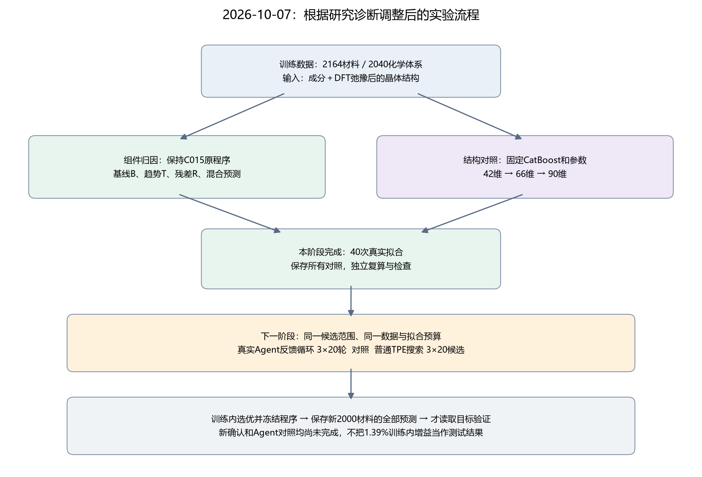
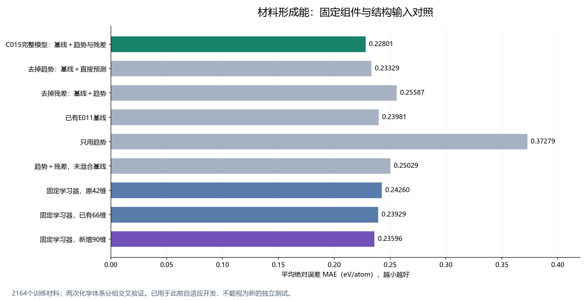

# 材料形成能：组件归因与结构改进（2026-10-07）

本阶段完成40次真实拟合。新化学角度特征使固定学习器的训练内MAE下降 **1.39%**；当前C015完整模型仍然最好。新的独立确认、三次Agent搜索及普通搜索对照尚未完成。

## 数据集与任务

- 目标是每原子形成能，单位eV/atom；误差越小越好。
- 固定训练2164材料、2040化学体系；两次独立随机化的化学体系分组2折，共4328个预测，但只有2164个独立材料。
- 来源为固定Materials Project / Matbench Discovery快照，使用DFT已经弛豫的结构。数据来源与元素参考约定延续原实验。
- [公开开发数据集](https://huggingface.co/datasets/fgh123654/materials-energy-stability-agent-dev)包含2879条开发数据，其中2164条训练、715条已知验证；本阶段只用2164条训练。
- 已观察的715、721、1000、1200、3000批次全部不用于本阶段选优。后续2000材料及300缓冲已固定选择规则，排除全部历史材料及化学体系，目前未读取新目标。

## 代码怎样运行

原42维包含30个成分/结构量和12个E04特征；已有66维再加24个R004两跳环境量。新90维再加入24个LINEGRAPH24描述：6个几何对照和18个元素属性与邻居夹角组合量。它是确定性描述程序，没有训练神经网络，也没有使用预训练权重。

结构程序通过旋转、平移、原子顺序、等价晶胞与超胞检查。数值上与旧列不完全重复，不代表所有信息都全新，也不代表已发现物理机制。

保持原C015程序，可信工具训练基线B、Ridge趋势T、CatBoost残差R，取得各组件的预测。完整预测为 **0.65B+0.35(T+R)**。去掉趋势的对照重新直接学习原目标，不能简单从完整预测中减去T。

同一学习器、同一参数和同一分组分别拟合42、66、90维输入。每个分组实际拟合10次，四组共40次；共享组件只计一次。这40次是受控诊断，Agent轮数和实验LLM调用数均为0。

## 实际结果

| 对照 | MAE | RMSE | 99%绝对误差分位数 |
|---|---:|---:|---:|
| C015完整模型：基线＋趋势与残差 | 0.22801 | 0.35636 | 1.10109 |
| 去掉趋势：基线＋直接预测 | 0.23329 | 0.36421 | 1.14949 |
| 去掉残差：基线＋趋势 | 0.25587 | 0.39441 | 1.33494 |
| 已有E011基线 | 0.23981 | 0.37288 | 1.18233 |
| 只用趋势 | 0.37279 | 0.56340 | 2.15717 |
| 趋势＋残差，未混合基线 | 0.25029 | 0.37821 | 1.21334 |
| 固定学习器，原42维 | 0.24260 | 0.37002 | 1.14976 |
| 固定学习器，已有66维 | 0.23929 | 0.37008 | 1.14541 |
| 固定学习器，新增90维 | 0.23596 | 0.36224 | 1.13828 |

新90维相比66维，两次分组的MAE都下降，平均下降1.39%。按2040个化学体系计算的配对训练内95%区间为[-0.00699, +0.00051] eV/atom，包含0；这支持继续探索，尚不能排除波动。最终是否对未使用材料有效，需要程序冻结后的新确认。

去掉趋势后误差从0.22801升到0.23329；去掉残差后升到0.25587。单独的趋势或趋势加残差并不优于完整组合，因此下一轮保留组合结构，检验新的结构信息与学习机制怎样配合。此结果说明预测中的互补关系，不能当作因果或化学机制证明。

原完整C015与原E011的训练内预测逐项重放差异为0，确保新诊断使用同一个原模型。保存所有负面结果与固定混合权重敏感性；不会按敏感性曲线改选混合权重。

## 接下来的改进及结论边界

Agent根据训练内反馈选择下一候选、实际调用科学工具、记录结果与反思。普通TPE使用完全相同的程序规则、数据分组和每候选四次拟合预算；双方各三次独立搜索、每次20个不同候选。比较的是这个受控候选范围内的搜索策略，不能概括为Agent胜过所有机器学习方法。

两个策略的候选都先在训练内选优，最终按相同规则选择误差最低的完整程序，允许来自Agent或普通TPE；将其冻结并保存新2000材料的全部预测，才允许读取确认目标。不会根据确认误差调参或重新选模型。当前没有新的独立测试提升、凸包稳定性或可合成性结论。

消融后定向修改参考[MLE-STAR](https://arxiv.org/abs/2506.15692v3)，化学角度表示参考[ALIGNN2.0](https://arxiv.org/abs/2609.19487v1)的结构关系思路；本实验没有复现其神经网络。

原始分数、程序、协议和训练内逐材料预测均保存在本目录。全部新代码、临时文件、日志和输出位于OneDrive之外。
