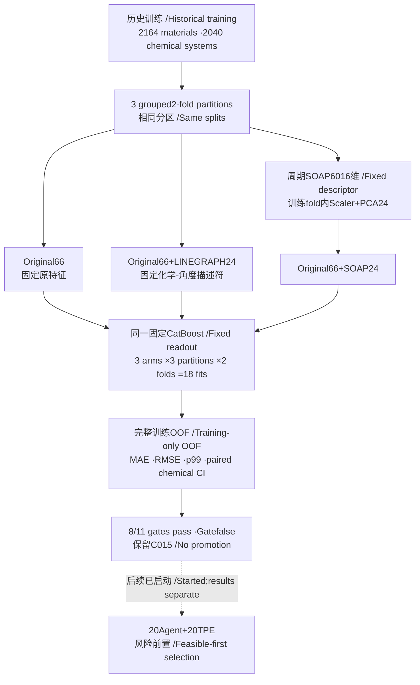
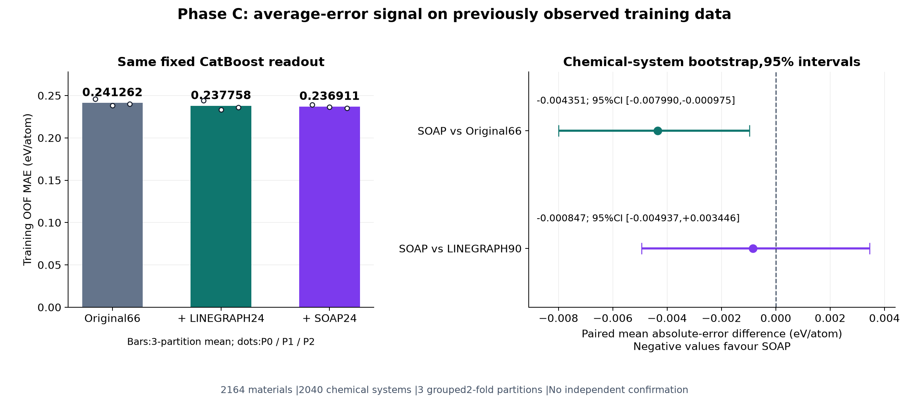
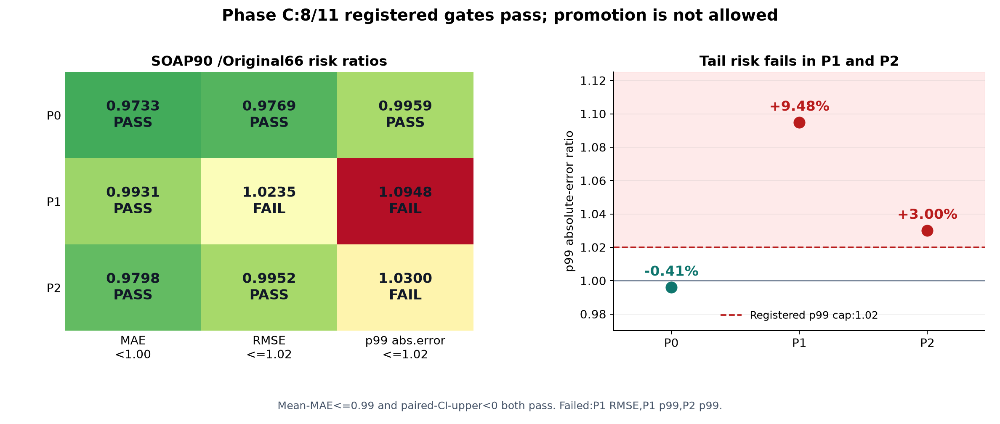

# 材料形成能：SOAP固定读出比较与风险门槛（Phase C）

**SOAP24使平均训练OOF误差下降1.80%，但风险门槛只通过8/11，不能据此确认新的准确度提升，也不替换历史C015。** 同一固定CatBoost模型下，Original66平均MAE为0.241262，加入SOAP24后为0.236911 eV/atom。

本阶段研究**每原子形成能**。实际完成18次CatBoost拟合，以及6次训练fold内Scaler和6次PCA拟合；没有实验Agent/LLM调用。18次模型拟合是结构消融比较，不是18轮Agent实验。

> **English:** Under one fixed CatBoost readout, SOAP24 lowers mean trainingOOF MAE by 1.80%. The registered gate fails(8/11 pass) due to partition-specific RMSE/p99 deterioration. These are previously observed training data, not independent confirmation. HistoricalC015 is retained.

## 数据与公平比较

|项目|实际使用|
|---|---|
|材料|2164个历史训练材料，2040个化学体系|
|目标|每原子形成能，单位eV/atom；没有稳定性或超导目标|
|分区|同一2164材料的3个化学体系分组2折分区；seeds20261009/20261010/20261011|
|预测|每方案2164×3=6492条训练OOF预测，仍是2164个不同材料|
|固定模型|三方案共用CatBoost参数、种子、分区；3×3×2=18次拟合|
|未用于本比较|旧715验证、721历史测试、旧3000确认、新2000封存确认的标签|

公开数据入口：[materials-energy-stability-agent-dev](https://huggingface.co/datasets/fgh123654/materials-energy-stability-agent-dev)。本次使用历史训练子集对应2164材料及结构表示；公开development为2879材料（2164训练+715旧验证），不能把2879全部写作本次训练。

Original66为已有42维特征加R00424；LINEGRAPH90追加固定LINEGRAPH24；SOAP90追加本fold训练数据压缩所得SOAP24。标准SOAP参数为DScribe2.1.2、周期结构、cutoff5Å、n_max4、l_max3、sigma0.5、mu1nu1、outer平均，产生6016维后逐材料L2归一化。StandardScaler和PCA24仅在当前训练fold拟合，再应用于评估fold。

SOAP不是Agent自创新特征；本阶段没有训练ALIGNN，也没有图模型checkpoint。LINEGRAPH24是固定化学-角度描述符，不是ALIGNN神经网络。三方案固定CatBoost参数：iterations900、depth6、learning_rate0.04、l2_leaf_reg8、lossRMSE、subsample0.85、seed20261006、CPU1线程。

## 结果：平均误差改善，但尾部约束失败

|同固定读出方案|输入维数|三分区平均MAE(eV/atom)|相对Original66的MAE下降|
|---|---:|---:|---:|
|Original66|66|0.241262|0.00%|
|Original66 + LINEGRAPH24|90|0.237758|1.45%|
|Original66 + SOAP24|90|0.236911|1.80%|

主比较SOAP90−Original66平均绝对误差差为-0.004351 eV/atom，化学体系配对bootstrap95%区间[-0.007990,-0.000975]，在0以下，支持已有训练分区内平均误差信号。次比较SOAP90−LINEGRAPH90为-0.000847，区间[-0.004937,+0.003446]包含0，不能据此断言SOAP优于LINEGRAPH24。

每个材料先平均3次OOF绝对误差，再作配对差，按2040化学体系进行行权重bootstrap：2000次重采样、seed20261007。这些分区已用于研发观察，区间不构成新盲测或独立泛化证据。

预注册11门槛：各分区MAE严格降低，RMSE/p99≤Original66×1.02，平均MAE≤Original66×0.99，主配对区间上界<0。实际8/11通过；失败项为P1 RMSE（1.0235倍）、P1 p99（1.0948倍，增加9.48%）、P2 p99（1.0300倍，增加3.00%）。p99是绝对误差的99分位数，监测高误差尾部。

**结论：固定结构信息有平均训练误差改善信号，但风险约束未满足，不能升级模型。历史C015继续保留。** C015是此前冻结的混合预测程序，不是本表的固定CatBoost直接读出；Original66一行不能叫C015，与C015的差异不能解释为本阶段同模型消融。

## 后续：风险约束的Agent与TPE已启动，结果另报

本报告只包含已闭合PhaseC。后续PhaseD风险约束实验已开始运行，计划20个真实Agent候选+20个TPE候选，每候选在全部3分区×2fold运行同一分支（12次模型拟合），总计上限480次。Original66、LINEGRAPH90、SOAP90三个输入域共用训练数据、预算与可行性优先选择。

未来先筛出各分区MAE<C015、RMSE/p99≤C015×1.02、三分区平均MAE≤C015平均×0.99的可行候选，再选最低平均MAE；无可行候选就保留C015。Agent反馈同时读取MAE/RMSE/p99/分组与风险比，并保存假设、反思和下一问题。这是新的预注册策略，不能用于回头替换上一轮已冻结主候选。

**后续20+20风险约束实验已开始运行，实际结果另行汇报；此C报告不包含D结果。** 20+20是注册目标，不是已经完成的轮数或提升结论。之后仍须真实运行闭合、独立审计、模型和全部预测冻结后，再按另行授权的一次性入口评分尚未使用的确认集。

## 可下载记录与核验

- [摘要JSON](summary.json)、[平均MAE表](mean_MAE.csv)、[9组分区指标](partition_metrics.csv)、[配对差与区间](paired_contrasts.csv)。
- [原始聚合结果](phaseC_outcome.json)保持原文件字节，不含逐材料目标。
- [方案元数据](protocol_summary.json)与[终审元数据](terminal_review_summary.json)为提取件，标注originalSHA，不冒充原始收据字节副本。
- [流程图源](workflow.mmd)、[误差图SVG](fixed_readout_error.svg)、[风险图SVG](partition_risk_ratios.svg)、[公开文件清单](publication_manifest.json)。

独立终审实际2287项检查通过、0失败；终审SHA`91192433f317892ca953a6b44cff382f866463f7587387f50dbba08bc4858b2a`。方案SHA`47325f53514baa2bd16d1e82e5ad6f99a13d1d33b3dd232f3c50655fa090375c`；结果SHA`d30819158c7fa074a4f7829224a3bd646ed0f6bca826fc0b6ed4da8513c62058`。生成本报告0模型拟合、0SOAP重生成、0确认目标读取。

## 实际代码

[固定读出与折内处理](code/fixed_readout.py)、[SOAP表示](code/soap_representation.py)、[纯描述符准备](code/prepare_soap.py)是本次实际冻结程序的原字节副本。运行依赖相应输入、版本锁和历史研究包；复现时需配置本机目录。
