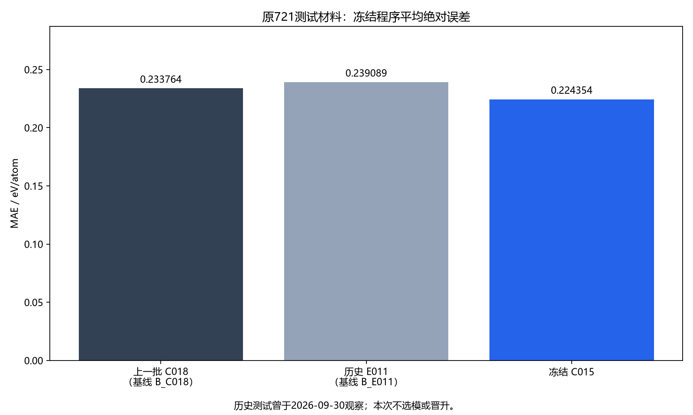
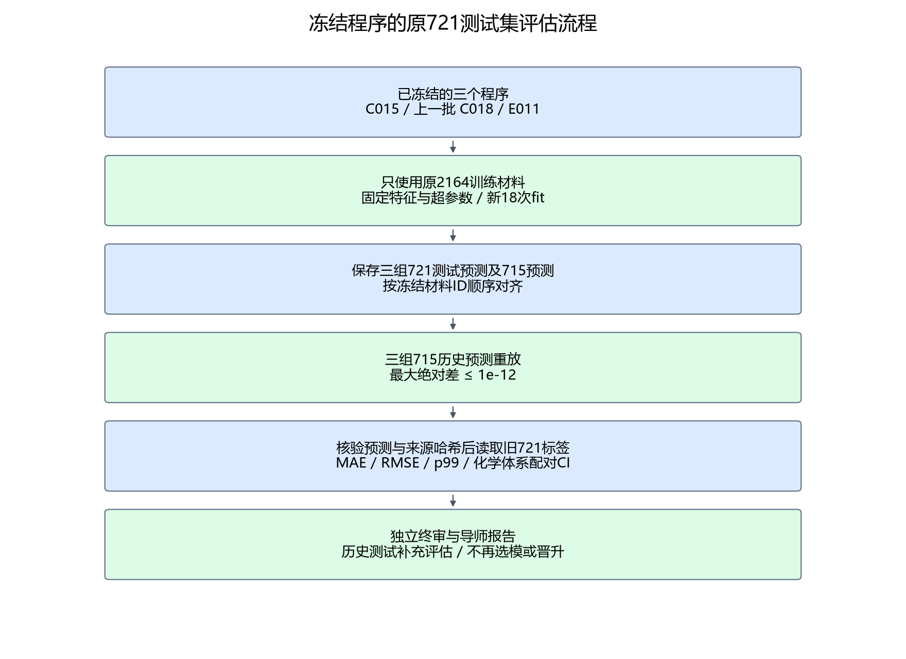
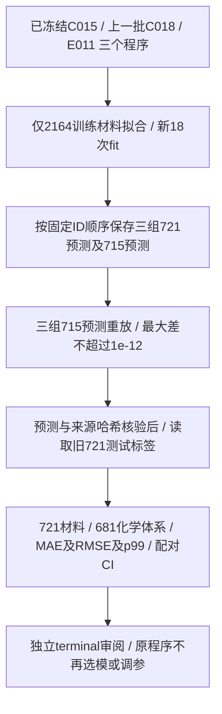
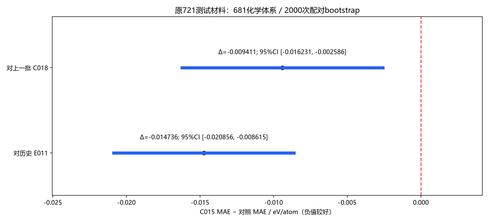

# 材料形成能 Agent：原721测试集补充评估

**相比上一批 C018，C015在原721测试集的MAE：0.233764 → 0.224354 eV/atom，下降4.03%。** 对照为上一批 C018（基线 B_C018）。MAE差为 -0.009411，化学体系配对95%置信区间 [-0.016231, -0.002586] eV/atom；区间全部低于0，支持这批旧测试材料上的平均误差下降。

**这是原固定测试集上的补充评估。** 这721个材料的测试标签和早期模型成绩在2026-09-30已被研究项目观察，本次只评价已冻结的三个程序，没有据本次成绩重新选模、调参或晋升，也不将它称作新盲测。

| 冻结程序 | MAE（eV/atom） | RMSE（eV/atom） | p99绝对误差（eV/atom） |
|---|---:|---:|---:|
| 本批冻结 C015 | 0.224354 | 0.347149 | 1.247580 |
| 上一批 C018（基线 B_C018） | 0.233764 | 0.368239 | 1.392992 |
| 历史 E011（基线 B_E011） | 0.239089 | 0.381071 | 1.379519 |

## 数据与代码流程

| 数据 | 数量 | 本次用途 |
|---|---:|---|
| 原训练集 | 2164材料 / 2040体系 | 唯一拟合来源；不混入验证或测试标签 |
| 已知验证集 | 715材料 / 680体系 | 三个程序的历史预测重放；不调参、不选模 |
| 原固定测试集 | 721材料 / 681体系 | 本次补充评分；历史已观察，已与训练和验证隔离 |
| 前一批新确认集 | 3000材料 / 2893体系 | 已完成的历史背景；本次不重测、不重复计入新评估 |

输入依次为 raw30 原始组成/弛豫结构特征、既有 E04 的12维，形成42维；固定 R004 的24维图邻域特征再组成66维。E011使用42维，上一批 C018与C015使用66维。E04在721结构上重新纯计算并与历史缓存核对；R004沿用既有程序，没有新增结构块。

原始结构与E04缓存的行顺序不同；输入准备按材料ID显式对齐到冻结顺序，再拼接特征。三组训练数值指纹与前一批完整训练的输入一致。

**流程：冻结三个程序 → 只用2164训练材料拟合 → 保存三组721及715预测 → 715重放通过 → 核对来源与预测哈希 → 读取721标签 → 评分与独立审阅。**

## 配对误差差异与结果边界

| 对照 | C015 MAE − 对照 MAE | 化学体系配对95%区间 |
|---|---:|---|
| 上一批 C018（基线 B_C018） | -0.009411 | [-0.016231, -0.002586] |
| 历史 E011（基线 B_E011） | -0.014736 | [-0.020856, -0.008615] |

负值表示C015平均误差更低。按681个化学体系成组进行2000次配对bootstrap（seed 20261007），保留同体系材料的相关性；该区间描述固定模型在这批历史测试材料上的差异，不包含此前搜索、训练或研究路线选择的不确定性。

这批721材料与训练2164、已知715、上一批1000确认及前一批3000确认均无材料ID或化学体系重合，但历史标签已被项目观察。研究数据来自同一公开MP快照，并使用DFT弛豫结构；不构成外部数据库验证、新DFT或实验合成结果。

## 拟合、重放与独立审核

本次额外完成18次可信API模型拟合（上一批C018为6、E011为5、C015为7），无自动重试。前一批622次已知拟合及原C017未决操作的28次保守预算记录保持原样；28不是已观察或已完成拟合。

| 程序 | 对此前715预测的最大绝对差 |
|---|---:|
| 上一批 C018（基线 B_C018） | 0 |
| 历史 E011（基线 B_E011） | 0 |
| 本批冻结 C015 | 0 |

独立终审 **PASS**，472项检查、0项失败。三组预测先保存，715重放门槛为1e-12，随后才读取旧测试标签。

## 前一批3000材料结果，仅作背景

前一批已完成的3000确认中，C015 MAE为0.216393，上一批C018为0.222805，平均误差下降2.88%。这不是本次重新取得的成绩；既有5项晋升门槛结论保持不变。

[前一批完整报告](https://github.com/Guohuan-Feng/pris-reproduction/tree/main/reports/materials-agent-2026-10-06-accuracy) · [公开开发数据](https://huggingface.co/datasets/fgh123654/materials-energy-stability-agent-dev) · [固定MP来源版本](https://doi.org/10.6084/m9.figshare.22715158.v38)

## 可审阅材料

- [本次完整聚合结果](test_results.json)
- [数据与来源哈希](data_and_source_metadata.json)
- [独立终审摘要](independent_test_review.json)
- [三组预测与释放证据摘要](prediction_and_release_summary.json)
- [原样程序与哈希](source/README.md)
- [公开文件清单与隐私核查](publication_manifest.json)

公开预测文件只有材料ID和预测值，不包含真实形成能标签。公开JSON中的本机路径已脱敏，原始证据SHA同时保留；科学程序按原始字节保存。包含本机路径的测试runner不作为原样源码公开。本报告是审阅快照，需要固定数据与运行环境才能复现。
